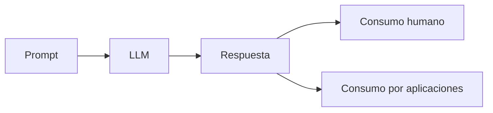

# Capitulo-16-Seccion-06-v0.1

# Módulo 2 — Prompt Engineering Profesional

# Capítulo 16 — Ingeniería del Prompt

**Versión:** 0.1  
**Estado:** Manuscrito del autor

> *"Una respuesta útil no depende únicamente de su contenido. También depende de la forma en que puede ser utilizada por otros sistemas."*

---

# Objetivos de aprendizaje

- Comprender la importancia del formato de salida en Prompt Engineering.
- Diferenciar respuestas orientadas a personas y respuestas orientadas a sistemas.
- Analizar el papel de los criterios de calidad dentro de un prompt profesional.
- Introducir el concepto de salidas estructuradas.

---

# Introducción

Hasta este punto hemos estudiado el rol, el contexto y las restricciones como componentes esenciales de un prompt.

Sin embargo, aún falta un elemento crítico para construir aplicaciones empresariales: definir cómo debe presentarse el resultado.

En una conversación entre personas, pequeñas diferencias de formato rara vez representan un problema.

En cambio, cuando la respuesta será procesada por otra aplicación, almacenada en una base de datos o utilizada por un agente, la estructura deja de ser un detalle para convertirse en un requisito de ingeniería.

---

# El formato también forma parte del diseño

Un modelo puede generar respuestas técnicamente correctas, pero difíciles de reutilizar por otros componentes.

Por este motivo, el formato esperado debe formar parte explícita del prompt.

Entre los formatos más habituales se encuentran:

- texto estructurado;
- listas jerárquicas;
- tablas;
- Markdown;
- JSON;
- XML;
- objetos compatibles con APIs.

---

# Criterios de calidad

Además del formato, un prompt profesional suele incorporar criterios que permiten evaluar si la respuesta cumple con el objetivo esperado.

Algunos ejemplos son:

| Criterio | Finalidad |
|----------|-----------|
| Precisión | Reducir ambigüedad |
| Completitud | Cubrir todos los aspectos solicitados |
| Trazabilidad | Justificar afirmaciones cuando corresponda |
| Consistencia | Mantener un estilo uniforme |
| Reutilización | Facilitar el procesamiento posterior |

Estos criterios transforman al prompt en una especificación verificable y no simplemente en una instrucción.

---

# Caso de estudio

Una empresa desarrolla un sistema para clasificar documentos.

La primera versión solicita únicamente una explicación del contenido.

Posteriormente el prompt evoluciona para devolver un objeto JSON con:

- categoría;
- nivel de confianza;
- palabras clave;
- resumen;
- observaciones.

Sin modificar el modelo, la aplicación pasa de requerir procesamiento manual a integrarse automáticamente con el resto de la plataforma.

La diferencia reside en el diseño del formato de salida.

---

# Buenas prácticas

- Definir explícitamente el formato esperado.
- Mantener estructuras consistentes entre versiones.
- Diseñar salidas fáciles de validar.
- Evitar formatos ambiguos cuando la respuesta será consumida por otros sistemas.

---

# Errores frecuentes

- Confiar en que el modelo elegirá espontáneamente el formato adecuado.
- Cambiar la estructura de salida sin versionado.
- Mezclar información estructurada y narrativa sin necesidad.
- Diseñar respuestas difíciles de procesar automáticamente.

---

# Ideas clave

- El formato de salida constituye un requisito funcional.
- Una buena estructura facilita la integración con otras aplicaciones.
- Los criterios de calidad convierten al prompt en un artefacto evaluable.

---

# Transición hacia la siguiente sección

En la próxima sección integraremos todos los componentes estudiados hasta el momento para construir el primer prompt profesional completo, analizando las decisiones de diseño adoptadas en cada uno de sus bloques.

---

> **"Un arquitecto no memoriza respuestas. Comprende problemas para poder diseñar soluciones."**
