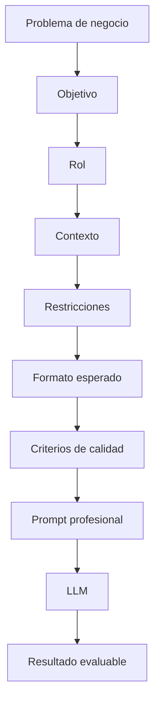

# Capitulo-16-Seccion-07-v0.1

# Módulo 2 — Prompt Engineering Profesional

# Capítulo 16 — Ingeniería del Prompt

**Versión:** 0.1  
**Estado:** Manuscrito del autor

> *"La diferencia entre un prompt improvisado y uno profesional no reside en su longitud, sino en las decisiones de diseño que lo componen."*

---

# Objetivos de aprendizaje

- Integrar todos los componentes estudiados en un prompt profesional.
- Comprender el proceso de diseño de un prompt desde la perspectiva del AI Engineering.
- Analizar cómo cada bloque contribuye a la calidad de la respuesta.
- Introducir una metodología sistemática para construir prompts reutilizables.

---

# Introducción

Hasta este punto hemos estudiado de forma independiente los principales componentes de un prompt profesional:

- el rol;
- el objetivo;
- el contexto;
- las restricciones;
- el formato de salida;
- los criterios de calidad.

En una aplicación empresarial estos elementos no aparecen de manera aislada.

Se integran para formar una única especificación que guía el comportamiento del modelo.

Desde esta perspectiva, diseñar un prompt se asemeja mucho más al diseño de un contrato entre componentes de software que a la redacción de una instrucción en lenguaje natural.

---

# Construyendo un prompt profesional

El siguiente esquema resume el proceso de diseño.

Obsérvese que el prompt no constituye el punto de partida del proceso.

El diseño comienza comprendiendo el problema de negocio.

---

# Un ejemplo conceptual

Supongamos que una organización necesita analizar contratos para detectar riesgos.

Una aproximación improvisada podría consistir en escribir:

> Analiza este contrato.

Desde una perspectiva de ingeniería esa instrucción resulta insuficiente.

Un diseño profesional definiría:

| Componente | Ejemplo |
|------------|----------|
| Rol | Abogado especializado en contratos comerciales. |
| Objetivo | Detectar riesgos contractuales. |
| Contexto | Políticas internas de la organización. |
| Restricciones | No realizar inferencias sin evidencia documental. |
| Formato | Tabla con riesgos, severidad y justificación. |
| Calidad | Fundamentar cada observación con referencias. |

Aunque el modelo utilizado sea exactamente el mismo, la calidad y consistencia del resultado aumentan considerablemente.

---

# El prompt como contrato

Una forma útil de comprender esta evolución consiste en pensar el prompt como un contrato.

Así como una API define qué información intercambiarán dos aplicaciones, un prompt define cómo interactuarán la aplicación y el modelo.

Cuanto más preciso sea ese contrato, menor será la incertidumbre durante la inferencia.

---

# Buenas prácticas

- Diseñar el prompt a partir del problema y no del modelo.
- Separar claramente cada bloque funcional.
- Documentar el propósito del prompt.
- Versionar cualquier modificación relevante.

---

# Errores frecuentes

- Escribir el prompt antes de comprender el problema.
- Incorporar instrucciones contradictorias.
- Omitir criterios de calidad.
- Considerar el prompt como un elemento descartable.

---

# Ideas clave

- Un prompt profesional integra múltiples componentes.
- El diseño comienza en el negocio y finaliza en la inferencia.
- Los prompts constituyen activos de ingeniería reutilizables.

---

# Transición hacia la siguiente sección

En la próxima sección analizaremos cómo evaluar la calidad de un prompt y por qué la experimentación sistemática resulta indispensable para construir aplicaciones empresariales confiables.

---

> **"Un arquitecto no memoriza respuestas. Comprende problemas para poder diseñar soluciones."**
