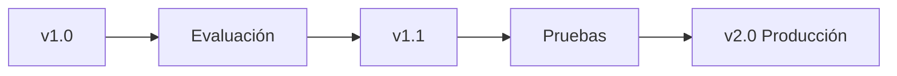

# Capitulo-16-Seccion-09-v0.1

# Módulo 2 — Prompt Engineering Profesional

# Capítulo 16 — Ingeniería del Prompt

**Versión:** 0.1  
**Estado:** Manuscrito del autor

> *"Aquello que no puede versionarse tampoco puede evolucionar de forma segura."*

---

# Objetivos de aprendizaje

- Comprender la necesidad de versionar prompts.
- Analizar la evolución controlada de un prompt en producción.
- Relacionar el versionado con calidad, auditoría y mantenimiento.
- Introducir las bases de PromptOps.

---

# Introducción

En la ingeniería de software resulta impensable modificar código directamente en producción sin conservar un historial de cambios.

Sin embargo, durante los primeros años de adopción de los Large Language Models (LLM), muchas organizaciones trataban los prompts como simples textos que podían modificarse en cualquier momento.

Ese enfoque pronto mostró sus limitaciones.

Un pequeño cambio en una instrucción puede alterar el comportamiento de una aplicación completa.

Por ello, un prompt debe considerarse un activo versionable.

---

# ¿Por qué versionar un prompt?

Versionar permite conocer:

- qué cambió;
- por qué cambió;
- quién realizó la modificación;
- qué resultados produjo;
- cómo volver a una versión anterior si fuera necesario.

El objetivo no consiste únicamente en conservar un historial, sino en reducir el riesgo asociado a la evolución del sistema.

---

# Versionado como práctica de ingeniería

Un prompt puede evolucionar por múltiples razones:

| Motivo | Ejemplo |
|--------|----------|
| Cambio de negocio | Nuevas políticas internas. |
| Mejora de precisión | Ajuste de restricciones. |
| Nuevo formato | Salida JSON en lugar de texto libre. |
| Optimización | Reducción de tokens y costos. |
| Integración | Compatibilidad con nuevas herramientas. |

Cada modificación debe estar acompañada por evidencia obtenida mediante pruebas comparativas.

---

# Caso de estudio

Un asistente de soporte técnico incorpora un nuevo formato de respuesta para facilitar su integración con un sistema de tickets.

El equipo conserva ambas versiones del prompt y ejecuta la misma batería de pruebas sobre cada una.

Gracias al versionado detecta que la nueva estructura mejora la integración, pero también incrementa ligeramente la longitud promedio de las respuestas.

Con esta información decide adoptar la nueva versión y planificar una optimización posterior.

---

# Buenas prácticas

- Asignar un identificador único a cada versión.
- Documentar el motivo del cambio.
- Asociar cada versión con sus resultados de evaluación.
- Mantener la posibilidad de revertir modificaciones.

---

# Errores frecuentes

- Sobrescribir prompts sin historial.
- Versionar únicamente cuando aparece un problema.
- No relacionar las versiones con métricas.
- Cambiar varios componentes simultáneamente sin trazabilidad.

---

# Ideas clave

- Los prompts evolucionan igual que cualquier componente de software.
- El versionado aporta trazabilidad y seguridad.
- Prompt Engineering y PromptOps comienzan a converger cuando los prompts ingresan al ciclo de vida de producción.

---

# Transición hacia la siguiente sección

En la próxima sección cerraremos el capítulo introduciendo los principios fundamentales de PromptOps, que permitirán gestionar prompts como activos estratégicos dentro de plataformas empresariales de Inteligencia Artificial.

---

> **"Un arquitecto no memoriza respuestas. Comprende problemas para poder diseñar soluciones."**
