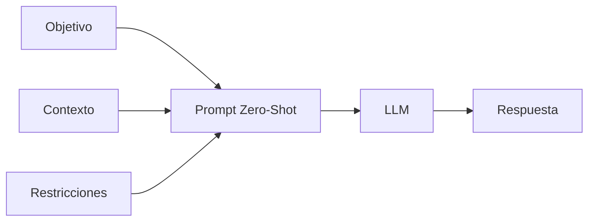

# Capitulo-17-Seccion-02-v0.1

# Módulo 2 — Prompt Engineering Profesional

# Capítulo 17 — Patrones de Prompt Engineering

**Versión:** 0.1  
**Estado:** Manuscrito del autor

> *"La solución más simple suele ser suficiente... hasta que el problema demuestra lo contrario."*

---

# Objetivos de aprendizaje

- Comprender el patrón Zero-Shot Prompting.
- Identificar cuándo resulta adecuado utilizarlo.
- Analizar sus ventajas y limitaciones.
- Establecer criterios para decidir cuándo evolucionar hacia otros patrones.

---

# Introducción

El patrón **Zero-Shot Prompting** representa la forma más directa de interactuar con un Large Language Model (LLM).

Consiste en solicitar una tarea sin proporcionar ejemplos previos.

Aunque pueda parecer el enfoque más básico, continúa siendo uno de los más utilizados en aplicaciones empresariales debido a su simplicidad, bajo costo de mantenimiento y rapidez de implementación.

Sin embargo, la simplicidad no debe confundirse con universalidad.

Comprender cuándo Zero-Shot resulta suficiente constituye una competencia fundamental para cualquier AI Engineer.

---

# ¿Qué es Zero-Shot Prompting?

En este patrón, el modelo recibe únicamente la descripción de la tarea.

No dispone de ejemplos que indiquen cómo debería responder.

Debe inferir el comportamiento esperado utilizando el conocimiento adquirido durante su entrenamiento y la información disponible en el prompt.

---

# ¿Cuándo utilizar Zero-Shot?

Zero-Shot suele ser apropiado cuando:

- la tarea es bien conocida por el modelo;
- existe poca ambigüedad;
- el formato esperado es sencillo;
- la variabilidad aceptable es elevada;
- la precisión absoluta no constituye un requisito crítico.

Algunos ejemplos incluyen:

- generación de resúmenes;
- traducciones;
- clasificación simple;
- extracción de información básica;
- redacción de contenido.

---

# Ventajas

| Ventaja | Descripción |
|----------|-------------|
| Simplicidad | Prompts fáciles de construir y mantener. |
| Bajo costo | Menor consumo de tokens. |
| Flexibilidad | Adaptación rápida a distintos escenarios. |
| Rapidez | Desarrollo e iteración más ágiles. |

---

# Limitaciones

Cuando aumenta la complejidad del problema, también lo hacen las limitaciones del patrón.

Entre las más frecuentes se encuentran:

- respuestas inconsistentes;
- formatos variables;
- interpretaciones ambiguas;
- dificultad para tareas altamente especializadas;
- menor control sobre el comportamiento del modelo.

Estas limitaciones explican la aparición de patrones como One-Shot y Few-Shot, que estudiaremos en las próximas secciones.

---

# Caso de estudio

Una empresa desarrolla un asistente para resumir informes internos.

El equipo comienza utilizando Zero-Shot debido a que el formato de salida es flexible y los usuarios aceptan pequeñas variaciones entre respuestas.

Meses después, el mismo sistema debe generar informes ejecutivos con una estructura estricta.

Las diferencias observadas entre distintas ejecuciones hacen evidente que Zero-Shot ya no resulta suficiente.

El equipo decide evolucionar hacia un patrón basado en ejemplos.

---

# Buenas prácticas

- Utilizar Zero-Shot como punto de partida.
- Mantener objetivos claros y específicos.
- Complementar el prompt con restricciones cuando sea necesario.
- Medir la calidad antes de incorporar patrones más complejos.

---

# Errores frecuentes

- Suponer que Zero-Shot resolverá cualquier problema.
- Utilizarlo en tareas altamente estructuradas sin evaluación previa.
- Confundir simplicidad con falta de diseño.
- Escalar soluciones críticas sin validar su comportamiento.

---

# Ideas clave

- Zero-Shot constituye el patrón más simple de Prompt Engineering.
- Su eficacia depende de la naturaleza del problema.
- La decisión de evolucionar hacia patrones más complejos debe basarse en evidencia y no en preferencias personales.

---

# Transición hacia la siguiente sección

En la próxima sección estudiaremos **One-Shot Prompting**, incorporando un único ejemplo para guiar el comportamiento del modelo y reducir la ambigüedad presente en determinadas tareas.

---

> **"Un arquitecto no memoriza respuestas. Comprende problemas para poder diseñar soluciones."**
