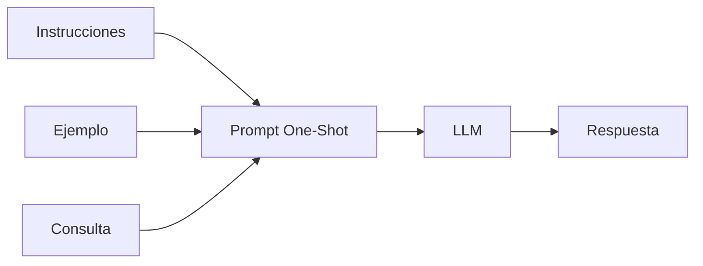

# Capitulo-17-Seccion-03-v0.1

# Módulo 2 — Prompt Engineering Profesional

# Capítulo 17 — Patrones de Prompt Engineering

**Versión:** 0.1  
**Estado:** Manuscrito del autor

> *"Un único ejemplo bien elegido puede eliminar más ambigüedad que un párrafo completo de instrucciones."*

---

# Objetivos de aprendizaje

- Comprender el patrón One-Shot Prompting.
- Analizar cómo un ejemplo condiciona el comportamiento del modelo.
- Identificar escenarios donde One-Shot supera a Zero-Shot.
- Comprender sus ventajas y limitaciones en aplicaciones empresariales.

---

# Introducción

En la sección anterior analizamos Zero-Shot Prompting, donde el modelo recibe únicamente la descripción de la tarea.

Sin embargo, existen situaciones en las que describir el resultado esperado no es suficiente. El formato puede ser complejo, existir múltiples interpretaciones válidas o requerirse un estilo muy específico.

En estos escenarios, proporcionar un único ejemplo representativo reduce significativamente la incertidumbre.

Esta estrategia recibe el nombre de **One-Shot Prompting**.

---

# ¿Qué es One-Shot Prompting?

One-Shot consiste en incorporar un único ejemplo completo de entrada y salida dentro del prompt.

Ese ejemplo funciona como una referencia que permite al modelo inferir el patrón esperado antes de resolver el caso real.

El ejemplo no sustituye las instrucciones. Las complementa.

---

# ¿Cuándo utilizar One-Shot?

One-Shot resulta especialmente útil cuando:

| Escenario | Beneficio |
|-----------|-----------|
| Formatos específicos | Reduce variaciones de salida. |
| Clasificaciones simples | Muestra el criterio esperado. |
| Transformaciones de texto | Establece un patrón claro. |
| Extracción de datos | Ilustra la estructura objetivo. |

En estos casos, un único ejemplo suele ser suficiente para orientar la inferencia.

---

# Ventajas

Entre los principales beneficios se encuentran:

- menor ambigüedad;
- mayor consistencia;
- rápida implementación;
- bajo consumo adicional de tokens;
- facilidad de mantenimiento.

En comparación con Zero-Shot, el costo adicional suele ser reducido y la mejora de calidad puede resultar significativa.

---

# Limitaciones

One-Shot también presenta restricciones.

Un único ejemplo puede:

- representar solo un caso particular;
- introducir sesgos no deseados;
- resultar insuficiente para tareas con alta variabilidad;
- dificultar la generalización cuando existen múltiples excepciones.

En estos escenarios será necesario recurrir a Few-Shot Prompting.

---

# Caso de estudio

Una empresa necesita convertir reportes técnicos en un formato Markdown corporativo.

Con Zero-Shot, la estructura cambia entre documentos.

El equipo incorpora un único ejemplo mostrando exactamente cómo debe verse el resultado.

Sin modificar el modelo, la consistencia aumenta y disminuye el trabajo de edición posterior.

---

# Buenas prácticas

- Seleccionar un ejemplo representativo.
- Mantener coherencia entre el ejemplo y las instrucciones.
- Evitar ejemplos excesivamente complejos.
- Actualizar el ejemplo cuando cambien los requisitos.

---

# Errores frecuentes

- Utilizar ejemplos que no representan el problema real.
- Contradecir las instrucciones mediante el ejemplo.
- Asumir que un ejemplo cubre todos los escenarios.
- Elegir ejemplos ambiguos o incompletos.

---

# Ideas clave

- One-Shot reduce la ambigüedad mostrando un comportamiento esperado.
- Un buen ejemplo puede mejorar notablemente la consistencia.
- La calidad del ejemplo es tan importante como la calidad de las instrucciones.

---

# Transición hacia la siguiente sección

En la próxima sección estudiaremos **Few-Shot Prompting**, donde múltiples ejemplos permiten capturar patrones más complejos y mejorar la capacidad de generalización del modelo.

---

> **"Un arquitecto no memoriza respuestas. Comprende problemas para poder diseñar soluciones."**
