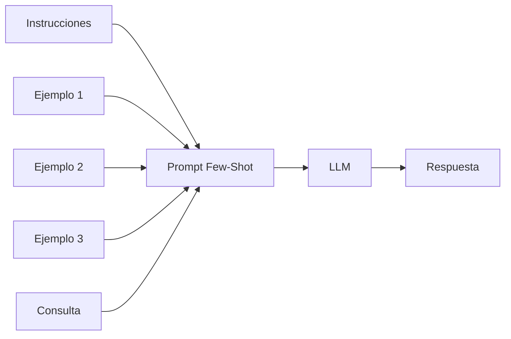

# Capitulo-17-Seccion-04-v0.1

# Módulo 2 — Prompt Engineering Profesional

# Capítulo 17 — Patrones de Prompt Engineering

**Versión:** 0.1  
**Estado:** Manuscrito del autor

> *"Los ejemplos no enseñan únicamente qué responder. Enseñan cómo pensar el problema."*

---

# Objetivos de aprendizaje

- Comprender el patrón **Few-Shot Prompting**.
- Analizar por qué múltiples ejemplos mejoran la generalización.
- Identificar cuándo Few-Shot resulta más apropiado que One-Shot.
- Reconocer sus ventajas, limitaciones y costos.

---

# Introducción

En la sección anterior analizamos cómo un único ejemplo puede orientar el comportamiento del modelo.

Sin embargo, muchos problemas empresariales presentan una variabilidad considerable.

Una única muestra rara vez alcanza para representar todos los escenarios posibles.

En estos casos aparece **Few-Shot Prompting**, un patrón que incorpora varios ejemplos cuidadosamente seleccionados para mostrar al modelo cómo debe comportarse frente a distintas situaciones.

El objetivo ya no consiste únicamente en ilustrar un formato.

Consiste en transmitir un criterio.

---

# ¿Qué es Few-Shot Prompting?

Few-Shot Prompting consiste en proporcionar una colección reducida de ejemplos representativos antes de presentar la consulta real.

Cada ejemplo actúa como una evidencia adicional sobre el comportamiento esperado.

La cantidad de ejemplos no constituye una regla fija.

Dependerá del problema, del modelo y del espacio disponible dentro del Context Window.

---

# ¿Cuándo utilizar Few-Shot?

Few-Shot resulta especialmente útil cuando:

| Escenario | Motivo |
|-----------|--------|
| Clasificaciones complejas | Existen múltiples categorías o excepciones. |
| Extracción de información | Los documentos presentan estructuras diferentes. |
| Generación de código | Se requiere mantener convenciones específicas. |
| Transformación de datos | Existen múltiples formatos de entrada. |
| Redacción especializada | Es necesario reproducir un estilo consistente. |

En estos casos, varios ejemplos permiten al modelo identificar patrones que un único caso difícilmente lograría representar.

---

# Selección de ejemplos

Uno de los errores más frecuentes consiste en incorporar ejemplos de manera aleatoria.

Desde la perspectiva del AI Engineering, los ejemplos deben seleccionarse deliberadamente.

Idealmente deberían cubrir:

- casos típicos;
- casos límite;
- situaciones ambiguas;
- excepciones relevantes;
- formatos diferentes.

El objetivo no es mostrar cantidad, sino diversidad representativa.

---

# Costos y beneficios

Few-Shot suele mejorar la calidad de las respuestas, pero también introduce nuevos desafíos.

| Beneficio | Impacto |
|-----------|---------|
| Mayor consistencia | Reduce variaciones entre respuestas. |
| Mejor generalización | Captura patrones complejos. |
| Menor ambigüedad | Facilita la interpretación del problema. |

| Costo | Impacto |
|-------|---------|
| Más tokens | Incrementa el costo de inferencia. |
| Mayor latencia | El procesamiento puede demorar más. |
| Mantenimiento | Los ejemplos también deben versionarse. |

La decisión de utilizar Few-Shot debe equilibrar estos factores.

---

# Caso de estudio

Una compañía de seguros desarrolla un sistema para clasificar siniestros.

Con Zero-Shot obtiene resultados aceptables.

Con One-Shot mejora la consistencia en los casos más frecuentes.

Sin embargo, los reclamos excepcionales continúan clasificándose incorrectamente.

El equipo incorpora diez ejemplos cuidadosamente seleccionados que representan distintos tipos de siniestros.

La precisión aumenta de forma significativa sin modificar el modelo.

La mejora proviene del diseño del prompt.

---

# Buenas prácticas

- Seleccionar ejemplos diversos.
- Evitar redundancias.
- Actualizar los ejemplos cuando cambien las reglas del negocio.
- Medir el impacto de cada incorporación.

---

# Errores frecuentes

- Utilizar demasiados ejemplos sin aportar información nueva.
- Elegir únicamente casos exitosos.
- Mezclar criterios inconsistentes entre ejemplos.
- Ignorar el consumo adicional de tokens.

---

# Ideas clave

- Few-Shot transmite criterios mediante múltiples ejemplos.
- La calidad de los ejemplos resulta más importante que su cantidad.
- Diseñar un conjunto representativo constituye una tarea de ingeniería.

---

# Transición hacia la siguiente sección

En la próxima sección estudiaremos **Chain of Thought Prompting**, uno de los patrones que revolucionó la forma de resolver problemas complejos mediante razonamiento paso a paso.

---

> **"Un arquitecto no memoriza respuestas. Comprende problemas para poder diseñar soluciones."**
