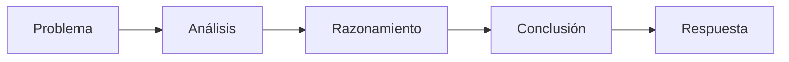

# Capitulo-17-Seccion-05-v0.1

# Módulo 2 — Prompt Engineering Profesional

# Capítulo 17 — Patrones de Prompt Engineering

**Versión:** 0.1  
**Estado:** Manuscrito del autor

> *"Resolver un problema complejo rara vez consiste en encontrar la respuesta correcta de inmediato. Consiste en construir un razonamiento que conduzca a ella."*

---

# Objetivos de aprendizaje

- Comprender el patrón **Chain of Thought (CoT) Prompting**.
- Analizar por qué el razonamiento paso a paso mejora determinadas tareas.
- Identificar escenarios donde CoT aporta valor y otros donde resulta innecesario.
- Incorporar criterios para utilizar CoT en aplicaciones empresariales.

---

# Introducción

Los patrones Zero-Shot, One-Shot y Few-Shot buscan reducir la ambigüedad mostrando al modelo qué tarea debe resolver y, en algunos casos, cómo luce un resultado esperado.

Sin embargo, existen problemas cuyo desafío no radica únicamente en producir una respuesta, sino en **construir un proceso de razonamiento**.

Cálculos, planificación, análisis normativo, diagnóstico, toma de decisiones y resolución de problemas complejos suelen beneficiarse de una estrategia diferente.

Aquí aparece **Chain of Thought Prompting (CoT)**.

---

# ¿Qué es Chain of Thought?

Chain of Thought consiste en incentivar al modelo a resolver un problema mediante una secuencia organizada de pasos intermedios antes de producir la respuesta final.

Conceptualmente, el patrón busca transformar un problema complejo en una serie de decisiones más pequeñas.

El objetivo no es hacer la respuesta más extensa, sino favorecer un proceso de inferencia más estructurado.

---

# ¿Cuándo utilizar CoT?

Este patrón resulta especialmente útil cuando la tarea requiere:

| Escenario | Motivo |
|-----------|--------|
| Resolución de problemas | Existen múltiples pasos intermedios. |
| Diagnósticos | Deben evaluarse distintas evidencias. |
| Planificación | Es necesario ordenar acciones. |
| Análisis normativo | Deben justificarse conclusiones. |
| Arquitectura | Hay que comparar alternativas antes de decidir. |

Por el contrario, tareas simples como traducciones o clasificaciones básicas rara vez justifican el costo adicional.

---

# Beneficios y limitaciones

## Beneficios

- Favorece respuestas más consistentes.
- Reduce errores en problemas complejos.
- Facilita la justificación de decisiones.
- Hace más transparente el proceso seguido por el modelo.

## Limitaciones

- Incrementa el consumo de tokens.
- Puede aumentar la latencia.
- No garantiza una conclusión correcta si el razonamiento parte de premisas incorrectas.
- No todas las tareas requieren razonamiento explícito.

---

# Caso de estudio

Un equipo desarrolla un asistente para apoyar el análisis de incidentes de ciberseguridad.

Con un enfoque Zero-Shot el modelo suele responder con una causa probable, pero omite justificarla.

Tras incorporar una estrategia basada en Chain of Thought, el sistema comienza a analizar evidencias, descartar hipótesis y construir una explicación antes de emitir la conclusión.

El resultado no solo mejora la precisión percibida, sino también la confianza de los analistas que utilizan la herramienta.

---

# Buenas prácticas

- Reservar CoT para problemas que realmente requieren razonamiento.
- Evaluar el costo adicional de inferencia.
- Solicitar pasos claros y verificables.
- Medir si el patrón mejora los resultados antes de adoptarlo.

---

# Errores frecuentes

- Aplicar CoT a tareas triviales.
- Asumir que más razonamiento implica mejores respuestas.
- Confundir explicaciones largas con razonamiento de calidad.
- No validar las conclusiones obtenidas.

---

# Ideas clave

- Chain of Thought guía el proceso de razonamiento, no solo la respuesta.
- Su mayor valor aparece en problemas complejos.
- Debe utilizarse cuando el beneficio supera el costo operativo.

---

# Transición hacia la siguiente sección

En la próxima sección estudiaremos **Self-Consistency**, un patrón que amplía Chain of Thought generando múltiples razonamientos alternativos antes de seleccionar la respuesta más consistente.

---

> **"Un arquitecto no memoriza respuestas. Comprende problemas para poder diseñar soluciones."**
