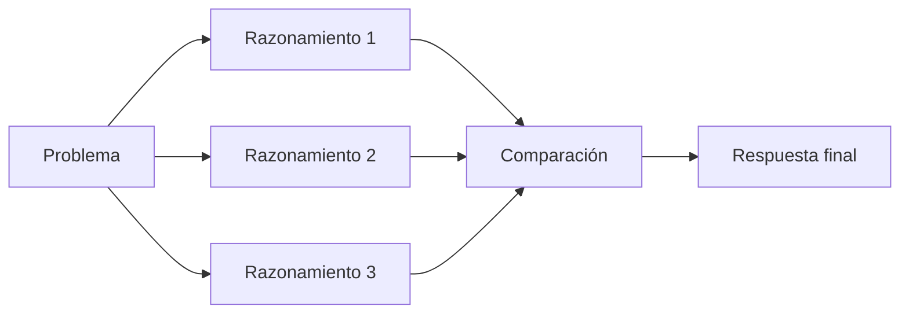

# Capitulo-17-Seccion-06-v0.1

# Módulo 2 — Prompt Engineering Profesional

# Capítulo 17 — Patrones de Prompt Engineering

**Versión:** 0.1  
**Estado:** Manuscrito del autor

> *"Cuando un único razonamiento no ofrece suficiente confianza, la ingeniería busca evidencia adicional antes de decidir."*

---

# Objetivos de aprendizaje

- Comprender el patrón **Self-Consistency**.
- Analizar cómo múltiples cadenas de razonamiento pueden mejorar la confiabilidad.
- Evaluar el costo y el beneficio de este enfoque.
- Identificar escenarios donde resulta apropiado utilizarlo.

---

# Introducción

En la sección anterior estudiamos **Chain of Thought (CoT)**, donde el modelo desarrolla un razonamiento paso a paso antes de emitir una respuesta.

Sin embargo, un único razonamiento puede conducir a una conclusión incorrecta debido a una premisa equivocada o a una inferencia desafortunada.

El patrón **Self-Consistency** aborda este problema solicitando al modelo que genere varias cadenas de razonamiento independientes y seleccione la conclusión que aparece con mayor consistencia.

---

# ¿Qué es Self-Consistency?

En lugar de confiar en una única secuencia de razonamiento, el sistema explora múltiples caminos posibles y compara sus resultados.

El objetivo no consiste en obtener muchas respuestas, sino en aumentar la probabilidad de seleccionar la más robusta.

---

# ¿Cuándo utilizarlo?

Self-Consistency aporta valor cuando:

| Escenario | Beneficio |
|-----------|-----------|
| Diagnóstico | Reduce el riesgo de conclusiones apresuradas. |
| Planificación | Compara estrategias alternativas. |
| Resolución de problemas complejos | Disminuye errores de razonamiento. |
| Evaluaciones críticas | Incrementa la confianza antes de decidir. |

Para tareas simples, el costo adicional suele superar el beneficio.

---

# Costos operativos

Este patrón incrementa:

- el consumo de tokens;
- el tiempo de inferencia;
- el costo económico;
- la complejidad de la orquestación.

Por ello, debe reservarse para escenarios donde la calidad de la decisión sea más importante que la velocidad de respuesta.

---

# Caso de estudio

Una entidad financiera utiliza un LLM para asistir en la evaluación preliminar de operaciones inusuales.

En lugar de aceptar la primera explicación generada, el sistema produce varias cadenas de razonamiento y compara sus conclusiones.

Cuando existe convergencia entre ellas, aumenta la confianza de la recomendación. Si aparecen diferencias significativas, la operación se deriva a un analista humano.

---

# Buenas prácticas

- Utilizar Self-Consistency únicamente cuando el riesgo lo justifique.
- Comparar razonamientos mediante criterios objetivos.
- Registrar métricas de calidad y costo.
- Combinar este patrón con evaluación automatizada.

---

# Errores frecuentes

- Aplicarlo indiscriminadamente.
- Confundir cantidad de razonamientos con calidad.
- Ignorar el impacto sobre la latencia.
- No definir cómo seleccionar la respuesta final.

---

# Ideas clave

- Self-Consistency incrementa la robustez comparando múltiples razonamientos.
- Su principal ventaja aparece en decisiones de alto impacto.
- El aumento de calidad debe compensar el costo adicional de inferencia.

---

# Transición hacia la siguiente sección

En la próxima sección estudiaremos **ReAct (Reason + Act)**, un patrón que combina razonamiento con la capacidad de utilizar herramientas externas para resolver problemas que exceden el conocimiento interno del modelo.

---

> **"Un arquitecto no memoriza respuestas. Comprende problemas para poder diseñar soluciones."**
