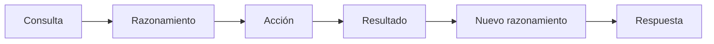

# Capitulo-17-Seccion-07-v0.1

# Módulo 2 — Prompt Engineering Profesional

# Capítulo 17 — Patrones de Prompt Engineering

**Versión:** 0.1  
**Estado:** Manuscrito del autor

> *"Un modelo deja de ser únicamente un generador de texto cuando puede razonar y actuar sobre el mundo que lo rodea."*

---

# Objetivos de aprendizaje

- Comprender el patrón **ReAct (Reason + Act)**.
- Analizar cómo combina razonamiento con ejecución de acciones.
- Diferenciar ReAct de Chain of Thought.
- Identificar escenarios empresariales donde aporta ventajas.

---

# Introducción

Los patrones analizados hasta el momento centran su atención en mejorar el proceso de razonamiento del modelo.

Sin embargo, muchas aplicaciones empresariales requieren algo más que producir una buena respuesta. Necesitan consultar información actualizada, ejecutar herramientas, invocar APIs o interactuar con otros sistemas.

Para resolver este tipo de problemas surge **ReAct (Reason + Act)**, un patrón que alterna ciclos de razonamiento con acciones concretas.

---

# ¿Qué es ReAct?

ReAct propone que el modelo no resuelva el problema únicamente con su conocimiento interno.

En cambio, puede razonar, decidir qué información necesita, ejecutar una acción y continuar razonando utilizando el resultado obtenido.

Este ciclo puede repetirse tantas veces como resulte necesario.

---

# Componentes del patrón

| Componente | Función |
|------------|---------|
| Reason | Analizar el estado actual del problema. |
| Act | Invocar una herramienta o ejecutar una acción. |
| Observe | Incorporar el resultado obtenido. |
| Decide | Determinar el siguiente paso. |

Esta alternancia convierte al modelo en un orquestador capaz de interactuar con su entorno.

---

# ¿Cuándo utilizar ReAct?

ReAct resulta especialmente adecuado cuando:

- la respuesta depende de información dinámica;
- es necesario consultar bases de datos;
- deben utilizarse herramientas externas;
- la aplicación integra múltiples servicios;
- el modelo necesita verificar información antes de responder.

En estos escenarios, limitarse al conocimiento del modelo suele ser insuficiente.

---

# Caso de estudio

Un asistente corporativo recibe la consulta:

> "¿Cuál es el saldo pendiente del cliente 45821 y qué facturas vencen esta semana?"

Un enfoque tradicional obligaría al modelo a responder con conocimiento incompleto o a rechazar la consulta.

Con ReAct, el sistema:

1. analiza la solicitud;
2. identifica la necesidad de consultar el ERP;
3. ejecuta la herramienta correspondiente;
4. recibe los datos;
5. construye la respuesta utilizando información actualizada.

El valor del patrón reside precisamente en esa capacidad de combinar razonamiento con acciones verificables.

---

# Buenas prácticas

- Definir claramente las herramientas disponibles.
- Validar las acciones antes de ejecutarlas.
- Registrar cada interacción para auditoría.
- Diseñar mecanismos de recuperación ante errores.

---

# Errores frecuentes

- Permitir acciones sin control.
- Exponer herramientas innecesarias.
- Omitir la validación de resultados.
- Confundir ReAct con Tool Calling; este último es un mecanismo de ejecución, mientras que ReAct es un patrón de razonamiento y decisión.

---

# Ideas clave

- ReAct integra razonamiento y ejecución.
- Permite resolver problemas que exceden el conocimiento interno del modelo.
- Constituye uno de los fundamentos conceptuales de los agentes modernos.

---

# Transición hacia la siguiente sección

En la próxima sección estudiaremos **Tree of Thoughts**, un patrón que amplía la capacidad de razonamiento explorando múltiples caminos de resolución antes de seleccionar la alternativa más prometedora.

---

> **"Un arquitecto no memoriza respuestas. Comprende problemas para poder diseñar soluciones."**
