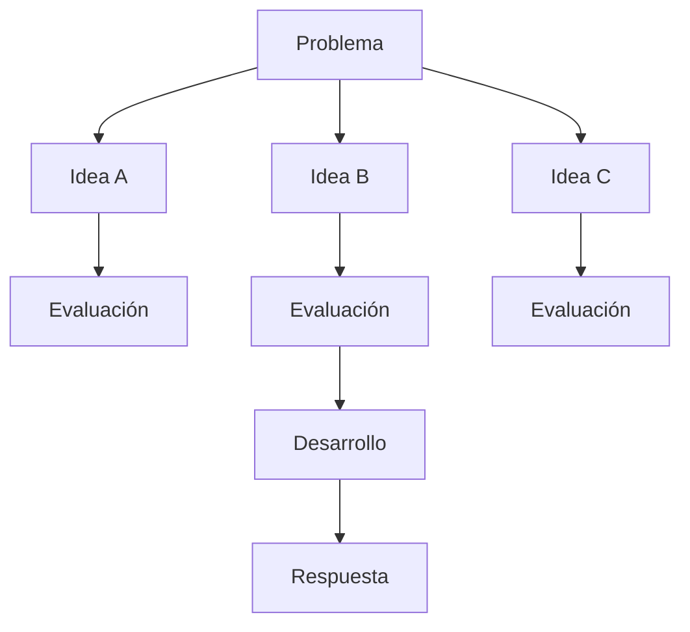

# Capitulo-17-Seccion-08-v0.1

# Módulo 2 — Prompt Engineering Profesional

# Capítulo 17 — Patrones de Prompt Engineering

**Versión:** 0.1  
**Estado:** Manuscrito del autor

> *"Las mejores decisiones rara vez aparecen al explorar un único camino. Surgen después de comparar alternativas."*

---

# Objetivos de aprendizaje

- Comprender el patrón **Tree of Thoughts (ToT)**.
- Analizar cómo amplía las capacidades de razonamiento de un LLM.
- Diferenciar Tree of Thoughts de Chain of Thought.
- Identificar escenarios donde explorar múltiples alternativas aporta valor.

---

# Introducción

En **Chain of Thought (CoT)** el modelo desarrolla un único razonamiento paso a paso.

Aunque este enfoque mejora el desempeño en numerosos problemas, mantiene una limitación importante: si el razonamiento inicial toma una dirección incorrecta, toda la conclusión puede verse afectada.

**Tree of Thoughts (ToT)** propone una estrategia diferente.

En lugar de avanzar por un único camino, el modelo explora varias alternativas, evalúa cada una y continúa desarrollando únicamente las más prometedoras.

Desde la perspectiva del AI Engineering, este patrón se asemeja más a un algoritmo de búsqueda que a una conversación tradicional.

---

# ¿Qué es Tree of Thoughts?

Tree of Thoughts organiza el proceso de razonamiento como un árbol.

Cada nodo representa una posible línea de pensamiento.

El sistema puede expandir, comparar, descartar o profundizar cada rama antes de seleccionar la solución final.

El objetivo no consiste en generar más texto, sino en explorar el espacio de soluciones de forma controlada.

---

# Comparación con Chain of Thought

| Aspecto | Chain of Thought | Tree of Thoughts |
|---------|------------------|------------------|
| Caminos explorados | Uno | Múltiples |
| Evaluación intermedia | Limitada | Explícita |
| Capacidad de corrección | Baja | Alta |
| Costo computacional | Menor | Mayor |

ToT incrementa el costo de inferencia, pero puede producir mejores resultados cuando existen numerosas alternativas posibles.

---

# ¿Cuándo utilizar Tree of Thoughts?

Este patrón resulta especialmente útil en tareas como:

- planificación estratégica;
- diseño de arquitecturas;
- resolución de problemas abiertos;
- optimización de procesos;
- análisis de múltiples escenarios;
- apoyo a la toma de decisiones.

En problemas simples, el beneficio suele ser inferior al costo adicional.

---

# Caso de estudio

Un equipo debe diseñar la arquitectura de una plataforma empresarial de IA.

No existe una única solución correcta.

El sistema genera tres alternativas:

- arquitectura completamente en la nube;
- infraestructura híbrida;
- despliegue on-premise.

Cada alternativa se evalúa según costo, escalabilidad, seguridad y mantenimiento.

En lugar de responder inmediatamente, el modelo compara las opciones y desarrolla únicamente la que mejor satisface los requisitos del negocio.

El patrón no reemplaza el criterio del arquitecto, pero amplía la capacidad para analizar opciones antes de decidir.

---

# Buenas prácticas

- Definir criterios claros de evaluación.
- Limitar la cantidad de ramas exploradas.
- Priorizar calidad sobre cantidad.
- Registrar por qué se descarta cada alternativa.

---

# Errores frecuentes

- Explorar demasiadas alternativas sin un criterio de selección.
- Utilizar ToT en problemas triviales.
- Confundir cantidad de opciones con calidad del análisis.
- Ignorar el impacto sobre tiempo y costos.

---

# Ideas clave

- Tree of Thoughts explora múltiples caminos antes de decidir.
- Incrementa la capacidad de análisis en problemas complejos.
- Debe reservarse para escenarios donde el beneficio justifique el costo.

---

# Transición hacia la siguiente sección

En la próxima sección compararemos los patrones estudiados hasta el momento y construiremos un marco de decisión que permita seleccionar el enfoque más adecuado según el problema de negocio.

---

> **"Un arquitecto no memoriza respuestas. Comprende problemas para poder diseñar soluciones."**
