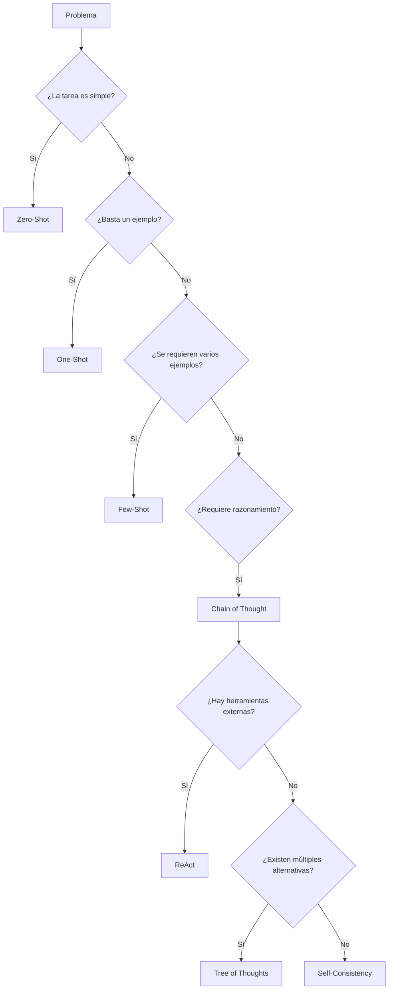

# Capitulo-17-Seccion-09-v0.1

# Módulo 2 — Prompt Engineering Profesional

# Capítulo 17 — Patrones de Prompt Engineering

**Versión:** 0.1  
**Estado:** Manuscrito del autor

> *"Conocer muchos patrones aporta poco valor si no se sabe cuál utilizar frente a un problema concreto."*

---

# Objetivos de aprendizaje

- Comparar los principales patrones de Prompt Engineering.
- Construir un marco de decisión para seleccionar el patrón adecuado.
- Relacionar la complejidad del problema con la estrategia de prompting.
- Introducir criterios de ingeniería para la toma de decisiones.

---

# Introducción

A lo largo de este capítulo analizamos diversos patrones de Prompt Engineering, cada uno diseñado para resolver un conjunto específico de problemas.

Sin embargo, una pregunta continúa abierta:

**¿Cómo decidir qué patrón utilizar?**

La respuesta no depende del modelo ni de las preferencias del ingeniero. Depende del problema que se intenta resolver y de las restricciones del entorno de producción.

---

# Un marco de decisión

La selección de un patrón puede entenderse como un proceso incremental. Se recomienda comenzar con la estrategia más simple capaz de resolver el problema y evolucionar únicamente cuando la evidencia demuestre que es necesario.

---

# Comparación general

| Patrón | Complejidad | Costo | Caso de uso típico |
|--------|-------------|-------|--------------------|
| Zero-Shot | Baja | Bajo | Tareas simples |
| One-Shot | Baja | Bajo | Formatos específicos |
| Few-Shot | Media | Medio | Generalización |
| Chain of Thought | Media | Medio | Razonamiento |
| Self-Consistency | Alta | Alto | Decisiones críticas |
| ReAct | Alta | Variable | Uso de herramientas |
| Tree of Thoughts | Muy alta | Alto | Exploración de alternativas |

---

# Ingeniería antes que técnica

Un error frecuente consiste en adoptar el patrón más sofisticado disponible suponiendo que producirá mejores resultados.

En ingeniería ocurre exactamente lo contrario.

La mejor solución suele ser aquella que satisface los requisitos utilizando la menor complejidad posible.

Cada patrón introduce costos adicionales en términos de tokens, latencia, mantenimiento y evaluación. Por ello, la decisión debe justificarse mediante métricas y necesidades concretas del negocio.

---

# Caso de estudio

Una organización desarrolla tres asistentes:

- un generador de resúmenes;
- un analizador de contratos;
- un agente que coordina procesos entre varios sistemas.

Aunque todos utilizan el mismo LLM, cada uno adopta un patrón diferente.

El primero emplea Zero-Shot, el segundo Chain of Thought y el tercero ReAct.

La diferencia no reside en la capacidad del modelo, sino en la naturaleza del problema que cada aplicación debe resolver.

---

# Buenas prácticas

- Comenzar por el patrón más simple.
- Incrementar la complejidad solo cuando sea necesario.
- Medir costo y calidad antes de cambiar de estrategia.
- Documentar la justificación de cada decisión.

---

# Errores frecuentes

- Elegir patrones por tendencia.
- Sobredimensionar la solución.
- Cambiar de patrón sin evidencia.
- Ignorar el impacto operativo.

---

# Ideas clave

- No existe un patrón universal.
- La selección depende del problema y del contexto.
- La simplicidad constituye una virtud cuando cumple los objetivos del negocio.

---

# Transición hacia la siguiente sección

En la próxima sección cerraremos el capítulo analizando cómo combinar varios patrones dentro de una misma solución y prepararemos el paso hacia el Capítulo 18, donde estudiaremos Prompt Engineering para entornos de producción.

---

> **"Un arquitecto no memoriza respuestas. Comprende problemas para poder diseñar soluciones."**
