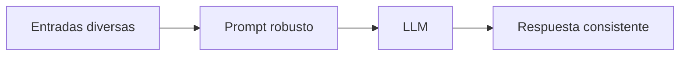

# Capitulo-18-Seccion-02-v0.1

# Módulo 2 — Prompt Engineering Profesional

# Capítulo 18 — Prompt Engineering para Producción

**Versión:** 0.1  
**Estado:** Manuscrito del autor

> *"La robustez no consiste en responder perfectamente cuando todo sale bien. Consiste en seguir respondiendo correctamente cuando la realidad deja de ser predecible."*

---

# Objetivos de aprendizaje

- Comprender el concepto de robustez aplicado al Prompt Engineering.
- Identificar las fuentes más comunes de variabilidad en producción.
- Analizar estrategias para diseñar prompts resilientes.
- Introducir el principio de programación defensiva aplicado a LLM.

---

# Introducción

En un entorno controlado, los usuarios suelen formular consultas claras, completas y coherentes.

La producción presenta un escenario muy diferente.

Los prompts deben enfrentarse a:

- errores tipográficos;
- instrucciones contradictorias;
- consultas incompletas;
- cambios de idioma;
- información redundante;
- solicitudes fuera del alcance previsto.

La robustez representa la capacidad del sistema para mantener un comportamiento útil aun cuando las condiciones de entrada se alejan del escenario ideal.

---

# ¿Qué significa que un prompt sea robusto?

Un prompt robusto no intenta prever todas las consultas posibles.

Su objetivo consiste en establecer reglas que permitan al modelo responder de forma consistente frente a una amplia variedad de situaciones.

La robustez surge del diseño, no del azar.

---

# Fuentes habituales de variabilidad

| Situación | Riesgo asociado |
|-----------|-----------------|
| Consultas ambiguas | Interpretaciones inconsistentes. |
| Datos incompletos | Respuestas especulativas. |
| Errores de escritura | Clasificaciones incorrectas. |
| Instrucciones conflictivas | Comportamientos impredecibles. |
| Cambios de contexto | Pérdida de coherencia. |

Comprender estas situaciones permite anticipar mecanismos de mitigación.

---

# Diseño defensivo

Al igual que en la ingeniería de software, resulta conveniente adoptar una estrategia defensiva.

Entre las prácticas más habituales se encuentran:

- solicitar aclaraciones cuando falte información crítica;
- indicar explícitamente las limitaciones del sistema;
- evitar inferencias no justificadas;
- validar el formato de entrada antes de procesarlo;
- establecer respuestas seguras para escenarios no contemplados.

Estas prácticas reducen la probabilidad de comportamientos inesperados.

---

# Caso de estudio

Una organización implementa un asistente para responder consultas sobre políticas de viajes.

Durante las pruebas internas todas las preguntas siguen el formato esperado.

Tras el despliegue aparecen mensajes como:

- "¿y si viajo mañana?"
- "lo mismo pero para Brasil"
- "¿esto también aplica a contratistas?"

El equipo incorpora reglas para identificar información insuficiente y solicitar datos adicionales antes de responder.

La tasa de respuestas incorrectas disminuye significativamente sin modificar el modelo.

---

# Buenas prácticas

- Diseñar para escenarios reales, no ideales.
- Definir comportamientos ante información incompleta.
- Priorizar seguridad antes que creatividad.
- Evaluar el prompt con entradas variadas.

---

# Errores frecuentes

- Asumir que todos los usuarios formularán consultas claras.
- Confiar en inferencias implícitas del modelo.
- Ignorar los casos límite.
- No probar entradas anómalas.

---

# Ideas clave

- La robustez constituye un requisito no funcional.
- Los prompts deben diseñarse para condiciones reales de operación.
- La ingeniería defensiva también aplica al Prompt Engineering.

---

# Transición hacia la siguiente sección

En la próxima sección estudiaremos estrategias para diseñar prompts deterministas y reducir la variabilidad de las respuestas en entornos empresariales.

---

> **"Un arquitecto no memoriza respuestas. Comprende problemas para poder diseñar soluciones."**
