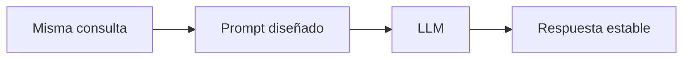

# Capitulo-18-Seccion-03-v0.1

# Módulo 2 — Prompt Engineering Profesional

# Capítulo 18 — Prompt Engineering para Producción

**Versión:** 0.1  
**Estado:** Manuscrito del autor

> *"En producción no alcanza con obtener una buena respuesta. Es necesario obtenerla de forma consistente."*

---

# Objetivos de aprendizaje

- Comprender el concepto de determinismo aplicado a sistemas basados en LLM.
- Analizar las causas de la variabilidad entre ejecuciones.
- Incorporar estrategias para reducir la incertidumbre operacional.
- Diseñar prompts orientados a resultados consistentes.

---

# Introducción

Los Large Language Models son sistemas probabilísticos.

Aun cuando reciben exactamente la misma entrada, pequeñas diferencias en la configuración o en el proceso de generación pueden producir respuestas distintas.

En aplicaciones conversacionales esta variabilidad suele ser aceptable e incluso deseable.

En entornos empresariales, sin embargo, la consistencia constituye un requisito fundamental.

Un sistema que genera respuestas significativamente diferentes frente a la misma consulta resulta difícil de validar, auditar y mantener.

---

# Determinismo y consistencia

Es importante distinguir ambos conceptos.

| Concepto | Descripción |
|----------|-------------|
| Determinismo | Capacidad de reproducir el mismo resultado bajo las mismas condiciones. |
| Consistencia | Capacidad de mantener un comportamiento estable aunque existan pequeñas variaciones. |

En la práctica, muchos LLM no son completamente deterministas, pero sí pueden diseñarse soluciones que incrementen su consistencia.

---

# Factores que introducen variabilidad

La calidad de las respuestas puede verse afectada por múltiples factores:

- configuración de temperatura;
- cambios en el contexto recibido;
- modificaciones del prompt;
- actualización del modelo;
- diferencias en los ejemplos Few-Shot;
- información recuperada dinámicamente mediante RAG.

Desde una perspectiva de AI Engineering, controlar estos factores resulta tan importante como diseñar correctamente el propio prompt.

---

# Estrategias para aumentar la consistencia

Entre las prácticas más utilizadas se encuentran:

- mantener prompts versionados;
- utilizar formatos de salida estructurados;
- minimizar ambigüedades;
- limitar la creatividad cuando el negocio requiere precisión;
- evaluar periódicamente las respuestas mediante conjuntos de prueba estables.

La consistencia no surge por casualidad. Es el resultado de decisiones de diseño.

---

# Caso de estudio

Una plataforma de atención ciudadana genera respuestas diferentes para consultas prácticamente idénticas.

El análisis revela tres causas principales:

- cambios frecuentes en el prompt;
- ausencia de un formato de salida obligatorio;
- temperatura elevada durante la inferencia.

Tras normalizar estos aspectos, la variabilidad disminuye y el equipo puede comparar resultados entre versiones con mayor confiabilidad.

---

# Buenas prácticas

- Reducir la ambigüedad del prompt.
- Mantener configuraciones estables entre evaluaciones.
- Registrar los parámetros utilizados en cada despliegue.
- Validar periódicamente la consistencia mediante pruebas automatizadas.

---

# Errores frecuentes

- Interpretar diferencias menores como fallas del modelo.
- Cambiar varias variables simultáneamente.
- Comparar resultados obtenidos bajo condiciones distintas.
- Ignorar el impacto de la configuración de inferencia.

---

# Ideas clave

- La consistencia es un requisito operativo.
- El diseño del prompt influye directamente sobre la estabilidad del sistema.
- La reproducibilidad depende tanto del prompt como del entorno donde se ejecuta.

---

# Transición hacia la siguiente sección

En la próxima sección estudiaremos cómo construir estrategias de prueba para prompts empresariales, incorporando conjuntos de casos, métricas y criterios objetivos de aceptación antes del despliegue.

---

> **"Un arquitecto no memoriza respuestas. Comprende problemas para poder diseñar soluciones."**
