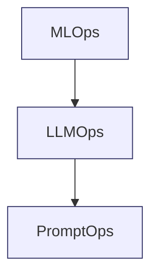

# Capitulo-18-Seccion-08-v0.1

# Módulo 2 — Prompt Engineering Profesional

# Capítulo 18 — Prompt Engineering para Producción

**Versión:** 0.1  
**Estado:** Manuscrito del autor

> *"Las plataformas maduras no gestionan disciplinas aisladas. Integran capacidades complementarias bajo una misma estrategia de ingeniería."*

---

# Objetivos de aprendizaje

- Comprender la relación entre PromptOps, LLMOps y MLOps.
- Identificar las responsabilidades de cada disciplina.
- Analizar sus puntos de integración dentro de una plataforma empresarial.
- Evitar superposiciones conceptuales frecuentes.

---

# Introducción

A medida que las organizaciones incorporan Inteligencia Artificial a sus procesos de negocio, aparecen nuevas disciplinas orientadas a gobernar distintos componentes del ciclo de vida de una solución.

Con frecuencia surgen dudas sobre los límites entre **MLOps**, **LLMOps** y **PromptOps**.

Aunque comparten principios de automatización, trazabilidad y mejora continua, cada una posee objetivos y responsabilidades diferentes.

Comprender estas diferencias permite diseñar plataformas más coherentes y asignar correctamente cada proceso.

---

# Tres niveles de operación

Desde una perspectiva de AI Engineering, estas disciplinas pueden entenderse como niveles complementarios.

- **MLOps** gobierna el ciclo de vida de modelos de Machine Learning.
- **LLMOps** administra la operación de modelos fundacionales y aplicaciones basadas en LLM.
- **PromptOps** controla el diseño, evolución y despliegue de los prompts utilizados por esas aplicaciones.

---

# Comparación de responsabilidades

| Disciplina | Responsabilidad principal |
|------------|---------------------------|
| MLOps | Entrenamiento, despliegue y monitoreo de modelos predictivos. |
| LLMOps | Gestión operativa de aplicaciones basadas en Large Language Models. |
| PromptOps | Gobierno del ciclo de vida de los prompts. |

Estas disciplinas no compiten entre sí.

Se complementan.

---

# Integración en una plataforma empresarial

En una solución moderna pueden coexistir las tres.

Por ejemplo:

- un modelo de clasificación entrenado mediante procesos MLOps;
- un asistente corporativo operado mediante LLMOps;
- un conjunto de prompts versionados, evaluados y desplegados mediante PromptOps.

El éxito de la plataforma depende de la coordinación entre estas capacidades.

---

# Caso de estudio

Una empresa desarrolla una plataforma de atención ciudadana.

El reconocimiento automático de documentos utiliza un modelo propio entrenado con prácticas de MLOps.

La interacción conversacional con el usuario se implementa mediante un LLM gestionado por procesos de LLMOps.

Los prompts que controlan el comportamiento del asistente se almacenan, prueban y despliegan utilizando PromptOps.

Cada disciplina aporta valor sobre un componente diferente de la solución.

---

# Buenas prácticas

- Definir claramente responsabilidades.
- Compartir métricas entre disciplinas.
- Integrar repositorios y pipelines cuando resulte conveniente.
- Evitar duplicar procesos de gobierno.

---

# Errores frecuentes

- Considerar PromptOps como un reemplazo de LLMOps.
- Gestionar prompts fuera del proceso de despliegue.
- Mezclar responsabilidades sin criterios claros.
- Diseñar procesos independientes que no compartan información.

---

# Ideas clave

- PromptOps, LLMOps y MLOps son disciplinas complementarias.
- Cada una gobierna un componente distinto del ecosistema de IA.
- La integración entre ellas incrementa la calidad, la trazabilidad y la capacidad de evolución.

---

# Transición hacia la siguiente sección

En la próxima sección cerraremos el capítulo sintetizando los principios del Prompt Engineering para Producción y presentaremos una arquitectura de referencia que integrará diseño, pruebas, observabilidad y operación continua.

---

> **"Un arquitecto no memoriza respuestas. Comprende problemas para poder diseñar soluciones."**
