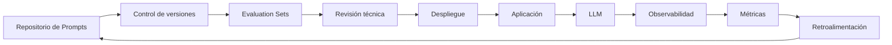

# Capitulo-18-Seccion-09-v0.1

# Módulo 2 — Prompt Engineering Profesional

# Capítulo 18 — Prompt Engineering para Producción

**Versión:** 0.1  
**Estado:** Manuscrito del autor

> *"La arquitectura no elimina la complejidad. La organiza para que pueda evolucionar de manera controlada."*

---

# Objetivos de aprendizaje

- Integrar los conceptos desarrollados durante el capítulo.
- Analizar una arquitectura de referencia para Prompt Engineering en producción.
- Comprender el flujo completo desde el diseño hasta la operación.
- Preparar la transición hacia Ingeniería Conversacional.

---

# Introducción

A lo largo de este capítulo analizamos los elementos que distinguen a un prompt experimental de un prompt preparado para producción.

Estudiamos robustez, consistencia, evaluación, observabilidad, despliegues controlados y PromptOps.

En esta sección integraremos estos conceptos en una arquitectura de referencia que represente el ciclo de vida completo de un prompt dentro de una plataforma empresarial.

---

# Arquitectura de referencia

Cada bloque representa una responsabilidad claramente definida.

La arquitectura favorece la trazabilidad, la mejora continua y la reducción del riesgo operativo.

---

# Componentes

| Componente | Responsabilidad |
|------------|-----------------|
| Repositorio | Almacenar prompts y su historial. |
| Versionado | Controlar la evolución de cada cambio. |
| Evaluation Sets | Validar calidad antes del despliegue. |
| Revisión | Verificar criterios técnicos y funcionales. |
| Observabilidad | Medir comportamiento en producción. |
| Retroalimentación | Incorporar mejoras basadas en evidencia. |

---

# Flujo operativo

Una modificación comienza con una necesidad del negocio.

El prompt se actualiza, se versiona y se somete a pruebas automáticas.

Si supera los criterios definidos, se despliega de manera controlada.

Una vez en producción, la plataforma registra métricas técnicas y funcionales que alimentan nuevas mejoras.

Este ciclo convierte al Prompt Engineering en un proceso continuo y no en una actividad puntual.

---

# Caso de estudio

Una empresa incorpora un nuevo requisito regulatorio para responder consultas sobre protección de datos.

El cambio afecta únicamente a un subconjunto de prompts.

Gracias a la arquitectura propuesta, el equipo identifica rápidamente los prompts involucrados, ejecuta los conjuntos de evaluación correspondientes, despliega la nueva versión de manera gradual y monitorea el impacto mediante métricas operativas.

La actualización se completa sin interrumpir el servicio ni comprometer la trazabilidad.

---

# Buenas prácticas

- Centralizar el ciclo de vida de los prompts.
- Automatizar validaciones siempre que sea posible.
- Mantener evidencia de cada despliegue.
- Basar las mejoras en métricas y no en percepciones.

---

# Errores frecuentes

- Gestionar versiones fuera del proceso de despliegue.
- Carecer de mecanismos de retroalimentación.
- Separar observabilidad del proceso de mejora.
- Considerar finalizado el trabajo después del despliegue.

---

# Ideas clave

- Un prompt en producción forma parte de una arquitectura.
- La calidad depende del proceso completo y no de una única instrucción.
- PromptOps integra diseño, evaluación y operación bajo un mismo ciclo de vida.

---

# Transición hacia el siguiente capítulo

En el próximo capítulo estudiaremos **Ingeniería Conversacional**, donde analizaremos cómo diseñar interacciones sostenidas en el tiempo mediante memoria, manejo del contexto, estrategias conversacionales y control del estado de una sesión.

---

> **"Un arquitecto no memoriza respuestas. Comprende problemas para poder diseñar soluciones."**
