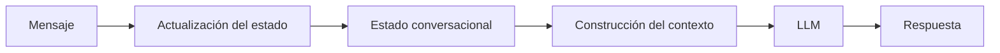

# Capitulo-19-Seccion-02-v0.1

# Módulo 2 — Prompt Engineering Profesional

# Capítulo 19 — Ingeniería Conversacional

**Versión:** 0.1  
**Estado:** Manuscrito del autor

> *"Una conversación inteligente no recuerda todo. Recuerda aquello que resulta relevante para alcanzar un objetivo."*

---

# Objetivos de aprendizaje

- Comprender el concepto de estado conversacional.
- Diferenciar estado, contexto y memoria.
- Analizar estrategias para administrar el estado en aplicaciones empresariales.
- Incorporar criterios de diseño para conversaciones de larga duración.

---

# Introducción

Una conversación humana mantiene continuidad porque las personas conservan información sobre lo ocurrido previamente.

En una aplicación basada en Large Language Models (LLM), esa continuidad no aparece de manera automática.

El sistema debe decidir qué información conservar, cuándo actualizarla y en qué momento dejar de utilizarla.

Ese conjunto de decisiones conforma el **estado conversacional**.

---

# ¿Qué es el estado conversacional?

El estado representa la información necesaria para continuar una conversación de forma coherente.

No incluye todo el historial.

Incluye únicamente aquello que resulta indispensable para interpretar correctamente la siguiente interacción.

---

# Estado, contexto y memoria

Aunque suelen confundirse, cumplen responsabilidades distintas.

| Concepto | Propósito | Duración |
|----------|-----------|----------|
| Estado | Situación actual de la conversación. | Temporal |
| Contexto | Información enviada al modelo en una inferencia. | Instantánea |
| Memoria | Información reutilizable entre conversaciones o sesiones. | Persistente |

Comprender esta separación permite construir aplicaciones más escalables y fáciles de mantener.

---

# Estrategias de representación

Existen diversas formas de administrar el estado.

- Variables estructuradas asociadas a la sesión.
- Objetos de dominio que representan el avance de un proceso.
- Máquinas de estados para flujos conversacionales.
- Eventos almacenados cronológicamente.
- Combinaciones de las estrategias anteriores.

La elección dependerá del problema de negocio y del nivel de complejidad requerido.

---

# Caso de estudio

Un asistente guía a un ciudadano durante la solicitud de un beneficio.

El sistema debe recordar:

- si la identidad ya fue validada;
- qué documentación fue presentada;
- qué etapa del proceso se encuentra activa;
- qué preguntas continúan pendientes.

Enviar el historial completo al modelo en cada interacción incrementaría costos y complejidad.

Mantener un estado estructurado permite reconstruir únicamente el contexto necesario para cada paso.

---

# Buenas prácticas

- Mantener el estado mínimo indispensable.
- Separar información transitoria de datos persistentes.
- Versionar la estructura del estado cuando evolucione el sistema.
- Evitar almacenar información redundante.

---

# Errores frecuentes

- Utilizar el historial completo como único mecanismo de continuidad.
- Confundir estado con memoria permanente.
- Actualizar el estado sin reglas claras.
- No validar la coherencia entre estado y contexto.

---

# Ideas clave

- El estado conversacional representa la situación actual del diálogo.
- No toda la información debe conservarse indefinidamente.
- Diseñar correctamente el estado mejora la eficiencia y la calidad de la conversación.

---

# Transición hacia la siguiente sección

En la próxima sección estudiaremos cómo administrar el contexto conversacional y qué estrategias permiten mantener conversaciones extensas sin superar las limitaciones del contexto disponible para el modelo.

---

> **"Un arquitecto no memoriza respuestas. Comprende problemas para poder diseñar soluciones."**
