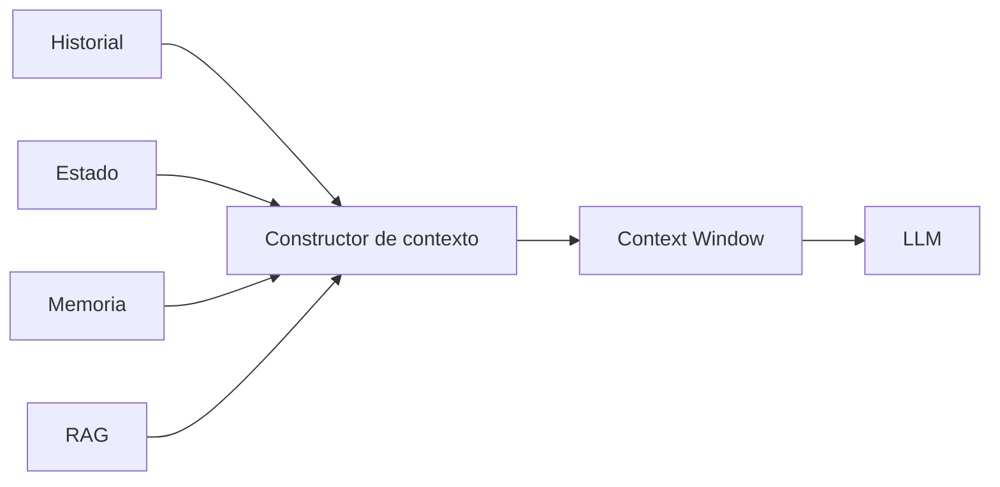

# Capitulo-19-Seccion-03-v0.1

# Módulo 2 — Prompt Engineering Profesional

# Capítulo 19 — Ingeniería Conversacional

**Versión:** 0.1  
**Estado:** Manuscrito del autor

> *"El contexto no consiste en enviar más información al modelo. Consiste en enviar únicamente la información correcta en el momento adecuado."*

---

# Objetivos de aprendizaje

- Comprender cómo administrar el contexto conversacional.
- Analizar el impacto del contexto sobre calidad, costo y rendimiento.
- Estudiar estrategias para mantener conversaciones extensas.
- Diseñar mecanismos de construcción dinámica del contexto.

---

# Introducción

Toda conversación depende del contexto disponible durante cada interacción.

En los Large Language Models (LLM), dicho contexto se materializa en la información enviada dentro del *context window*.

Una estrategia ingenua consistiría en reenviar todo el historial en cada consulta.

Aunque sencilla, esta aproximación incrementa el consumo de tokens, aumenta la latencia y termina deteriorando la eficiencia del sistema.

La Ingeniería Conversacional propone un enfoque diferente: construir dinámicamente el contexto necesario para cada inferencia.

---

# El contexto como recurso limitado

El contexto constituye un recurso finito.

Cada token utilizado para transmitir información histórica reduce el espacio disponible para nuevas instrucciones, documentos o respuestas.

La calidad del sistema depende tanto de **qué información se incorpora** como de **qué información se descarta**.

---

# Estrategias de construcción

Existen diversas estrategias para administrar conversaciones largas.

| Estrategia | Características |
|------------|-----------------|
| Historial completo | Simple, pero poco escalable. |
| Ventana deslizante | Conserva únicamente los mensajes recientes. |
| Resúmenes progresivos | Reemplaza conversaciones antiguas por síntesis. |
| Estado estructurado | Mantiene únicamente información relevante del proceso. |
| Contexto híbrido | Combina estado, memoria y recuperación mediante RAG. |

Cada alternativa representa un equilibrio diferente entre costo, precisión y complejidad.

---

# Selección inteligente del contexto

Desde la perspectiva del AI Engineering, el contexto debería construirse respondiendo preguntas como:

- ¿Qué información resulta imprescindible para resolver esta consulta?
- ¿Qué datos pertenecen al estado actual?
- ¿Qué información puede recuperarse bajo demanda mediante RAG?
- ¿Qué elementos dejaron de ser relevantes?

Este proceso convierte la construcción del contexto en una decisión arquitectónica y no simplemente en una concatenación de mensajes.

---

# Caso de estudio

Un asistente acompaña durante varias semanas el proceso de implementación de un sistema ERP.

Enviar todas las conversaciones anteriores al modelo resulta inviable.

La solución adoptada combina:

- estado estructurado del proyecto;
- resumen de reuniones anteriores;
- recuperación de documentos técnicos mediante RAG;
- últimos mensajes intercambiados.

El modelo recibe únicamente la información necesaria para continuar la conversación con coherencia.

---

# Buenas prácticas

- Construir el contexto dinámicamente.
- Minimizar información redundante.
- Separar historial, estado y memoria.
- Evaluar periódicamente el tamaño promedio del contexto.

---

# Errores frecuentes

- Reenviar el historial completo en todas las consultas.
- Confiar únicamente en el contexto reciente.
- Mezclar información temporal y permanente.
- Ignorar el costo asociado al crecimiento del contexto.

---

# Ideas clave

- El contexto es un recurso limitado que debe administrarse.
- La construcción dinámica mejora eficiencia y escalabilidad.
- Una buena arquitectura conversacional envía menos información, pero más relevante.

---

# Transición hacia la siguiente sección

En la próxima sección estudiaremos la memoria conversacional y analizaremos cómo conservar información útil entre sesiones sin depender exclusivamente del contexto enviado al modelo.

---

> **"Un arquitecto no memoriza respuestas. Comprende problemas para poder diseñar soluciones."**
