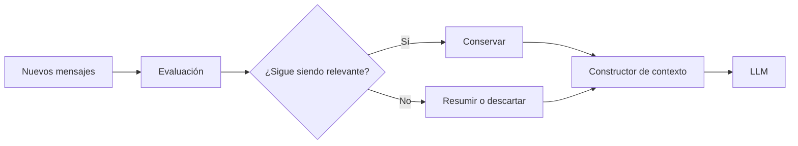

# Capitulo-19-Seccion-05-v0.1

# Módulo 2 — Prompt Engineering Profesional

# Capítulo 19 — Ingeniería Conversacional

**Versión:** 0.1  
**Estado:** Manuscrito del autor

> *"Una conversación extensa no se sostiene recordando cada palabra. Se sostiene preservando aquello que mantiene vivo el significado."*

---

# Objetivos de aprendizaje

- Comprender el papel del historial conversacional.
- Analizar estrategias para administrar conversaciones de larga duración.
- Estudiar técnicas de resumen progresivo y compresión del contexto.
- Diseñar conversaciones escalables desde una perspectiva de AI Engineering.

---

# Introducción

A medida que una conversación crece, también lo hace la cantidad de información potencialmente relevante.

Reenviar todo el historial en cada interacción incrementa el consumo de tokens, aumenta la latencia y dificulta identificar qué información continúa siendo útil.

La Ingeniería Conversacional propone administrar el historial como un recurso dinámico, preservando el significado de la conversación sin depender de una copia íntegra de todos los mensajes.

---

# El ciclo de vida del historial

El historial no es un bloque estático de texto.

Cada nueva interacción modifica su valor para futuras consultas.

Administrar el historial implica decidir qué conservar, qué resumir y qué eliminar.

---

# Estrategias habituales

| Estrategia | Ventajas | Limitaciones |
|------------|----------|--------------|
| Historial completo | Máxima fidelidad. | Alto consumo de tokens. |
| Ventana deslizante | Baja latencia. | Puede perder información antigua. |
| Resúmenes progresivos | Reduce costos manteniendo continuidad. | Requiere generar resúmenes de calidad. |
| Historial híbrido | Combina estado, memoria y mensajes recientes. | Mayor complejidad de implementación. |

No existe una estrategia universal. La elección depende del dominio y de los objetivos de la aplicación.

---

# Resúmenes progresivos

Una técnica ampliamente utilizada consiste en reemplazar segmentos antiguos de la conversación por un resumen estructurado.

Este resumen conserva:

- decisiones tomadas;
- objetivos pendientes;
- hechos relevantes;
- restricciones acordadas;
- eventos significativos.

De este modo, el sistema mantiene la continuidad sin consumir innecesariamente el contexto disponible.

---

# Caso de estudio

Un asistente acompaña durante meses la implementación de un proyecto tecnológico.

Cada semana se intercambian cientos de mensajes.

En lugar de conservar todo el historial, la plataforma genera automáticamente un resumen al finalizar cada reunión y actualiza el estado del proyecto.

Cuando el usuario retoma la conversación semanas después, el sistema reconstruye el contexto utilizando:

- el estado actual;
- los resúmenes históricos;
- los mensajes recientes;
- la documentación recuperada mediante RAG.

La conversación continúa con coherencia sin necesidad de reenviar miles de mensajes.

---

# Buenas prácticas

- Definir políticas claras para resumir el historial.
- Conservar únicamente información con valor futuro.
- Validar periódicamente la calidad de los resúmenes.
- Diferenciar historial operativo de memoria persistente.

---

# Errores frecuentes

- Mantener indefinidamente todo el historial.
- Resumir información crítica sin mecanismos de validación.
- Mezclar eventos históricos con estado actual.
- Ignorar el impacto del crecimiento del contexto sobre costos y rendimiento.

---

# Ideas clave

- El historial conversacional debe administrarse activamente.
- Los resúmenes progresivos permiten escalar conversaciones extensas.
- La continuidad depende de preservar significado, no necesariamente texto literal.

---

# Transición hacia la siguiente sección

En la próxima sección estudiaremos cómo diseñar flujos conversacionales guiados, incorporando objetivos, transiciones de estado y estrategias para conducir la interacción sin perder flexibilidad.

---

> **"Un arquitecto no memoriza respuestas. Comprende problemas para poder diseñar soluciones."**
