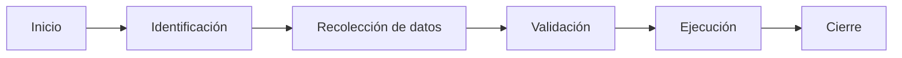

# Capitulo-19-Seccion-06-v0.1

# Módulo 2 — Prompt Engineering Profesional

# Capítulo 19 — Ingeniería Conversacional

**Versión:** 0.1  
**Estado:** Manuscrito del autor

> *"Una buena conversación no consiste únicamente en responder preguntas. Consiste en conducir al usuario hacia un objetivo sin perder naturalidad."*

---

# Objetivos de aprendizaje

- Comprender el concepto de flujo conversacional.
- Analizar cómo modelar conversaciones orientadas a objetivos.
- Diferenciar conversaciones libres y guiadas.
- Diseñar transiciones de estado para aplicaciones empresariales.

---

# Introducción

No todas las conversaciones poseen el mismo grado de libertad.

Un asistente creativo puede aceptar cambios permanentes de tema.

Un asistente para tramitar una licencia, registrar un reclamo o completar un proceso administrativo necesita conducir la interacción hacia un resultado concreto.

En estos escenarios, el diseño del flujo conversacional constituye una responsabilidad arquitectónica.

---

# Conversaciones orientadas a objetivos

En una conversación guiada cada interacción busca acercar al usuario a un estado final deseado.

Ese objetivo puede consistir en:

- completar un formulario;
- generar un documento;
- resolver una incidencia;
- registrar una operación;
- finalizar una compra.

El modelo deja de responder únicamente mensajes aislados y comienza a participar en un proceso.

---

# Estados y transiciones

Una forma habitual de representar estos procesos consiste en utilizar estados.

Cada estado define:

| Elemento | Función |
|----------|---------|
| Objetivo | Qué debe lograrse antes de avanzar. |
| Información requerida | Datos necesarios para continuar. |
| Reglas | Validaciones y restricciones. |
| Próximos estados | Caminos posibles según la interacción. |

El LLM participa en la conversación, pero la lógica de transición permanece bajo control de la aplicación.

---

# Conversaciones libres y guiadas

| Conversación libre | Conversación guiada |
|--------------------|---------------------|
| Alta flexibilidad. | Objetivo definido. |
| Cambios frecuentes de tema. | Flujo controlado. |
| Menor estructura. | Estados explícitos. |
| Predomina la creatividad. | Predomina la consistencia. |

Muchas soluciones empresariales combinan ambos enfoques.

---

# Caso de estudio

Un asistente ayuda a los empleados a solicitar vacaciones.

El usuario puede formular preguntas abiertas sobre políticas internas, pero el proceso de solicitud sigue un flujo definido:

1. identificar al empleado;
2. seleccionar fechas;
3. validar disponibilidad;
4. confirmar la solicitud;
5. registrar la operación.

La conversación conserva naturalidad mientras la aplicación controla el avance entre estados.

---

# Buenas prácticas

- Definir objetivos claros para cada etapa.
- Separar la lógica de negocio del comportamiento conversacional.
- Validar la información antes de avanzar de estado.
- Permitir retrocesos cuando resulte necesario.

---

# Errores frecuentes

- Delegar completamente el control del flujo al modelo.
- No representar explícitamente el estado del proceso.
- Mezclar conversación y reglas de negocio.
- Diseñar recorridos sin contemplar excepciones.

---

# Ideas clave

- Una conversación empresarial suele estar orientada a objetivos.
- Los estados permiten controlar procesos complejos sin perder flexibilidad.
- El LLM conversa; la aplicación gobierna el flujo.

---

# Transición hacia la siguiente sección

En la próxima sección estudiaremos cómo gestionar interrupciones, cambios de intención y recuperación del contexto, permitiendo construir conversaciones robustas frente a comportamientos impredecibles de los usuarios.

---

> **"Un arquitecto no memoriza respuestas. Comprende problemas para poder diseñar soluciones."**
