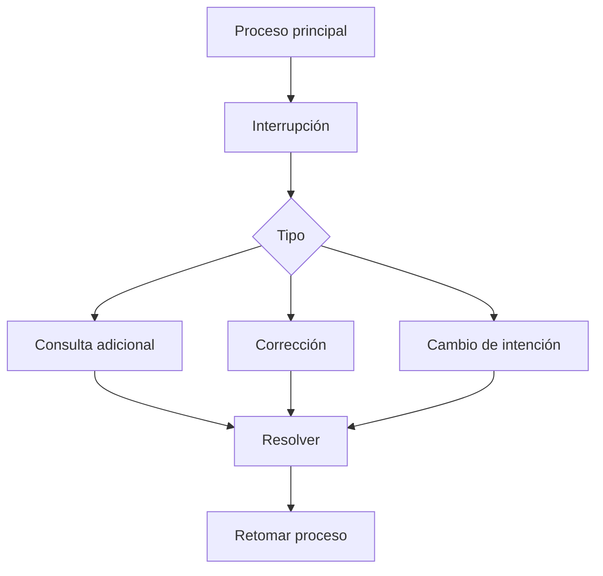

# Capitulo-19-Seccion-07-v0.1

# Módulo 2 — Prompt Engineering Profesional

# Capítulo 19 — Ingeniería Conversacional

**Versión:** 0.1  
**Estado:** Manuscrito del autor

> *"Una conversación robusta no es aquella en la que el usuario nunca se desvía. Es aquella que siempre encuentra el camino para continuar."*

---

# Objetivos de aprendizaje

- Comprender cómo gestionar interrupciones y cambios de intención.
- Analizar estrategias para recuperar el contexto conversacional.
- Diseñar conversaciones resilientes frente a comportamientos impredecibles.
- Introducir mecanismos de recuperación y continuidad.

---

# Introducción

En los ejemplos estudiados hasta ahora, las conversaciones evolucionaron siguiendo un recorrido relativamente ordenado.

Sin embargo, los usuarios reales rara vez mantienen ese comportamiento.

Durante una misma interacción pueden:

- cambiar de tema;
- formular varias preguntas simultáneamente;
- corregir información previamente ingresada;
- retomar un asunto tratado mucho tiempo atrás;
- abandonar temporalmente el proceso principal.

La Ingeniería Conversacional debe contemplar estas situaciones desde el diseño de la arquitectura y no únicamente mediante instrucciones incluidas en el prompt.

---

# Interrupciones conversacionales

Una interrupción representa cualquier evento que modifica temporalmente el flujo principal de la conversación.

No necesariamente constituye un error.

En muchos casos forma parte del comportamiento esperado del usuario.

El objetivo consiste en responder la interrupción sin perder el estado del proceso original.

---

# Cambios de intención

Uno de los mayores desafíos consiste en detectar cuándo el usuario ha cambiado realmente de objetivo.

Por ejemplo:

- pasar de solicitar vacaciones a consultar una política interna;
- abandonar un trámite para iniciar otro diferente;
- interrumpir una compra para modificar datos personales.

En estos casos, la aplicación debe decidir si:

- mantiene el flujo actual;
- suspende temporalmente el proceso;
- inicia una nueva conversación;
- solicita confirmación antes de cambiar de contexto.

---

# Recuperación del contexto

Una vez resuelta la interrupción, el sistema debe reconstruir el contexto necesario para continuar.

Las estrategias más habituales incluyen:

| Estrategia | Beneficio |
|------------|-----------|
| Estado estructurado | Recuperación inmediata del proceso. |
| Resumen del último objetivo | Facilita retomar la conversación. |
| Memoria de corto plazo | Conserva información reciente. |
| Historial resumido | Evita reenviar conversaciones completas. |

La recuperación del contexto debe ser transparente para el usuario.

---

# Caso de estudio

Un ciudadano inicia el trámite para renovar un permiso.

Mientras completa el proceso, pregunta cuáles son los requisitos para un familiar.

El asistente responde la consulta adicional y luego continúa exactamente en el punto donde había quedado la renovación original, sin solicitar nuevamente la información ya proporcionada.

La conversación mantiene coherencia gracias a una correcta administración del estado y del contexto.

---

# Buenas prácticas

- Modelar explícitamente las interrupciones posibles.
- Permitir regresar al flujo principal sin pérdida de información.
- Confirmar cambios de intención cuando exista ambigüedad.
- Separar claramente los procesos activos de las consultas secundarias.

---

# Errores frecuentes

- Reiniciar la conversación ante cualquier interrupción.
- Perder el estado del proceso principal.
- Mezclar objetivos diferentes dentro del mismo contexto.
- Asumir cambios de intención sin validarlos.

---

# Ideas clave

- Las interrupciones forman parte del comportamiento normal de los usuarios.
- La recuperación del contexto constituye una capacidad arquitectónica.
- Una conversación robusta combina flexibilidad con control del estado.

---

# Transición hacia la siguiente sección

En la próxima sección estudiaremos patrones avanzados de Ingeniería Conversacional para coordinar múltiples conversaciones, asistentes especializados y procesos paralelos dentro de una misma solución empresarial.

---

> **"Un arquitecto no memoriza respuestas. Comprende problemas para poder diseñar soluciones."**
