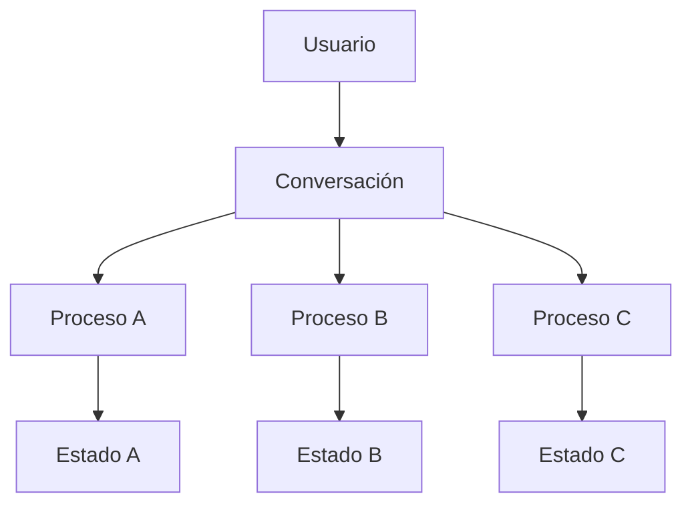

# Capitulo-19-Seccion-08-v0.1

# Módulo 2 — Prompt Engineering Profesional

# Capítulo 19 — Ingeniería Conversacional

**Versión:** 0.1  
**Estado:** Manuscrito del autor

> *"Las conversaciones complejas no se vuelven inmanejables por su duración. Se vuelven inmanejables cuando no existe una estrategia para coordinarlas."*

---

# Objetivos de aprendizaje

- Comprender cómo coordinar conversaciones complejas.
- Analizar conversaciones paralelas y asistentes especializados.
- Introducir patrones de orquestación conversacional.
- Diseñar soluciones escalables para entornos empresariales.

---

# Introducción

Hasta este punto hemos considerado conversaciones que persiguen un único objetivo.

Sin embargo, muchas soluciones empresariales requieren administrar múltiples procesos simultáneamente.

Un asistente puede responder preguntas generales, consultar documentación mediante RAG, ejecutar herramientas, coordinar agentes especializados y mantener varios procesos abiertos con el mismo usuario.

La Ingeniería Conversacional moderna debe organizar esta complejidad sin perder coherencia.

---

# Conversaciones paralelas

Una conversación puede contener varios hilos activos.

Por ejemplo:

- un trámite administrativo en curso;
- una consulta sobre normativa;
- una solicitud de generación de un informe.

Cada hilo posee su propio estado, aunque todos comparten un mismo usuario.

La arquitectura debe impedir que el contexto de un proceso contamine a los demás.

---

# Orquestación conversacional

En lugar de construir un único asistente monolítico, muchas plataformas utilizan un orquestador.

Su función consiste en decidir:

| Decisión | Ejemplo |
|----------|---------|
| Qué proceso continúa activo | Retomar un trámite iniciado previamente. |
| Qué especialista interviene | Consultar un agente financiero o legal. |
| Qué memoria recuperar | Preferencias del usuario o datos del proceso. |
| Qué herramientas utilizar | ERP, CRM, RAG o APIs externas. |

El LLM participa en la conversación, mientras que la aplicación coordina el flujo global.

---

# Beneficios del enfoque modular

Una arquitectura basada en conversaciones coordinadas ofrece:

- mayor escalabilidad;
- reutilización de componentes;
- aislamiento entre procesos;
- mantenimiento más sencillo;
- incorporación gradual de nuevos asistentes.

Estos beneficios resultan especialmente relevantes en plataformas empresariales de gran tamaño.

---

# Caso de estudio

Una universidad implementa un asistente institucional.

Durante la misma sesión un estudiante:

1. consulta el calendario académico;
2. inicia un trámite administrativo;
3. solicita ayuda sobre una materia;
4. pregunta por el estado de una beca.

El orquestador mantiene cada proceso de forma independiente y reconstruye el contexto adecuado cuando el estudiante retoma cualquiera de ellos.

La experiencia permanece fluida sin mezclar información entre dominios.

---

# Buenas prácticas

- Mantener estados independientes por proceso.
- Centralizar la orquestación conversacional.
- Recuperar únicamente el contexto necesario.
- Definir responsabilidades claras para cada asistente especializado.

---

# Errores frecuentes

- Compartir un único contexto para todos los procesos.
- Delegar toda la coordinación al modelo.
- Mezclar memorias pertenecientes a dominios distintos.
- No contemplar conversaciones paralelas.

---

# Ideas clave

- Una plataforma empresarial puede mantener múltiples conversaciones lógicas al mismo tiempo.
- La orquestación constituye una responsabilidad arquitectónica.
- La modularidad mejora la escalabilidad y el mantenimiento.

---

# Transición hacia la siguiente sección

En la próxima sección analizaremos principios de diseño para construir experiencias conversacionales consistentes, preparando el cierre del capítulo y su integración con las arquitecturas basadas en prompts y agentes.

---

> **"Un arquitecto no memoriza respuestas. Comprende problemas para poder diseñar soluciones."**
