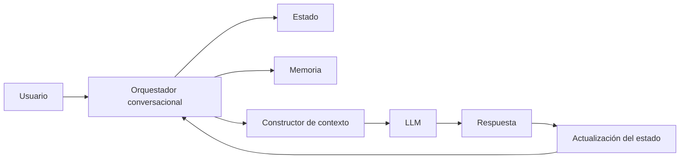

# Capitulo-19-Seccion-09-v0.1

# Módulo 2 — Prompt Engineering Profesional

# Capítulo 19 — Ingeniería Conversacional

**Versión:** 0.1  
**Estado:** Manuscrito del autor

> *"Una conversación bien diseñada no se mide por la cantidad de respuestas generadas, sino por la facilidad con la que el usuario alcanza su objetivo."*

---

# Objetivos de aprendizaje

- Integrar los principios fundamentales de la Ingeniería Conversacional.
- Analizar criterios para diseñar experiencias conversacionales consistentes.
- Comprender la relación entre conversación, arquitectura y experiencia de usuario.
- Preparar la transición hacia las arquitecturas basadas en prompts.

---

# Introducción

A lo largo de este capítulo estudiamos cómo una conversación empresarial requiere mucho más que un modelo capaz de responder preguntas.

Analizamos el estado conversacional, el contexto, la memoria, el historial, los flujos guiados, la gestión de interrupciones y la coordinación entre múltiples procesos.

Todos estos elementos convergen en un mismo objetivo: construir experiencias conversacionales útiles, coherentes y sostenibles.

La calidad de una conversación no depende únicamente del modelo utilizado. Depende, sobre todo, de las decisiones arquitectónicas que organizan la interacción.

---

# Principios de diseño

Toda solución conversacional madura debería apoyarse en un conjunto de principios estables.

| Principio | Finalidad |
|-----------|-----------|
| Claridad | Facilitar la comprensión de cada interacción. |
| Continuidad | Mantener coherencia entre mensajes y sesiones. |
| Relevancia | Incorporar únicamente el contexto necesario. |
| Recuperación | Permitir retomar procesos sin pérdida de información. |
| Gobernanza | Registrar estado, memoria y decisiones relevantes. |

Estos principios constituyen una guía para el diseño de asistentes empresariales de cualquier dominio.

---

# Arquitectura conversacional integrada

La conversación deja de depender exclusivamente del modelo y pasa a ser coordinada por una arquitectura especializada.

---

# Conversación como proceso

Desde la perspectiva del AI Engineering, una conversación puede entenderse como un proceso de negocio.

Cada interacción:

- modifica el estado;
- consume contexto;
- puede recuperar memoria;
- produce nuevos eventos;
- genera información para futuras decisiones.

Este enfoque facilita la integración con sistemas corporativos, motores de workflow y agentes especializados.

---

# Caso de estudio

Una compañía de seguros implementa un asistente para gestionar siniestros.

El usuario puede iniciar una denuncia, consultar documentación, cargar evidencia fotográfica, solicitar el estado del trámite y recibir recomendaciones.

Aunque todas estas acciones forman parte de una misma conversación, la plataforma administra estados independientes, memoria persistente y recuperación selectiva del contexto.

El resultado es una experiencia continua que acompaña al usuario durante todo el ciclo de vida del proceso.

---

# Buenas prácticas

- Diseñar conversaciones alineadas con procesos de negocio.
- Mantener responsabilidades separadas entre conversación y lógica de negocio.
- Construir mecanismos explícitos de contexto, estado y memoria.
- Medir la experiencia conversacional mediante indicadores objetivos.

---

# Errores frecuentes

- Considerar que un LLM resuelve por sí solo la experiencia conversacional.
- Utilizar historiales ilimitados como única estrategia de continuidad.
- Acoplar el flujo conversacional a reglas de negocio difíciles de mantener.
- Ignorar la evolución de la conversación a lo largo del tiempo.

---

# Ideas clave

- La Ingeniería Conversacional integra múltiples componentes arquitectónicos.
- El modelo constituye solo una parte de la solución.
- Diseñar conversaciones implica diseñar procesos, estados y decisiones.

---

# Transición hacia el siguiente capítulo

En el próximo capítulo estudiaremos las **Arquitecturas Basadas en Prompts**, analizando cómo estructurar aplicaciones donde los prompts dejan de ser instrucciones aisladas para convertirse en componentes reutilizables dentro de soluciones complejas de AI Engineering.

---

> **"Un arquitecto no memoriza respuestas. Comprende problemas para poder diseñar soluciones."**
