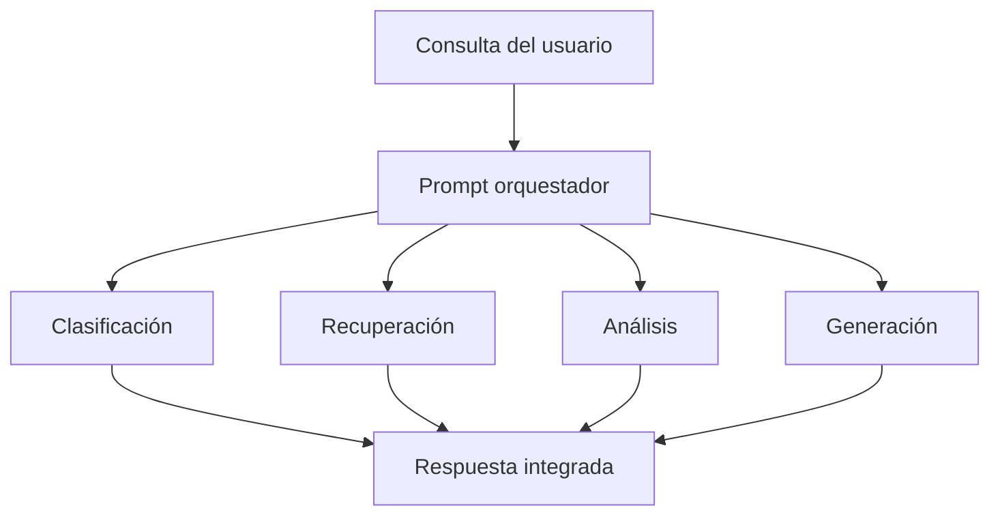

# Capitulo-20-Seccion-03-v0.1

# Módulo 2 — Prompt Engineering Profesional

# Capítulo 20 — Arquitecturas Basadas en Prompts

**Versión:** 0.1  
**Estado:** Manuscrito del autor

> *"Una arquitectura jerárquica no busca concentrar decisiones. Busca distribuir responsabilidades de forma organizada."*

---

# Objetivos de aprendizaje

- Comprender el concepto de arquitecturas jerárquicas de prompts.
- Analizar el papel de un prompt orquestador.
- Diferenciar coordinación de ejecución.
- Diseñar soluciones escalables mediante componentes especializados.

---

# Introducción

A medida que una plataforma incorpora nuevos casos de uso, aumenta la cantidad de prompts necesarios para resolverlos.

Intentar conectar todos los componentes entre sí genera dependencias difíciles de mantener.

Una alternativa consiste en introducir un nivel de coordinación que organice la interacción entre prompts especializados.

En este enfoque aparece el **prompt orquestador**, responsable de decidir qué componente debe intervenir en cada etapa del proceso.

---

# Arquitectura jerárquica

En una arquitectura jerárquica los prompts no colaboran de manera desordenada.

Existe un componente coordinador que interpreta la solicitud, determina la estrategia de resolución y delega cada tarea al prompt más apropiado.

La inteligencia de la solución surge de la colaboración entre componentes, no de un único prompt de gran tamaño.

---

# Responsabilidades del orquestador

El componente coordinador puede asumir funciones como:

| Responsabilidad | Objetivo |
|-----------------|----------|
| Interpretar la intención | Comprender el objetivo principal del usuario. |
| Seleccionar componentes | Elegir el prompt adecuado para cada tarea. |
| Construir el contexto | Enviar únicamente la información necesaria. |
| Integrar resultados | Unificar respuestas parciales. |
| Gestionar errores | Definir estrategias de recuperación. |

Es importante observar que el orquestador no reemplaza a los componentes especializados.

Su función consiste en coordinar su trabajo.

---

# Coordinación y desacoplamiento

Una arquitectura jerárquica favorece el desacoplamiento.

Cada prompt puede evolucionar de manera independiente mientras respete el contrato definido por el orquestador.

Esto permite:

- incorporar nuevos componentes sin modificar todo el sistema;
- sustituir prompts por versiones mejoradas;
- reutilizar componentes en distintos flujos;
- realizar pruebas de manera aislada.

---

# Caso de estudio

Una organización desarrolla un asistente corporativo que responde consultas legales, financieras y de recursos humanos.

El orquestador identifica el dominio de la consulta y deriva el procesamiento al componente correspondiente.

Posteriormente integra la información obtenida y genera una respuesta consistente para el usuario.

Cuando el área financiera modifica sus políticas, únicamente evoluciona el prompt especializado de ese dominio.

La arquitectura completa permanece estable.

---

# Buenas prácticas

- Mantener al orquestador enfocado en la coordinación.
- Definir contratos claros entre componentes.
- Minimizar el acoplamiento entre prompts especializados.
- Registrar las decisiones del orquestador para facilitar auditoría.

---

# Errores frecuentes

- Convertir al orquestador en un componente monolítico.
- Duplicar responsabilidades entre prompts.
- Permitir dependencias directas innecesarias.
- Acoplar la lógica de negocio al mecanismo de coordinación.

---

# Ideas clave

- La jerarquía organiza la colaboración entre prompts.
- El orquestador coordina; los componentes especializados ejecutan.
- El desacoplamiento facilita la evolución de la arquitectura.

---

# Transición hacia la siguiente sección

En la próxima sección estudiaremos arquitecturas basadas en cadenas y grafos de prompts, analizando cómo modelar flujos dinámicos que adapten su comportamiento según el contexto y los resultados obtenidos en cada etapa.

---

> **"Un arquitecto no memoriza respuestas. Comprende problemas para poder diseñar soluciones."**
