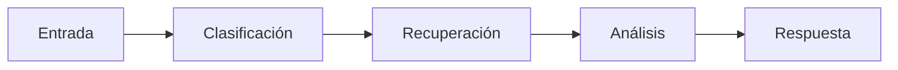
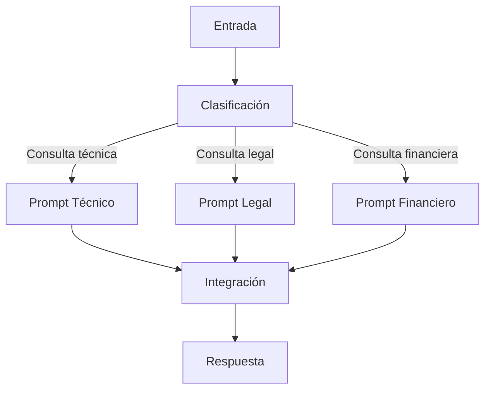

# Capitulo-20-Seccion-04-v0.1

# Módulo 2 — Prompt Engineering Profesional

# Capítulo 20 — Arquitecturas Basadas en Prompts

**Versión:** 0.1  
**Estado:** Manuscrito del autor

> *"Las arquitecturas más flexibles no siguen siempre el mismo camino. Deciden el camino mientras avanzan."*

---

# Objetivos de aprendizaje

- Comprender las diferencias entre cadenas y grafos de prompts.
- Analizar flujos secuenciales y dinámicos.
- Diseñar arquitecturas adaptativas basadas en decisiones.
- Introducir criterios para modelar rutas de ejecución.

---

# Introducción

Las primeras aplicaciones construidas con Large Language Models (LLM) resolvían los problemas mediante secuencias lineales de prompts.

Con el crecimiento de la complejidad aparecieron escenarios donde el siguiente paso dependía del resultado obtenido en el anterior.

En estos casos, una cadena fija deja de ser suficiente y la arquitectura comienza a comportarse como un grafo de decisiones.

---

# Cadenas de prompts

Una cadena representa una secuencia predefinida.

Cada componente recibe la salida del anterior y ejecuta una única responsabilidad.

Las cadenas resultan apropiadas cuando el proceso es estable y todas las ejecuciones siguen el mismo recorrido.

---

# Grafos de prompts

En un grafo, el flujo puede bifurcarse según el contexto, el resultado de una validación o la información recuperada.

Cada nodo representa un componente especializado y cada transición responde a una decisión arquitectónica.

---

# ¿Cuándo utilizar cada enfoque?

| Arquitectura | Escenario recomendado |
|--------------|----------------------|
| Cadena | Procesos repetitivos y lineales. |
| Grafo | Procesos con múltiples alternativas. |
| Híbrida | Soluciones empresariales complejas. |

En la práctica, la mayoría de las plataformas modernas combinan ambos modelos.

---

# Decisiones dinámicas

Una arquitectura basada en grafos permite decidir en tiempo de ejecución:

- qué prompts ejecutar;
- cuáles omitir;
- qué herramientas invocar;
- cuándo finalizar el proceso;
- cuándo solicitar información adicional.

La aplicación deja de ejecutar una secuencia rígida y pasa a construir el recorrido más adecuado para cada situación.

---

# Caso de estudio

Una plataforma de atención al ciudadano recibe consultas de distintos organismos.

El primer componente identifica el dominio de la consulta.

A partir de esa decisión, el flujo deriva hacia prompts especializados, recupera documentación específica mediante RAG y finalmente integra toda la información en una respuesta única.

El recorrido cambia para cada consulta sin modificar la arquitectura general.

---

# Buenas prácticas

- Diseñar nodos con responsabilidades bien definidas.
- Mantener reglas explícitas para las transiciones.
- Evitar grafos excesivamente complejos.
- Registrar el camino seguido durante cada ejecución.

---

# Errores frecuentes

- Modelar todos los procesos como cadenas lineales.
- Incorporar bifurcaciones innecesarias.
- Ocultar la lógica de decisión dentro de los prompts.
- No registrar las rutas recorridas.

---

# Ideas clave

- Las cadenas simplifican procesos lineales.
- Los grafos permiten adaptar el flujo a cada problema.
- La arquitectura debe equilibrar simplicidad, flexibilidad y mantenibilidad.

---

# Transición hacia la siguiente sección

En la próxima sección estudiaremos cómo integrar arquitecturas basadas en prompts con RAG, Tool Calling y agentes, mostrando cómo estos componentes colaboran dentro de una plataforma moderna de AI Engineering.

---

> **"Un arquitecto no memoriza respuestas. Comprende problemas para poder diseñar soluciones."**
