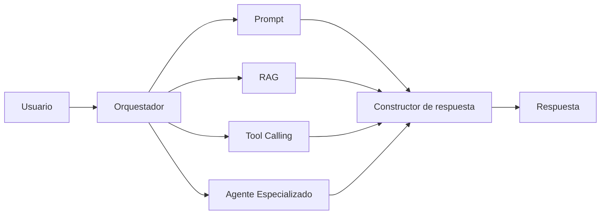

# Capitulo-20-Seccion-05-v0.1

# Módulo 2 — Prompt Engineering Profesional

# Capítulo 20 — Arquitecturas Basadas en Prompts

**Versión:** 0.1  
**Estado:** Manuscrito del autor

> *"Una arquitectura moderna no elige entre prompts, RAG o herramientas. Los integra para resolver problemas reales."*

---

# Objetivos de aprendizaje

- Comprender cómo se integran los prompts con otras capacidades de IA.
- Analizar el papel de RAG, Tool Calling y Agentes dentro de una arquitectura.
- Diferenciar responsabilidades entre componentes.
- Diseñar soluciones desacopladas y extensibles.

---

# Introducción

Las arquitecturas basadas en prompts constituyen el núcleo lógico de muchas aplicaciones modernas, pero rara vez operan de forma aislada.

Una solución empresarial suele combinar múltiples capacidades:

- prompts especializados;
- recuperación de información mediante RAG;
- ejecución de herramientas;
- integración con APIs;
- agentes especializados;
- motores de workflow.

El desafío consiste en coordinar estos componentes sin convertir la solución en un sistema monolítico.

---

# Arquitectura integrada

En esta arquitectura, el prompt deja de ser el único protagonista y pasa a colaborar con otros componentes especializados.

---

# Responsabilidades de cada componente

| Componente | Responsabilidad |
|------------|-----------------|
| Prompt | Interpretar instrucciones y generar razonamiento. |
| RAG | Recuperar conocimiento externo actualizado. |
| Tool Calling | Ejecutar acciones sobre sistemas externos. |
| Agente | Coordinar tareas complejas y objetivos. |
| Orquestador | Decidir el flujo y administrar el estado. |

Esta separación favorece la mantenibilidad y la evolución independiente de cada elemento.

---

# Principios de integración

Al diseñar una arquitectura integrada conviene respetar algunos principios:

- cada componente debe tener una responsabilidad única;
- la información debe circular mediante contratos claros;
- el contexto debe construirse dinámicamente;
- las decisiones deben ser observables y auditables;
- la lógica de negocio debe permanecer fuera del prompt cuando sea posible.

Estos principios permiten escalar la solución sin incrementar innecesariamente la complejidad.

---

# Caso de estudio

Una empresa implementa un asistente para soporte técnico.

El flujo de resolución incluye:

1. clasificar la consulta mediante un prompt;
2. recuperar documentación técnica utilizando RAG;
3. consultar el inventario mediante una API;
4. ejecutar un diagnóstico con una herramienta especializada;
5. generar una respuesta personalizada para el usuario.

Cada componente cumple una función concreta y el orquestador decide cuándo debe intervenir.

---

# Buenas prácticas

- Diseñar componentes independientes.
- Utilizar RAG para conocimiento dinámico.
- Reservar Tool Calling para acciones verificables.
- Delegar la coordinación en un orquestador.
- Medir el desempeño de cada etapa del flujo.

---

# Errores frecuentes

- Resolver todos los problemas con un único prompt.
- Duplicar información entre RAG y contexto.
- Mezclar razonamiento con lógica de integración.
- Acoplar herramientas directamente al modelo.

---

# Ideas clave

- Las arquitecturas modernas integran múltiples capacidades.
- Los prompts constituyen un componente más del ecosistema.
- La separación de responsabilidades incrementa la escalabilidad y la calidad.

---

# Transición hacia la siguiente sección

En la próxima sección analizaremos patrones arquitectónicos reutilizables para aplicaciones basadas en LLM y construiremos un catálogo de referencia que servirá de base para los módulos de RAG, Agentes y AI Engineering.

---

> **"Un arquitecto no memoriza respuestas. Comprende problemas para poder diseñar soluciones."**
