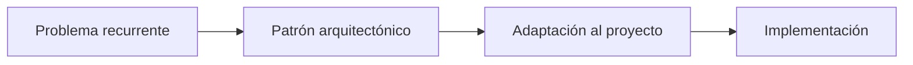

# Capitulo-20-Seccion-06-v0.1

# Módulo 2 — Prompt Engineering Profesional

# Capítulo 20 — Arquitecturas Basadas en Prompts

**Versión:** 0.1  
**Estado:** Manuscrito del autor

> *"Las arquitecturas maduras no nacen de la improvisación. Surgen de patrones que demostraron ser útiles una y otra vez."*

---

# Objetivos de aprendizaje

- Comprender el concepto de patrón arquitectónico aplicado a LLM.
- Identificar patrones reutilizables en soluciones basadas en prompts.
- Analizar criterios para seleccionar un patrón adecuado.
- Preparar las bases para arquitecturas de RAG y Agentes.

---

# Introducción

En ingeniería de software, un patrón arquitectónico representa una solución reutilizable para un problema recurrente.

No constituye una implementación específica, sino una guía que resume experiencias acumuladas y buenas prácticas.

Las aplicaciones basadas en Large Language Models (LLM) presentan desafíos similares.

Con el tiempo han surgido patrones que permiten organizar prompts, herramientas, memoria y flujos conversacionales de manera consistente.

Comprender estos patrones facilita el diseño de soluciones más robustas y reduce la necesidad de reinventar la arquitectura en cada proyecto.

---

# ¿Qué es un patrón arquitectónico?

Un patrón arquitectónico describe cómo se relacionan distintos componentes para resolver un tipo de problema.

No impone tecnologías concretas ni modelos específicos.

Su propósito consiste en ofrecer una estructura que pueda adaptarse a distintos contextos.

El patrón actúa como una referencia que guía las decisiones de diseño.

---

# Patrones frecuentes en aplicaciones con LLM

A continuación se presentan algunos de los patrones más utilizados.

| Patrón | Objetivo principal |
|--------|--------------------|
| Pipeline | Resolver tareas secuenciales. |
| Router | Derivar solicitudes al componente adecuado. |
| Orquestador | Coordinar múltiples componentes especializados. |
| Retrieval-Augmented | Incorporar conocimiento externo mediante RAG. |
| Multiagente | Distribuir responsabilidades entre agentes especializados. |
| Workflow | Modelar procesos con estados y reglas de negocio. |

Cada patrón responde a necesidades diferentes y puede combinarse con los demás.

---

# ¿Cómo seleccionar un patrón?

La elección no depende únicamente de la tecnología disponible.

Conviene analizar aspectos como:

- naturaleza del problema;
- cantidad de componentes involucrados;
- necesidad de escalabilidad;
- requisitos de mantenimiento;
- volumen esperado de usuarios;
- complejidad del flujo de negocio.

En muchos casos, la mejor solución consiste en combinar varios patrones dentro de una misma arquitectura.

---

# Caso de estudio

Una empresa desarrolla una plataforma para atención ciudadana.

Durante una primera etapa implementa un patrón de **Pipeline** para resolver consultas simples.

Posteriormente incorpora un **Router** que deriva las solicitudes hacia asistentes especializados y un componente **Retrieval-Augmented** para consultar normativa vigente.

Finalmente agrega un **Workflow** para gestionar trámites administrativos de larga duración.

La arquitectura evoluciona sin reemplazar los componentes existentes.

Cada nuevo patrón amplía las capacidades del sistema respetando el diseño previo.

---

# Buenas prácticas

- Seleccionar patrones en función del problema y no de la tecnología.
- Favorecer la composición de patrones sencillos.
- Documentar las decisiones arquitectónicas.
- Mantener desacopladas las responsabilidades.

---

# Errores frecuentes

- Elegir patrones por moda.
- Implementar arquitecturas excesivamente complejas desde el inicio.
- Confundir un patrón con una herramienta específica.
- Reemplazar una arquitectura estable sin una necesidad justificada.

---

# Ideas clave

- Los patrones arquitectónicos representan conocimiento reutilizable.
- No existe un patrón universal para todos los proyectos.
- Una arquitectura madura suele combinar varios patrones complementarios.

---

# Transición hacia la siguiente sección

En la próxima sección construiremos un catálogo de referencia que resumirá las arquitecturas estudiadas y mostrará cómo evolucionan desde soluciones simples hasta plataformas modernas de AI Engineering.

---

> **"Un arquitecto no memoriza respuestas. Comprende problemas para poder diseñar soluciones."**
