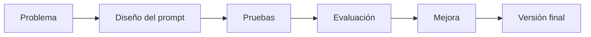

# Capitulo-21-Seccion-01-v0.1

# Módulo 2 — Prompt Engineering Profesional

# Capítulo 21 — Laboratorios de Prompt Engineering

**Versión:** 0.1  
**Estado:** Manuscrito del autor

> *"La ingeniería se aprende comprendiendo conceptos, pero se domina resolviendo problemas."*

---

# Objetivos de aprendizaje

- Comprender la finalidad de los laboratorios del módulo.
- Integrar los conceptos estudiados en escenarios prácticos.
- Introducir una metodología sistemática para experimentar con prompts.
- Preparar al lector para resolver casos reales de AI Engineering.

---

# Introducción

Los capítulos anteriores desarrollaron los fundamentos del Prompt Engineering desde una perspectiva de ingeniería.

Se estudiaron patrones, prácticas para producción, ingeniería conversacional y arquitecturas basadas en prompts.

A partir de este capítulo cambia la dinámica del aprendizaje.

El objetivo deja de ser incorporar nuevos conceptos y pasa a ser **aplicarlos** en situaciones representativas del mundo profesional.

Cada laboratorio propone un problema, una estrategia de resolución y un conjunto de criterios para evaluar el resultado obtenido.

---

# ¿Por qué laboratorios?

Leer un prompt bien diseñado permite comprender una técnica.

Construirlo, evaluarlo y mejorarlo permite desarrollar una competencia.

Por este motivo, los laboratorios no buscan presentar "la respuesta correcta", sino reproducir el proceso de diseño propio de un AI Engineer.

Cada iteración aporta información para la siguiente.

---

# Metodología de trabajo

Todos los laboratorios del módulo seguirán una estructura común.

| Etapa | Objetivo |
|-------|----------|
| Análisis | Comprender el problema de negocio. |
| Diseño | Elaborar una primera versión del prompt. |
| Ejecución | Probar la solución con distintos casos. |
| Evaluación | Medir calidad, consistencia y costo. |
| Refinamiento | Incorporar mejoras basadas en evidencia. |

Esta metodología refleja un ciclo de mejora continua similar al utilizado en proyectos reales.

---

# Caso de estudio inicial

Una organización necesita automatizar la clasificación de correos electrónicos.

En lugar de escribir un prompt definitivo desde el comienzo, el equipo:

1. analiza el problema;
2. identifica las categorías necesarias;
3. diseña un primer prompt;
4. ejecuta un conjunto de pruebas;
5. mide los resultados;
6. ajusta el diseño.

El laboratorio no termina cuando el prompt funciona una vez, sino cuando demuestra un comportamiento consistente.

---

# Buenas prácticas

- Formular hipótesis antes de modificar un prompt.
- Cambiar una variable por vez.
- Registrar resultados de cada iteración.
- Construir conjuntos de prueba representativos.
- Documentar las decisiones de diseño.

---

# Errores frecuentes

- Optimizar sin medir.
- Cambiar varias variables simultáneamente.
- Evaluar únicamente ejemplos favorables.
- Concluir un laboratorio tras una única ejecución exitosa.

---

# Ideas clave

- Los laboratorios desarrollan criterio de ingeniería, no solo conocimiento teórico.
- La experimentación debe ser sistemática y medible.
- Cada iteración aporta evidencia para mejorar la solución.

---

# Transición hacia la siguiente sección

En la próxima sección comenzaremos el primer laboratorio práctico, centrado en el diseño y evaluación de prompts para tareas de clasificación, aplicando los principios estudiados durante todo el módulo.

---

> **"Un arquitecto no memoriza respuestas. Comprende problemas para poder diseñar soluciones."**
