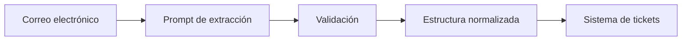

# Capitulo-21-Seccion-03-v0.1

# Módulo 2 — Prompt Engineering Profesional

# Capítulo 21 — Laboratorios de Prompt Engineering

**Versión:** 0.1  
**Estado:** Manuscrito del autor

> *"La verdadera utilidad de un modelo no reside únicamente en generar texto. Reside en transformar información desestructurada en datos utilizables por otros sistemas."*

---

# Objetivos de aprendizaje

- Diseñar prompts para extracción estructurada de información.
- Comprender la importancia de formatos de salida consistentes.
- Aplicar criterios de validación sobre datos generados por un LLM.
- Incorporar prácticas de ingeniería orientadas a la integración con aplicaciones empresariales.

---

# Introducción

Uno de los usos más frecuentes de los Large Language Models (LLM) consiste en convertir información escrita en lenguaje natural en estructuras que puedan ser procesadas automáticamente.

Correos electrónicos, documentos, contratos, expedientes o conversaciones contienen gran cantidad de información útil, pero difícil de utilizar directamente desde una aplicación.

El objetivo de este laboratorio consiste en diseñar un prompt capaz de extraer únicamente la información relevante y devolverla con un formato estable.

---

# El problema

Una organización recibe solicitudes por correo electrónico para registrar incidentes técnicos.

Cada mensaje debe transformarse en un registro con la siguiente información:

- nombre del solicitante;
- área responsable;
- prioridad;
- descripción resumida;
- fecha estimada del incidente.

La salida será utilizada posteriormente por un sistema de gestión de tickets.

---

# Estrategia de resolución

El éxito del laboratorio no depende únicamente de identificar la información correcta, sino también de producir un formato consistente para todas las ejecuciones.

---

# Casos de prueba

El conjunto de evaluación debería incluir:

| Tipo de caso | Objetivo |
|--------------|----------|
| Información completa | Validar el comportamiento esperado. |
| Datos faltantes | Verificar manejo de valores ausentes. |
| Información contradictoria | Evaluar reglas de prioridad. |
| Mensajes extensos | Analizar capacidad de síntesis. |
| Formato irregular | Comprobar robustez frente a entradas reales. |

Estos escenarios permiten identificar limitaciones antes del despliegue.

---

# Criterios de evaluación

La calidad del prompt puede medirse considerando:

- exactitud de los campos extraídos;
- estabilidad del formato;
- porcentaje de información omitida;
- facilidad de integración con aplicaciones consumidoras;
- necesidad de intervención humana posterior.

No siempre el prompt más detallado produce el mejor resultado. La simplicidad y la consistencia suelen ser factores determinantes.

---

# Caso de estudio

Durante las primeras pruebas, el modelo identifica correctamente los datos principales, pero utiliza distintos nombres para un mismo campo y altera el orden de la salida.

En lugar de modificar la lógica de la aplicación, el equipo ajusta el prompt para imponer una estructura uniforme.

Como consecuencia, disminuye significativamente la complejidad del procesamiento posterior.

Este ejemplo demuestra que el Prompt Engineering también impacta directamente sobre la arquitectura de software.

---

# Buenas prácticas

- Definir claramente el formato esperado.
- Mantener nombres de campos consistentes.
- Validar el resultado antes de consumirlo.
- Diseñar prompts pensando en los sistemas que utilizarán la información.

---

# Errores frecuentes

- Permitir formatos variables.
- Mezclar información relevante con texto explicativo.
- No contemplar datos ausentes.
- Acoplar el procesamiento posterior a respuestas impredecibles.

---

# Ideas clave

- La extracción estructurada constituye uno de los casos de uso más importantes del Prompt Engineering.
- La estabilidad del formato es tan importante como la calidad de la extracción.
- Diseñar pensando en la integración simplifica toda la arquitectura.

---

# Transición hacia la siguiente sección

En la próxima sección desarrollaremos un laboratorio centrado en generación controlada de contenido, donde el objetivo será producir respuestas consistentes respetando restricciones de estilo, longitud, formato y políticas organizacionales.

---

> **"Un arquitecto no memoriza respuestas. Comprende problemas para poder diseñar soluciones."**
