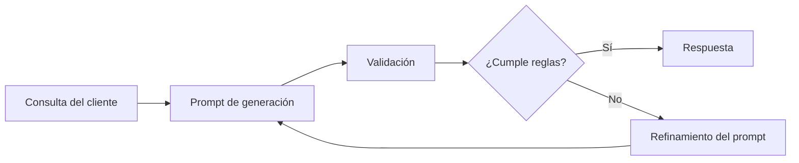

# Capitulo-21-Seccion-04-v0.1

# Módulo 2 — Prompt Engineering Profesional

# Capítulo 21 — Laboratorios de Prompt Engineering

**Versión:** 0.1  
**Estado:** Manuscrito del autor

> *"Generar texto es sencillo. Generarlo respetando reglas de negocio, formato y estilo constituye un verdadero desafío de ingeniería."*

---

# Objetivos de aprendizaje

- Diseñar prompts para generación controlada de contenido.
- Aplicar restricciones de formato, estilo y longitud.
- Comprender la importancia de la consistencia en aplicaciones empresariales.
- Evaluar la calidad de la generación mediante criterios objetivos.

---

# Introducción

Muchos asistentes empresariales deben producir documentos, correos electrónicos, informes o respuestas destinadas a clientes y colaboradores.

Aunque un LLM puede generar texto de alta calidad, en producción no alcanza con que la respuesta sea correcta.

También debe cumplir restricciones previamente definidas:

- respetar un tono institucional;
- mantener un formato estable;
- limitar la longitud;
- utilizar terminología aprobada;
- evitar información no solicitada.

Este laboratorio tiene como objetivo diseñar prompts capaces de controlar esos aspectos de manera sistemática.

---

# El problema

Una empresa desea automatizar la redacción de respuestas a consultas de clientes.

Cada respuesta debe cumplir las siguientes reglas:

- lenguaje profesional y cordial;
- extensión máxima de 250 palabras;
- estructura fija de tres secciones;
- ausencia de opiniones personales;
- inclusión de un cierre institucional.

La salida será enviada directamente al cliente sin edición manual.

---

# Flujo del laboratorio

El ciclo continúa hasta obtener un comportamiento consistente.

---

# Casos de prueba

Para evaluar la solución conviene utilizar consultas variadas.

| Tipo de caso | Objetivo |
|--------------|----------|
| Consulta simple | Validar comportamiento básico. |
| Reclamo complejo | Evaluar capacidad de síntesis. |
| Solicitud ambigua | Verificar manejo de incertidumbre. |
| Consulta extensa | Comprobar respeto por la longitud máxima. |
| Mensajes con tono agresivo | Evaluar mantenimiento del estilo institucional. |

---

# Criterios de evaluación

El laboratorio puede medirse utilizando indicadores como:

- cumplimiento del formato requerido;
- respeto por las restricciones de longitud;
- coherencia del estilo;
- ausencia de información inventada;
- estabilidad entre distintas ejecuciones.

Estos indicadores permiten transformar un criterio subjetivo ("me gusta la respuesta") en una evaluación repetible.

---

# Caso de estudio

En una primera versión, el modelo genera respuestas técnicamente correctas, pero con extensiones variables y estilos inconsistentes.

El equipo incorpora reglas explícitas sobre estructura, tono y longitud.

Tras ejecutar nuevamente el conjunto de pruebas, las respuestas mantienen una presentación uniforme y requieren muchas menos correcciones manuales.

La mejora no proviene del modelo, sino del refinamiento del prompt y de su proceso de evaluación.

---

# Buenas prácticas

- Especificar claramente las restricciones de salida.
- Separar contenido obligatorio de contenido opcional.
- Validar automáticamente el formato cuando sea posible.
- Medir consistencia además de calidad.

---

# Errores frecuentes

- Confiar en que el modelo mantendrá el mismo estilo sin indicaciones.
- Mezclar múltiples objetivos en un solo prompt.
- Evaluar únicamente la calidad del contenido.
- Ignorar el impacto del formato sobre los sistemas consumidores.

---

# Ideas clave

- La generación controlada requiere tanto diseño como validación.
- Las restricciones explícitas reducen la variabilidad.
- Un buen prompt facilita la integración y disminuye la necesidad de edición posterior.

---

# Transición hacia la siguiente sección

En la próxima sección desarrollaremos un laboratorio orientado al diseño de conversaciones, aplicando conceptos de memoria, estado y contexto para construir asistentes capaces de mantener interacciones prolongadas y coherentes.

---

> **"Un arquitecto no memoriza respuestas. Comprende problemas para poder diseñar soluciones."**
