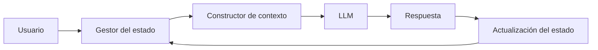

# Capitulo-21-Seccion-05-v0.1

# Módulo 2 — Prompt Engineering Profesional

# Capítulo 21 — Laboratorios de Prompt Engineering

**Versión:** 0.1  
**Estado:** Manuscrito del autor

> *"Una conversación de calidad no se mide por la cantidad de respuestas. Se mide por la capacidad de mantener un objetivo común a lo largo del tiempo."*

---

# Objetivos de aprendizaje

- Aplicar los conceptos de Ingeniería Conversacional en un caso práctico.
- Diseñar un asistente con estado, contexto y memoria.
- Evaluar la continuidad de una conversación prolongada.
- Medir la robustez frente a interrupciones y cambios de intención.

---

# Introducción

Los laboratorios anteriores se centraron en tareas puntuales: clasificación, extracción de información y generación controlada.

En este laboratorio el desafío cambia.

El objetivo ya no consiste en responder correctamente un único mensaje, sino en mantener una conversación coherente durante múltiples interacciones, administrando el estado del proceso y reconstruyendo el contexto cuando resulte necesario.

---

# El problema

Una organización desea implementar un asistente para gestionar solicitudes de soporte interno.

Durante una misma conversación el usuario puede:

- informar un incidente;
- consultar el estado de un ticket;
- corregir información previamente enviada;
- realizar preguntas adicionales;
- retomar una solicitud iniciada horas antes.

La solución debe conservar continuidad sin reenviar permanentemente todo el historial.

---

# Arquitectura del laboratorio

El foco del laboratorio no es el modelo, sino la arquitectura que sostiene la conversación.

---

# Casos de prueba

| Escenario | Objetivo |
|-----------|----------|
| Conversación lineal | Validar el flujo básico. |
| Cambio de intención | Verificar recuperación del contexto. |
| Corrección de datos | Actualizar el estado sin inconsistencias. |
| Conversación extensa | Evaluar administración del contexto. |
| Reanudación de sesión | Comprobar uso de memoria persistente. |

---

# Criterios de evaluación

La solución puede evaluarse mediante indicadores como:

- continuidad de la conversación;
- consistencia del estado;
- recuperación correcta del contexto;
- cantidad de información redundante enviada al modelo;
- satisfacción del usuario al completar el proceso.

Estos indicadores permiten medir la calidad conversacional más allá de la respuesta individual.

---

# Caso de estudio

Durante las pruebas, un usuario inicia un ticket, interrumpe la conversación para consultar una política interna y luego retoma el incidente original.

La primera implementación pierde el contexto y solicita nuevamente información ya proporcionada.

Tras incorporar un estado estructurado y un constructor dinámico de contexto, el asistente retoma el proceso exactamente donde había quedado.

La mejora no surge del modelo, sino del diseño de la arquitectura conversacional.

---

# Buenas prácticas

- Mantener el estado separado del historial.
- Recuperar únicamente el contexto relevante.
- Registrar eventos significativos de la conversación.
- Validar la continuidad mediante pruebas prolongadas.

---

# Errores frecuentes

- Utilizar el historial completo como única memoria.
- Reiniciar el flujo ante cualquier interrupción.
- Mezclar estado, memoria y contexto.
- No probar conversaciones extensas.

---

# Ideas clave

- La calidad conversacional depende de la arquitectura.
- Estado y contexto son componentes explícitos del diseño.
- Una conversación robusta debe mantener continuidad frente a cambios e interrupciones.

---

# Transición hacia la siguiente sección

En la próxima sección desarrollaremos un laboratorio integrador donde combinaremos clasificación, extracción, generación, conversación y composición de prompts para resolver un caso completo de AI Engineering.

---

> **"Un arquitecto no memoriza respuestas. Comprende problemas para poder diseñar soluciones."**
