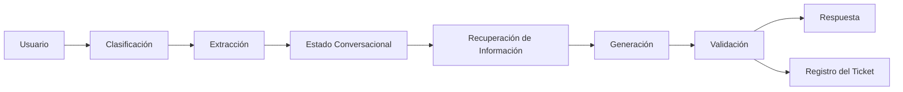

# Capitulo-21-Seccion-06-v0.1

# Módulo 2 — Prompt Engineering Profesional

# Capítulo 21 — Laboratorios de Prompt Engineering

**Versión:** 0.1  
**Estado:** Manuscrito del autor

> *"La ingeniería alcanza su mayor valor cuando integra múltiples capacidades para resolver un único problema de negocio."*

---

# Objetivos de aprendizaje

- Integrar todos los conceptos estudiados durante el módulo.
- Diseñar una solución completa basada en Prompt Engineering.
- Aplicar criterios de arquitectura, evaluación y operación.
- Comprender el trabajo de un AI Engineer frente a un caso real.

---

# Introducción

Los laboratorios anteriores abordaron capacidades específicas:

- clasificación;
- extracción estructurada;
- generación controlada;
- conversaciones de larga duración.

En este laboratorio el desafío consiste en integrarlas dentro de una única solución.

El objetivo no es construir el mejor prompt posible, sino diseñar una arquitectura capaz de resolver un problema empresarial de principio a fin.

---

# El problema

Una organización desea implementar un asistente corporativo para su mesa de ayuda.

El sistema debe ser capaz de:

- interpretar la consulta del usuario;
- clasificar automáticamente el tipo de solicitud;
- extraer información relevante;
- consultar documentación interna;
- mantener una conversación coherente;
- generar una respuesta profesional;
- registrar el incidente en el sistema de tickets cuando corresponda.

El desafío consiste en coordinar todas estas capacidades sin perder mantenibilidad.

---

# Arquitectura propuesta

Cada componente representa una responsabilidad independiente dentro de la solución.

---

# Plan de trabajo

El laboratorio propone recorrer las siguientes etapas.

| Etapa | Objetivo |
|--------|----------|
| Análisis | Comprender el problema del negocio. |
| Diseño | Definir arquitectura y prompts. |
| Implementación | Construir cada componente por separado. |
| Integración | Conectar todos los módulos. |
| Evaluación | Ejecutar casos de prueba completos. |
| Mejora | Refinar componentes según evidencia. |

Este proceso refleja el ciclo de vida habitual de un proyecto de AI Engineering.

---

# Casos de prueba

El conjunto de evaluación debería contemplar:

- consultas simples;
- solicitudes incompletas;
- conversaciones largas;
- cambios de intención;
- recuperación mediante RAG;
- generación de tickets;
- errores de integración;
- escenarios fuera del alcance previsto.

La solución debe demostrar estabilidad frente a todos ellos.

---

# Criterios de evaluación

El laboratorio puede evaluarse considerando:

- precisión funcional;
- consistencia conversacional;
- estabilidad de los formatos;
- reutilización de componentes;
- facilidad de mantenimiento;
- trazabilidad de las decisiones;
- costo aproximado de inferencia;
- experiencia del usuario.

La evaluación ya no se centra únicamente en el prompt, sino en el comportamiento del sistema completo.

---

# Caso de estudio

Una empresa implementa este laboratorio como prueba piloto.

Durante las primeras iteraciones identifica que el mayor problema no proviene del modelo, sino de la interacción entre los distintos componentes.

El equipo rediseña la arquitectura, desacopla responsabilidades y mejora la construcción del contexto.

Como resultado disminuyen los errores, se reducen los costos operativos y aumenta la satisfacción de los usuarios.

La principal conclusión es que el éxito depende de la arquitectura mucho más que de un único prompt.

---

# Buenas prácticas

- Diseñar primero la arquitectura y luego los prompts.
- Validar cada componente por separado.
- Automatizar las pruebas de integración.
- Registrar todas las versiones del sistema.
- Medir el desempeño global además del comportamiento individual.

---

# Errores frecuentes

- Optimizar únicamente los prompts.
- Ignorar la interacción entre componentes.
- Acoplar excesivamente la solución.
- No medir el impacto de cada cambio sobre el sistema completo.

---

# Ideas clave

- Los problemas empresariales requieren integrar múltiples capacidades.
- El Prompt Engineering constituye solo una parte de la solución.
- La arquitectura determina la escalabilidad y mantenibilidad del sistema.

---

# Transición hacia la siguiente sección

En la próxima sección realizaremos el cierre de los laboratorios del módulo y prepararemos el proyecto integrador, donde el lector diseñará una solución completa de AI Engineering utilizando todos los conceptos aprendidos.

---

> **"Un arquitecto no memoriza respuestas. Comprende problemas para poder diseñar soluciones."**
