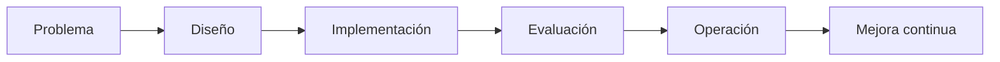

# Capitulo-21-Seccion-07-v0.1

# Módulo 2 — Prompt Engineering Profesional

# Capítulo 21 — Laboratorios de Prompt Engineering

**Versión:** 0.1  
**Estado:** Manuscrito del autor

> *"El propósito de un laboratorio no es confirmar lo que creemos saber. Es revelar aquello que todavía necesitamos aprender."*

---

# Objetivos de aprendizaje

- Consolidar los aprendizajes obtenidos durante los laboratorios.
- Identificar criterios para evaluar la madurez de una solución basada en LLM.
- Reflexionar sobre el proceso de mejora continua.
- Preparar la transición hacia el Proyecto Integrador.

---

# Introducción

Los laboratorios desarrollados en este capítulo reprodujeron situaciones habituales en proyectos de AI Engineering.

En cada uno de ellos el objetivo fue diferente, pero el método se mantuvo constante:

- comprender el problema;
- diseñar una solución;
- medir resultados;
- iterar sobre la evidencia obtenida.

Esta forma de trabajo constituye una de las principales diferencias entre experimentar con IA y desarrollar soluciones empresariales.

---

# Síntesis de los laboratorios

| Laboratorio | Competencia principal |
|-------------|-----------------------|
| Clasificación | Diseñar prompts para categorización consistente. |
| Extracción estructurada | Transformar lenguaje natural en datos utilizables. |
| Generación controlada | Respetar restricciones de formato y estilo. |
| Ingeniería conversacional | Administrar estado, contexto y memoria. |
| Integración | Coordinar múltiples componentes dentro de una arquitectura. |

Cada laboratorio desarrolló una capacidad específica que será reutilizada en proyectos de mayor complejidad.

---

# Criterios de madurez

Antes de considerar finalizada una solución conviene responder preguntas como:

- ¿El comportamiento es consistente?
- ¿Puede reproducirse el resultado?
- ¿Existen métricas objetivas?
- ¿La arquitectura facilita el mantenimiento?
- ¿El costo operativo resulta aceptable?
- ¿La solución resuelve efectivamente el problema del negocio?

Estas preguntas desplazan el foco desde el modelo hacia el valor entregado por la solución.

---

# Caso de estudio

Dos equipos desarrollan asistentes similares.

El primero obtiene respuestas de gran calidad en demostraciones, pero carece de pruebas, versionado y métricas.

El segundo produce resultados inicialmente más modestos, aunque mantiene un proceso sistemático de evaluación, observabilidad y mejora.

Después de varios meses, el segundo equipo logra una plataforma más estable, más económica y más fácil de evolucionar.

La diferencia no radica en el modelo utilizado, sino en la disciplina de ingeniería aplicada durante el desarrollo.

---

# Buenas prácticas

- Documentar cada decisión relevante.
- Medir antes de optimizar.
- Incorporar retroalimentación de usuarios reales.
- Revisar periódicamente la arquitectura.
- Convertir cada incidente en un nuevo caso de prueba.

---

# Errores frecuentes

- Considerar terminada una solución después de una demostración exitosa.
- Optimizar sin evidencia.
- Ignorar la deuda técnica generada por los prompts.
- No capturar el aprendizaje obtenido durante los laboratorios.

---

# Ideas clave

- La práctica desarrolla criterio de ingeniería.
- La calidad depende del proceso completo y no de una única iteración.
- Cada laboratorio constituye un paso hacia soluciones empresariales de mayor escala.

---

# Transición hacia el siguiente capítulo

En el próximo capítulo desarrollaremos el **Proyecto Integrador del Módulo 2**, donde todos los conceptos estudiados se aplicarán en el diseño de una solución completa de AI Engineering, siguiendo un proceso similar al de un proyecto profesional.

---

> **"Un arquitecto no memoriza respuestas. Comprende problemas para poder diseñar soluciones."**
