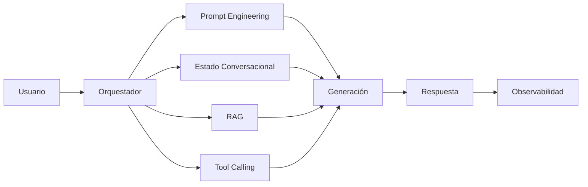

# Capitulo-22-Seccion-01-v0.1

# Módulo 2 — Prompt Engineering Profesional

# Capítulo 22 — Proyecto Integrador del Módulo 2

**Versión:** 0.1  
**Estado:** Manuscrito del autor

> *"El conocimiento demuestra su valor cuando permite construir una solución que resuelve un problema real."*

---

# Objetivos de aprendizaje

- Integrar todos los conceptos desarrollados durante el módulo.
- Diseñar una solución completa desde la perspectiva del AI Engineering.
- Aplicar un proceso profesional de análisis, diseño, implementación y evaluación.
- Preparar la transición hacia el estudio de los modelos fundacionales.

---

# Introducción

Los capítulos anteriores abordaron cada componente de forma individual:

- Ingeniería del Prompt.
- Patrones de Prompt Engineering.
- Prompt Engineering para Producción.
- Ingeniería Conversacional.
- Arquitecturas Basadas en Prompts.
- Laboratorios prácticos.

El proyecto integrador propone combinar todos estos conocimientos para resolver un caso de negocio de principio a fin.

El objetivo no consiste en construir un prompt aislado, sino en diseñar una solución completa.

---

# El desafío

Una organización desea implementar un **Asistente Corporativo Inteligente** que permita:

- responder consultas internas;
- recuperar documentación institucional;
- clasificar solicitudes;
- generar respuestas estructuradas;
- registrar incidentes cuando corresponda;
- mantener conversaciones de larga duración;
- integrarse con sistemas existentes.

El proyecto deberá diseñarse como si fuera a evolucionar hasta convertirse en un sistema de producción.

---

# Alcance del proyecto

La arquitectura propuesta constituye un punto de partida que podrá ampliarse en módulos posteriores.

---

# Entregables esperados

El proyecto debería incluir, como mínimo:

| Entregable | Objetivo |
|------------|----------|
| Análisis del problema | Comprender el dominio de negocio. |
| Arquitectura | Definir componentes y responsabilidades. |
| Diseño de prompts | Especificar prompts reutilizables. |
| Estrategia conversacional | Estado, contexto y memoria. |
| Plan de evaluación | Casos de prueba y métricas. |
| Estrategia de despliegue | Versionado, observabilidad y mejora continua. |

---

# Criterios de evaluación

La solución será evaluada considerando:

- calidad del diseño arquitectónico;
- separación de responsabilidades;
- reutilización de componentes;
- robustez conversacional;
- facilidad de mantenimiento;
- capacidad de evolución;
- alineación con las necesidades del negocio.

No se evaluará únicamente la calidad de las respuestas generadas.

---

# Caso de estudio

Un equipo desarrolla una primera versión del asistente utilizando un único prompt.

El prototipo funciona durante las demostraciones, pero rápidamente aparecen dificultades para incorporar nuevas funcionalidades.

Tras aplicar los principios estudiados en este módulo, el equipo divide responsabilidades, incorpora un orquestador, define prompts especializados, agrega evaluación continua y establece un proceso de PromptOps.

La nueva arquitectura requiere un mayor esfuerzo inicial, pero reduce significativamente el costo de evolución del sistema.

---

# Buenas prácticas

- Diseñar primero la arquitectura.
- Pensar en la evolución futura del sistema.
- Documentar todas las decisiones relevantes.
- Evaluar con evidencia objetiva.
- Priorizar simplicidad sobre complejidad innecesaria.

---

# Errores frecuentes

- Comenzar escribiendo prompts sin analizar el problema.
- Concentrar toda la lógica en un único componente.
- No definir métricas de éxito.
- Ignorar aspectos operativos como observabilidad y versionado.

---

# Ideas clave

- Un proyecto de AI Engineering integra múltiples disciplinas.
- El Prompt Engineering es una capacidad fundamental, pero no suficiente.
- La arquitectura determina la sostenibilidad de la solución a largo plazo.

---

# Transición hacia el Módulo 3

Con este proyecto concluye el **Módulo 2 — Prompt Engineering Profesional**.

En el siguiente módulo estudiaremos los principales **modelos fundacionales** disponibles en la actualidad, comparando sus capacidades, fortalezas, limitaciones y escenarios de uso desde una perspectiva de ingeniería. El objetivo dejará de ser cómo diseñar prompts y pasará a responder una nueva pregunta:

**¿Qué modelo conviene utilizar para cada problema?**

---

> **"Un arquitecto no memoriza respuestas. Comprende problemas para poder diseñar soluciones."**
