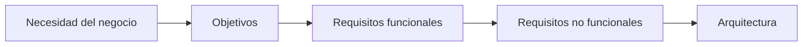

# Capitulo-22-Seccion-02-v0.1

# Módulo 2 — Prompt Engineering Profesional

# Capítulo 22 — Proyecto Integrador del Módulo 2

**Versión:** 0.1  
**Estado:** Manuscrito del autor

> *"Todo proyecto exitoso comienza comprendiendo el problema antes de elegir la tecnología."*

---

# Objetivos de aprendizaje

- Realizar el análisis inicial de un proyecto de AI Engineering.
- Identificar actores, objetivos y restricciones.
- Traducir necesidades de negocio en requerimientos técnicos.
- Definir el alcance de una primera versión viable.

---

# Introducción

Antes de escribir un prompt, seleccionar un modelo o definir una arquitectura, un AI Engineer necesita comprender el problema que intenta resolver.

Las decisiones tomadas durante esta etapa condicionarán el resto del proyecto.

Un análisis incompleto suele producir soluciones técnicamente interesantes, pero alejadas de las necesidades reales del negocio.

---

# Paso 1: Comprender el problema

El análisis inicial debe responder preguntas como:

- ¿Qué proceso desea mejorar la organización?
- ¿Quién utilizará el sistema?
- ¿Qué tareas serán asistidas por IA?
- ¿Qué tareas seguirán siendo responsabilidad de las personas?
- ¿Cómo se medirá el éxito del proyecto?

Estas respuestas constituyen la base del diseño posterior.

---

# Identificación de actores

| Actor | Responsabilidad |
|--------|-----------------|
| Usuario final | Interactúa con el asistente. |
| Responsable funcional | Define reglas de negocio. |
| Equipo de IA | Diseña la solución. |
| Equipo de IT | Integra la plataforma. |
| Administrador | Supervisa operación y métricas. |

Cada actor posee expectativas y necesidades diferentes.

---

# Del problema a los requisitos

El objetivo no consiste únicamente en automatizar tareas, sino en construir una solución sostenible.

---

# Caso de estudio

Una empresa desea implementar un asistente para su mesa de ayuda.

Tras las primeras reuniones, el equipo descubre que el principal problema no es responder preguntas, sino reducir los tiempos de clasificación y registro de incidentes.

Esta conclusión modifica completamente el alcance del proyecto: la prioridad deja de ser la conversación y pasa a ser la automatización del proceso de atención.

---

# Actividades propuestas

1. Describir el problema de negocio.
2. Identificar actores y responsabilidades.
3. Definir objetivos medibles.
4. Delimitar el alcance de la primera versión.
5. Registrar riesgos y restricciones conocidas.

---

# Buenas prácticas

- Comprender el negocio antes de diseñar la solución.
- Validar el alcance con los interesados.
- Documentar supuestos y restricciones.
- Priorizar objetivos medibles.

---

# Errores frecuentes

- Comenzar escribiendo prompts sin análisis previo.
- Confundir deseos con requisitos.
- Intentar resolver todos los problemas en la primera versión.
- No definir criterios de éxito.

---

# Ideas clave

- Todo proyecto comienza con el análisis del problema.
- La tecnología debe responder a objetivos del negocio.
- Un buen análisis reduce riesgos durante el desarrollo.

---

# Transición hacia la siguiente sección

En la próxima sección diseñaremos la arquitectura de referencia del proyecto, definiendo componentes, responsabilidades y flujos de interacción entre ellos.

---

> **"Un arquitecto no memoriza respuestas. Comprende problemas para poder diseñar soluciones."**
