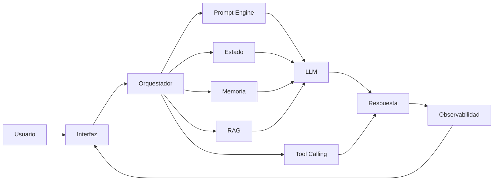

# Capitulo-22-Seccion-03-v0.1

# Módulo 2 — Prompt Engineering Profesional

# Capítulo 22 — Proyecto Integrador del Módulo 2

**Versión:** 0.1  
**Estado:** Manuscrito del autor

> *"Una arquitectura no describe únicamente cómo funciona un sistema. Describe cómo podrá evolucionar durante los próximos años."*

---

# Objetivos de aprendizaje

- Diseñar una arquitectura de referencia para el proyecto integrador.
- Identificar los principales componentes de una solución basada en LLM.
- Definir responsabilidades y relaciones entre los distintos módulos.
- Aplicar los principios de desacoplamiento y escalabilidad estudiados durante el módulo.

---

# Introducción

Con el problema de negocio claramente definido, el siguiente paso consiste en diseñar la arquitectura que permitirá implementar la solución.

En esta etapa aún no se desarrollan prompts ni se elige un modelo específico.

El objetivo es identificar los componentes necesarios, establecer sus responsabilidades y definir cómo colaborarán entre sí.

Una buena arquitectura permite incorporar nuevas capacidades sin rediseñar completamente el sistema.

---

# Componentes principales

Para este proyecto se propone una arquitectura compuesta por los siguientes elementos:

| Componente | Responsabilidad |
|------------|-----------------|
| Interfaz de usuario | Recibir consultas y presentar respuestas. |
| Orquestador | Coordinar el flujo general del sistema. |
| Prompt Engine | Gestionar los prompts especializados. |
| Estado conversacional | Mantener la continuidad de la interacción. |
| Memoria | Persistir información relevante entre sesiones. |
| RAG | Recuperar conocimiento actualizado. |
| Tool Calling | Ejecutar acciones sobre sistemas externos. |
| Observabilidad | Registrar métricas, eventos y auditoría. |

Cada componente posee una responsabilidad claramente delimitada.

---

# Arquitectura de referencia

La arquitectura prioriza la separación de responsabilidades y facilita la incorporación de nuevos componentes.

---

# Decisiones de diseño

Durante esta etapa conviene responder preguntas como:

- ¿Qué componentes deberán ser reutilizables?
- ¿Qué información permanecerá fuera del modelo?
- ¿Dónde se administrará el estado conversacional?
- ¿Qué servicios externos participarán del proceso?
- ¿Cómo se registrarán métricas y eventos?

Responder estas preguntas antes de implementar reduce considerablemente el riesgo de rediseños posteriores.

---

# Caso de estudio

El equipo responsable del proyecto decide incorporar una base documental mediante RAG varios meses después del inicio del desarrollo.

Gracias a la arquitectura modular, el nuevo componente se integra sin modificar el resto de la solución.

El orquestador únicamente incorpora una nueva decisión dentro del flujo de procesamiento.

La inversión realizada durante el diseño arquitectónico demuestra su valor al facilitar la evolución del sistema.

---

# Actividades propuestas

1. Dibujar la arquitectura del proyecto.
2. Identificar responsabilidades de cada componente.
3. Definir contratos de interacción.
4. Detectar posibles puntos de acoplamiento.
5. Justificar las principales decisiones de diseño.

---

# Buenas prácticas

- Mantener responsabilidades bien definidas.
- Diseñar componentes independientes.
- Favorecer la reutilización.
- Pensar en la evolución futura de la plataforma.
- Documentar todas las decisiones relevantes.

---

# Errores frecuentes

- Incorporar lógica de negocio dentro de los prompts.
- Acoplar directamente todos los componentes.
- Diseñar una arquitectura excesivamente compleja desde el inicio.
- No contemplar crecimiento futuro.

---

# Ideas clave

- La arquitectura constituye el esqueleto de toda solución de AI Engineering.
- El desacoplamiento facilita mantenimiento y evolución.
- Diseñar correctamente reduce costos a largo plazo.

---

# Transición hacia la siguiente sección

En la próxima sección comenzaremos el diseño funcional de los componentes, definiendo los prompts, los flujos conversacionales y los mecanismos de evaluación que utilizará el proyecto integrador.

---

> **"Un arquitecto no memoriza respuestas. Comprende problemas para poder diseñar soluciones."**
