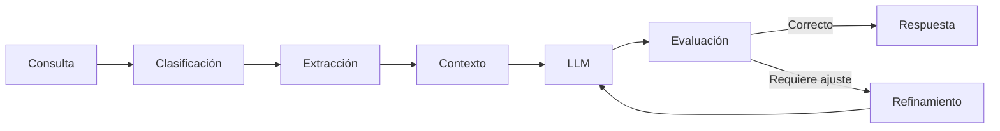

# Capitulo-22-Seccion-04-v0.1

# Módulo 2 — Prompt Engineering Profesional

# Capítulo 22 — Proyecto Integrador del Módulo 2

**Versión:** 0.1  
**Estado:** Manuscrito del autor

> *"La arquitectura define qué componentes existen. El diseño funcional define cómo colaboran para resolver el problema."*

---

# Objetivos de aprendizaje

- Diseñar el comportamiento funcional de la solución.
- Definir los prompts especializados y sus responsabilidades.
- Especificar el flujo conversacional del proyecto.
- Establecer una estrategia inicial de evaluación.

---

# Introducción

Con la arquitectura definida, el siguiente paso consiste en describir el comportamiento de cada componente.

Esta etapa conecta las necesidades del negocio con la implementación técnica.

Todavía no se escribe código. Tampoco se optimizan prompts.

El objetivo consiste en definir claramente qué hará cada componente, qué información recibirá y qué resultado deberá producir.

---

# Diseño funcional

Para este proyecto se propone dividir las responsabilidades en componentes especializados.

| Componente | Función |
|------------|----------|
| Prompt de clasificación | Identificar la intención del usuario. |
| Prompt de extracción | Obtener datos relevantes de la consulta. |
| Prompt de generación | Construir la respuesta final. |
| Gestor de contexto | Preparar la información enviada al modelo. |
| Gestor de memoria | Recuperar información persistente. |
| Evaluador | Verificar calidad y formato de la respuesta. |

Cada componente puede evolucionar de manera independiente siempre que respete su contrato funcional.

---

# Flujo de interacción

Este flujo permite introducir controles de calidad antes de entregar la respuesta al usuario.

---

# Estrategia de evaluación

Desde el comienzo del proyecto conviene definir cómo se medirá la calidad.

Algunos indicadores iniciales son:

- precisión funcional;
- consistencia del formato;
- cumplimiento de reglas de negocio;
- estabilidad entre ejecuciones;
- consumo aproximado de tokens;
- tiempo medio de respuesta.

Las métricas deberán revisarse periódicamente a medida que evolucione la solución.

---

# Caso de estudio

Durante el diseño funcional, el equipo detecta que un mismo prompt intenta clasificar la consulta, extraer datos y generar la respuesta.

En lugar de aumentar su complejidad, divide estas responsabilidades en tres componentes independientes.

Las pruebas posteriores muestran una mejora en mantenibilidad, facilidad de depuración y reutilización.

---

# Actividades propuestas

1. Definir las responsabilidades de cada prompt.
2. Especificar entradas y salidas esperadas.
3. Diseñar el flujo conversacional.
4. Elaborar un primer conjunto de métricas.
5. Revisar posibles puntos de mejora antes de implementar.

---

# Buenas prácticas

- Mantener responsabilidades pequeñas y bien definidas.
- Diseñar contratos claros entre componentes.
- Pensar en la reutilización desde el inicio.
- Definir métricas antes de comenzar las pruebas.

---

# Errores frecuentes

- Crear prompts con múltiples responsabilidades.
- No documentar el comportamiento esperado.
- Posponer la evaluación para el final del proyecto.
- Diseñar componentes difíciles de reutilizar.

---

# Ideas clave

- El diseño funcional transforma la arquitectura en un plan de implementación.
- Los prompts deben actuar como componentes especializados.
- La evaluación comienza durante el diseño, no después del desarrollo.

---

# Transición hacia la siguiente sección

En la próxima sección abordaremos la planificación de las pruebas del proyecto integrador, definiendo escenarios de validación, conjuntos de evaluación y criterios de aceptación que permitan decidir objetivamente cuándo la solución está preparada para evolucionar hacia un entorno de producción.

---

> **"Un arquitecto no memoriza respuestas. Comprende problemas para poder diseñar soluciones."**
