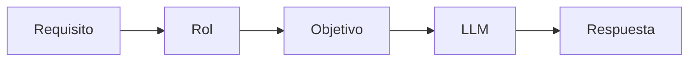

# Módulo 2 — Prompt Engineering Profesional

# Capítulo 16 — Ingeniería del Prompt

## Sección 3 — El rol en el prompt profesional

> *"El rol asignado al modelo no cambia quién es el modelo. Cambia el marco desde el cual debe interpretar el problema."*

---

## Objetivos de aprendizaje

- Comprender el concepto de **Role Prompting**.
- Analizar cómo influye el rol en la generación de respuestas.
- Distinguir entre un rol conversacional y un rol de ingeniería.
- Incorporar buenas prácticas para definir roles en aplicaciones empresariales.

---

## Introducción

Vimos en la sección anterior que el prompt profesional se compone de bloques con responsabilidades diferenciadas. El primero de esos bloques en el orden de diseño es el rol.

Uno de los patrones más utilizados en Prompt Engineering consiste en asignar un rol explícito al Large Language Model (LLM).

En apariencia, esta técnica parece sencilla: indicar al modelo que actúe como un abogado, un arquitecto de software o un analista financiero. Sin embargo, desde la perspectiva del AI Engineering, un rol no representa un personaje, sino un mecanismo para acotar el espacio de respuesta del modelo.

Definir correctamente el rol reduce ambigüedad, mejora la consistencia y facilita la reutilización del prompt.

---

## ¿Qué representa un rol?

Un rol comunica al modelo el tipo de comportamiento esperado antes de resolver la tarea.

No aporta conocimiento nuevo ni modifica los parámetros internos del modelo.

Su función consiste en orientar el proceso de inferencia —el proceso por el cual el modelo genera una respuesta a partir de la entrada recibida— hacia un contexto determinado.

Esta función cambia según el entorno en que se usa el rol:

| Contexto | Características del rol |
|----------|------------------------|
| Conversacional | Informal, cambia entre sesiones, no versionado, orientado a personalidad. |
| De ingeniería | Estable, versionado, acotado, orientado a comportamiento predecible y auditable. |

En una aplicación empresarial, el rol es siempre un rol de ingeniería: se especifica con precisión, no varía entre conversaciones y se gestiona como parte del ciclo de vida del prompt.

| Rol | Propósito |
|------|-----------|
| Arquitecto de IA | Priorizar decisiones de diseño y arquitectura. |
| Auditor | Identificar riesgos y controles. |
| Redactor técnico | Generar documentación clara y estructurada. |
| Revisor | Detectar inconsistencias y oportunidades de mejora. |

---

## Roles en producción

En aplicaciones empresariales, el rol suele permanecer estable y formar parte del propio sistema.

Por ejemplo, un asistente de soporte técnico mantiene el mismo rol durante todas las conversaciones, mientras que el contexto cambia en cada consulta.

Esta separación favorece el versionado y evita modificar instrucciones críticas cada vez que evoluciona el negocio. Si el rol se mantiene como un bloque fijo y versionado, cualquier cambio en él puede evaluarse de manera aislada antes de pasar a producción.

---

## Caso de estudio

Una empresa implementa un asistente para revisar documentación técnica.

En la primera versión el prompt comienza simplemente con:

> "Analiza este documento."

Los resultados varían considerablemente entre consultas.

En una segunda iteración se define el rol:

> "Actúa como un arquitecto de software especializado en revisión de documentación técnica. Prioriza consistencia, riesgos y oportunidades de mejora."

Sin modificar el modelo ni la información de entrada, las respuestas se vuelven más homogéneas y alineadas con las expectativas del equipo.

---

## Buenas prácticas

- Definir roles estables, específicos y alineados con el objetivo del negocio.
- Evitar roles contradictorios o que mezclen múltiples funciones en un mismo bloque.
- Relacionar el rol con los demás componentes del prompt para mantener coherencia interna.
- Versionar cualquier cambio sobre el rol y evaluarlo antes del despliegue.

---

## Errores frecuentes

- Utilizar roles excesivamente genéricos que no orientan la inferencia.
- Mezclar el rol con instrucciones operativas que corresponden al bloque de restricciones.
- Cambiar el rol sin evaluar el impacto sobre la calidad del sistema.
- Pensar que un rol reemplaza al contexto o a las restricciones.

---

## Ideas clave

- Un rol orienta el comportamiento esperado del modelo; no modifica su conocimiento.
- El rol forma parte del diseño del prompt y debe tratarse con la misma disciplina que cualquier otro componente.
- Los roles deben responder a necesidades de ingeniería, no solo a fines conversacionales.

---

## Transición hacia la siguiente sección

En la próxima sección analizaremos el papel del contexto dentro de un prompt profesional: qué información incorpora, cómo influye en la calidad de las respuestas y en qué se diferencia de la memoria.
