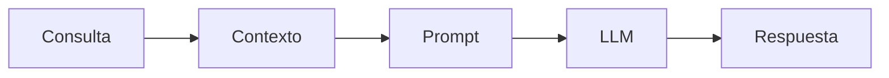

# Módulo 2 — Prompt Engineering Profesional

# Capítulo 16 — Ingeniería del Prompt

## Sección 4 — El contexto en el prompt profesional

> *"Un modelo responde con lo que sabe, pero decide qué conocimiento utilizar en función del contexto que recibe."*

---

## Objetivos de aprendizaje

- Comprender el papel del contexto en Prompt Engineering.
- Diferenciar contexto, conocimiento y memoria.
- Analizar cómo el contexto condiciona la calidad de la inferencia.
- Incorporar criterios para diseñar contexto en aplicaciones empresariales.

---

## Introducción

En la sección anterior analizamos cómo el rol establece el marco general de actuación del modelo. Sin embargo, un rol por sí solo rara vez resulta suficiente para resolver problemas reales.

El modelo necesita comprender la situación concreta sobre la cual debe trabajar. Esa información adicional constituye el contexto.

Desde la perspectiva del AI Engineering, el contexto representa uno de los recursos más valiosos de un sistema basado en Large Language Models (LLM). Su calidad influye directamente sobre la precisión, consistencia y relevancia de las respuestas generadas durante la inferencia.

---

## ¿Qué es el contexto?

El contexto es el conjunto de información que el sistema incorpora al prompt para ayudar al modelo a resolver una tarea específica.

Puede incluir:

- información del usuario;
- documentación corporativa;
- resultados de búsquedas;
- conversaciones previas;
- reglas del negocio;
- datos provenientes de otras aplicaciones.

El contexto no modifica el conocimiento interno del modelo. Lo orienta hacia la información relevante para la consulta actual, dentro del espacio disponible para la inferencia: la ventana de contexto (*Context Window*), que representa la cantidad máxima de texto —medida en tokens— que el modelo puede procesar en una sola operación.

---

## Contexto y memoria

Con frecuencia ambos conceptos se utilizan como sinónimos, aunque cumplen funciones diferentes.

| Concepto | Propósito |
|----------|-----------|
| Contexto | Información disponible para la inferencia actual. Se incorpora al prompt en el momento de la consulta. |
| Memoria | Información persistente reutilizada entre interacciones. Se almacena fuera del modelo y se recupera cuando resulta relevante. |

Para comprender la diferencia en la práctica, consideremos una conversación multi-turno. Cuando la longitud del intercambio supera la capacidad de la Context Window, los turnos más antiguos dejan de estar disponibles para la siguiente inferencia. La memoria surge para resolver ese problema: es un mecanismo externo que recupera información relevante de interacciones anteriores y la reincorpora al contexto cuando se necesita. No es simplemente "contexto persistente"; implica decisiones de diseño sobre qué guardar, cómo indexarlo y cuándo recuperarlo. Esta distinción será fundamental cuando estudiemos arquitecturas conversacionales y agentes inteligentes.

---

## Caso de estudio

Una organización desarrolla un asistente para responder consultas sobre procedimientos internos.

Sin contexto, el modelo responde utilizando únicamente su conocimiento general, que puede no reflejar las normas específicas de la organización.

Cuando el sistema incorpora las políticas internas mediante una arquitectura Retrieval-Augmented Generation (RAG) —un patrón en el que se recuperan fragmentos de documentación relevante antes de enviar el prompt al modelo—, las respuestas pasan a reflejar las normas reales de la organización.

El cambio no proviene del modelo, sino del contexto suministrado.

---

## Buenas prácticas

- Incorporar únicamente contexto relevante para la tarea en curso.
- Mantener la información actualizada y con trazabilidad de origen.
- Evitar contexto redundante o contradictorio.
- Controlar el tamaño del contexto para no superar la capacidad de la Context Window disponible.

---

## Errores frecuentes

- Asumir que más contexto siempre produce mejores respuestas. El exceso de información puede diluir lo relevante.
- Mezclar información contradictoria sin prioridad explícita.
- Incluir datos irrelevantes que aumentan el consumo de tokens sin beneficio.
- No controlar el tamaño del contexto y generar respuestas truncadas por saturación de la Context Window.

---

## Ideas clave

- El contexto orienta la inferencia del modelo hacia la información relevante para la tarea actual.
- Su calidad impacta directamente en la calidad de la respuesta.
- El contexto y la memoria son conceptos distintos: el primero es inmediato y transaccional; el segundo es persistente y recuperado.
- Diseñar el contexto constituye una tarea de ingeniería, no una decisión improvisada.

---

## Transición hacia la siguiente sección

En la próxima sección analizaremos las restricciones dentro de un prompt profesional: qué son, por qué son necesarias y cómo permiten controlar el comportamiento del modelo en aplicaciones empresariales donde la consistencia es un requisito crítico.
