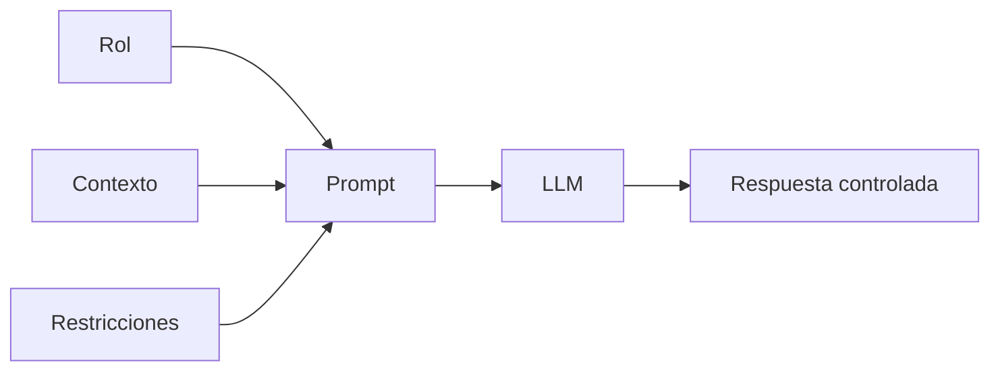

# Módulo 2 — Prompt Engineering Profesional

# Capítulo 16 — Ingeniería del Prompt

## Sección 5 — Las restricciones en el prompt profesional

> *"Un buen prompt no solo indica qué hacer. También define claramente qué no debe hacerse."*

---

## Objetivos de aprendizaje

- Comprender el papel de las restricciones dentro de un prompt profesional.
- Analizar cómo las restricciones reducen la ambigüedad durante la inferencia.
- Diferenciar restricciones funcionales y no funcionales.
- Incorporar criterios de diseño para soluciones empresariales.

---

## Introducción

Hemos estudiado hasta aquí dos de los componentes fundamentales del prompt profesional: el rol y el contexto. El rol establece el marco de actuación del modelo; el contexto le proporciona la información necesaria para la tarea. Sin embargo, incluso un modelo correctamente contextualizado puede generar respuestas que no resulten adecuadas para una aplicación empresarial.

El motivo es sencillo.

Los Large Language Models (LLM) poseen una enorme flexibilidad durante la generación de texto. Esa capacidad constituye una ventaja para tareas creativas, pero representa un desafío cuando se requieren respuestas consistentes, auditables y alineadas con reglas de negocio.

Las restricciones aparecen precisamente para reducir ese espacio de incertidumbre. Son el tercer componente del modelo de anatomía del prompt que presentamos en la Sección 2.

---

## ¿Qué son las restricciones?

Las restricciones representan un conjunto de reglas que limitan el comportamiento permitido del modelo.

No describen el problema.

No aportan conocimiento.

Su función consiste en establecer los límites dentro de los cuales debe desarrollarse la respuesta.

Algunos ejemplos son:

- utilizar únicamente la información proporcionada;
- responder en un idioma determinado;
- no realizar suposiciones;
- citar las fuentes utilizadas;
- limitar la extensión de la respuesta;
- generar una estructura específica.

---

## Tipos de restricciones

Desde una perspectiva de ingeniería pueden distinguirse dos grandes categorías.

| Tipo | Finalidad | Ejemplo |
|------|-----------|---------|
| Funcionales | Definen qué debe o no debe hacer el modelo. | "No responder preguntas fuera del dominio legal cubierto por el contrato." |
| No funcionales | Establecen requisitos de formato, longitud, idioma, estilo o rendimiento. | "Responder siempre en menos de 200 palabras en español formal." |

Las restricciones funcionales afectan el *qué*: delimitan el dominio de actuación del modelo. Las no funcionales afectan el *cómo*: definen la forma que debe tomar la respuesta. Esta distinción tiene consecuencias prácticas en el mantenimiento del prompt: cuando una restricción funcional y una no funcional entran en conflicto, el equipo necesita saber cuál tiene mayor prioridad.

Esta clasificación resulta especialmente útil cuando los prompts forman parte de sistemas complejos y deben mantenerse durante largos períodos. Conviene también tener en cuenta que las restricciones no sustituyen los controles de seguridad de la aplicación: son una capa del prompt, no el único mecanismo de defensa del sistema.

---

## Caso de estudio

Una organización desarrolla un asistente para responder consultas legales.

Durante las primeras pruebas el modelo complementa artículos de la legislación con información inferida a partir de su entrenamiento general.

Aunque muchas respuestas parecen razonables, algunas incluyen interpretaciones que no forman parte del marco normativo vigente.

El problema se corrige incorporando una restricción explícita:

> "Responde únicamente utilizando la normativa incluida en el contexto. Si la información no está disponible, indícalo expresamente."

Esta modificación reduce significativamente las respuestas no verificables.

---

## Buenas prácticas

- Escribir restricciones de forma explícita; nunca confiar en restricciones implícitas.
- Evitar reglas ambiguas que puedan interpretarse de más de una manera.
- Diferenciar claramente restricciones y objetivos dentro del prompt.
- Revisar periódicamente su vigencia a medida que el negocio evoluciona.

---

## Errores frecuentes

- Confiar en que el modelo inferirá las restricciones a partir del contexto.
- Incorporar reglas contradictorias que el modelo no puede resolver.
- Definir restricciones excesivamente generales que no acotan el comportamiento real.
- Olvidar actualizar las restricciones cuando cambian las reglas del negocio.

---

## Ideas clave

- Las restricciones delimitan el comportamiento del modelo; no describen el problema ni aportan conocimiento.
- Constituyen un mecanismo esencial para aumentar la confiabilidad en aplicaciones empresariales.
- La distinción entre restricciones funcionales y no funcionales facilita el mantenimiento y la resolución de conflictos entre reglas.

---

## Transición hacia la siguiente sección

En la próxima sección estudiaremos los dos componentes restantes del prompt profesional: los criterios de calidad y el formato de salida. Estos elementos transforman las respuestas del modelo en artefactos consistentes y fácilmente consumibles por otras aplicaciones.
