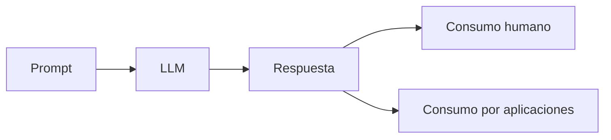

# Módulo 2 — Prompt Engineering Profesional

# Capítulo 16 — Ingeniería del Prompt

## Sección 6 — Formato de salida y criterios de calidad

> *"Una respuesta útil no depende únicamente de su contenido. También depende de la forma en que puede ser utilizada por otros sistemas."*

---

## Objetivos de aprendizaje

- Comprender la importancia del formato de salida en Prompt Engineering.
- Diferenciar respuestas orientadas a personas y respuestas orientadas a sistemas.
- Analizar el papel de los criterios de calidad dentro de un prompt profesional.
- Introducir el concepto de salidas estructuradas.

---

## Introducción

Hemos estudiado hasta aquí el rol, el contexto y las restricciones. Esos tres componentes orientan al modelo hacia el problema correcto y limitan su comportamiento. Quedan dos elementos más para completar la anatomía del prompt profesional: el formato de salida y los criterios de calidad.

En una conversación entre personas, pequeñas diferencias de formato rara vez representan un problema.

En cambio, cuando la respuesta será procesada por otra aplicación, almacenada en una base de datos o utilizada por un agente, la estructura deja de ser un detalle para convertirse en un requisito de ingeniería.

---

## El formato también forma parte del diseño

Un modelo puede generar respuestas técnicamente correctas, pero difíciles de reutilizar por otros componentes.

Por este motivo, el formato esperado debe formar parte explícita del prompt.

Entre los formatos más habituales se encuentran:

- texto estructurado;
- listas jerárquicas;
- tablas;
- Markdown;
- JSON;
- XML;
- objetos compatibles con APIs.

Cuando la salida es un formato estructurado como JSON o XML, es necesario recordar que el modelo puede generar respuestas malformadas, incompletas o con campos adicionales no solicitados. Por ese motivo, las salidas estructuradas deben validarse en la capa de aplicación, independientemente de lo que especifique el prompt. Un prompt que solicita JSON no garantiza JSON válido: garantiza que el modelo intentará generarlo.

---

## Criterios de calidad

Además del formato, un prompt profesional suele incorporar criterios que orientan al modelo sobre qué se considera una respuesta aceptable.

| Criterio | Finalidad |
|----------|-----------|
| Precisión | Reducir ambigüedad en la respuesta. |
| Completitud | Cubrir todos los aspectos solicitados. |
| Trazabilidad | Justificar afirmaciones cuando corresponda. |
| Consistencia | Mantener un estilo uniforme entre respuestas. |
| Reutilización | Facilitar el procesamiento posterior. |

Los criterios de calidad cumplen dos funciones complementarias que conviene distinguir con claridad:

- **Dentro del prompt**: le comunican al modelo qué estándares debe alcanzar la respuesta. Son parte de la especificación.
- **Fuera del prompt**: le permiten al equipo de ingeniería verificar si esos estándares se cumplieron. Son parte del proceso de evaluación.

Esta dualidad se retomará en la Sección 8, donde analizaremos cómo convertir esos criterios en métricas de evaluación sistemática. Lo importante en esta sección es que los criterios de calidad transforman al prompt en una especificación verificable y no simplemente en una instrucción.

---

## Caso de estudio

Una empresa desarrolla un sistema para clasificar documentos.

La primera versión solicita únicamente una explicación del contenido.

Posteriormente el prompt evoluciona para devolver un objeto JSON con:

- categoría;
- nivel de confianza;
- palabras clave;
- resumen;
- observaciones.

Sin modificar el modelo, la aplicación pasa de requerir procesamiento manual a integrarse automáticamente con el resto de la plataforma.

La diferencia reside en el diseño del formato de salida. El equipo añade además una capa de validación de esquema que verifica que el JSON recibido contenga exactamente los cinco campos esperados antes de enviarlo al siguiente componente del sistema.

---

## Buenas prácticas

- Definir explícitamente el formato esperado; no asumir que el modelo elegirá el adecuado.
- Mantener estructuras consistentes entre versiones del prompt.
- Diseñar salidas fáciles de validar externamente.
- Validar el esquema de las salidas estructuradas en la capa de aplicación.

---

## Errores frecuentes

- Confiar en que el modelo elegirá espontáneamente el formato adecuado.
- Cambiar la estructura de salida sin versionado ni comunicación a los sistemas consumidores.
- Mezclar información estructurada y narrativa sin necesidad explícita.
- Diseñar respuestas difíciles de procesar automáticamente por no haber especificado el esquema.

---

## Ideas clave

- El formato de salida constituye un requisito funcional del prompt, no una opción secundaria.
- Una buena estructura facilita la integración con otras aplicaciones.
- Los criterios de calidad tienen una doble función: orientan al modelo dentro del prompt y sirven como referencia de evaluación fuera de él.

---

## Transición hacia la siguiente sección

En la próxima sección articularemos todos los componentes estudiados —rol, objetivo, contexto, restricciones, criterios de calidad y formato— para analizar el proceso de construcción de un prompt profesional integrado.
