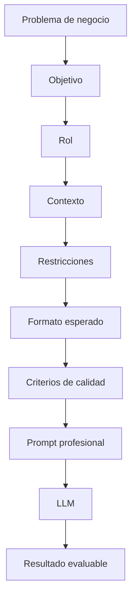

# Módulo 2 — Prompt Engineering Profesional

# Capítulo 16 — Ingeniería del Prompt

## Sección 7 — Construyendo un prompt profesional

> *"La diferencia entre un prompt improvisado y uno profesional no reside en su longitud, sino en las decisiones de diseño que lo componen."*

---

## Objetivos de aprendizaje

- Integrar todos los componentes estudiados en un prompt profesional.
- Comprender el proceso de diseño de un prompt desde la perspectiva del AI Engineering.
- Analizar cómo cada bloque contribuye a la calidad de la respuesta.
- Introducir una metodología sistemática para construir prompts reutilizables.

---

## Introducción

A lo largo de las secciones anteriores hemos estudiado cada componente del prompt profesional de manera independiente: el rol, el objetivo, el contexto, las restricciones, el formato de salida y los criterios de calidad.

En una aplicación empresarial estos elementos no aparecen de manera aislada. Se integran para formar una única especificación que guía el comportamiento del modelo.

Desde esta perspectiva, diseñar un prompt se asemeja mucho más al diseño de un contrato entre componentes de software que a la redacción de una instrucción en lenguaje natural. Esta sección cierra el ciclo de los componentes y muestra cómo el proceso de diseño va del problema de negocio al resultado evaluable.

---

## El proceso de diseño

El siguiente esquema resume el proceso de construcción de un prompt profesional.



Obsérvese que el prompt no constituye el punto de partida del proceso.

El diseño comienza comprendiendo el problema de negocio. Solo después se determina el objetivo, se define el rol, se selecciona el contexto relevante, se establecen las restricciones y se especifican el formato y los criterios de calidad.

---

## Un ejemplo: del problema al prompt

Supongamos que una organización necesita analizar contratos para detectar riesgos.

Una aproximación improvisada podría consistir en escribir:

> Analiza este contrato.

Desde una perspectiva de ingeniería esa instrucción resulta insuficiente. No especifica qué tipo de análisis se espera, desde qué perspectiva, con qué información adicional, bajo qué restricciones ni en qué formato debe entregarse el resultado.

Un diseño profesional partiría del problema —detectar riesgos contractuales de forma auditable— y construiría el prompt componente por componente:

| Componente | Decisión de diseño |
|------------|-------------------|
| Rol | Abogado especializado en contratos comerciales. |
| Objetivo | Identificar riesgos contractuales y clasificarlos por severidad. |
| Contexto | Políticas internas de la organización y normativa aplicable. |
| Restricciones | No realizar inferencias sin evidencia documental. Citar la cláusula que sustenta cada observación. |
| Formato | Tabla con columnas: riesgo, cláusula de referencia, severidad (alta/media/baja) y recomendación. |
| Criterios de calidad | Cada observación debe estar fundamentada; no incluir riesgos inferidos sin sustento textual. |

El resultado de integrar estas decisiones en texto podría ser:

```
Actúa como un abogado especializado en contratos comerciales.

Tu tarea es analizar el contrato adjunto e identificar los riesgos contractuales presentes,
clasificándolos por severidad (alta, media o baja).

Utiliza únicamente la información contenida en el documento y en las políticas internas
adjuntas. No realices inferencias que no estén sustentadas en el texto.

Para cada riesgo identificado, indica:
- la cláusula o sección que lo origina,
- la severidad (alta / media / baja),
- una recomendación concreta.

Presenta los resultados en formato de tabla con las columnas: Riesgo | Cláusula | Severidad | Recomendación.

Cada observación debe citar el texto que la fundamenta. Si no encuentras evidencia suficiente para una observación, no la incluyas.
```

Este texto es el prompt completo tal como se enviaría al modelo. Aunque el modelo utilizado sea exactamente el mismo que antes, la calidad y consistencia del resultado aumentan considerablemente.

---

## El prompt como contrato

Una forma útil de comprender esta evolución consiste en pensar el prompt como un contrato.

Así como una API define qué información intercambiarán dos aplicaciones, un prompt define cómo interactuarán la aplicación y el modelo. Cuanto más preciso sea ese contrato, menor será la incertidumbre durante la inferencia.

Cuando el contrato es impreciso, aparecen consecuencias concretas: el modelo puede ignorar restricciones que no están formuladas con precisión suficiente, entregar un formato diferente al esperado porque el esquema no se especificó completamente, o incluir información inferida porque no se limitó explícitamente el uso del conocimiento interno del modelo.

Actualizar un prompt es equivalente a renegociar las cláusulas de ese contrato. Por eso cada modificación debe evaluarse antes de pasar a producción y debe quedar registrada con una nueva versión.

---

## Buenas prácticas

- Diseñar el prompt a partir del problema de negocio, no a partir del modelo.
- Separar claramente cada bloque funcional y documentar su propósito.
- Redactar el prompt completo en texto antes de considerarlo listo para pruebas.
- Versionar cualquier modificación relevante y evaluarla antes del despliegue.

---

## Errores frecuentes

- Escribir el prompt antes de comprender el problema que debe resolver.
- Incorporar instrucciones contradictorias entre bloques.
- Omitir criterios de calidad porque el resultado "parece correcto" en pruebas manuales.
- Considerar el prompt como un elemento descartable en lugar de un activo de ingeniería.

---

## Ideas clave

- Un prompt profesional integra múltiples componentes con responsabilidades diferenciadas.
- El diseño comienza en el problema de negocio y termina en un resultado evaluable.
- Los prompts son contratos entre la aplicación y el modelo: la precisión del contrato determina la consistencia del resultado.

---

## Transición hacia la siguiente sección

Construido el prompt, la pregunta inevitable es: ¿cumple realmente con el objetivo para el cual fue diseñado? En la próxima sección analizaremos cómo evaluar la calidad de un prompt de manera sistemática y por qué esa evaluación es indispensable en aplicaciones empresariales.
