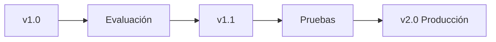

# Módulo 2 — Prompt Engineering Profesional

# Capítulo 16 — Ingeniería del Prompt

## Sección 9 — Versionado de prompts

> *"Aquello que no puede versionarse tampoco puede evolucionar de forma segura."*

---

## Objetivos de aprendizaje

- Comprender la necesidad de versionar prompts.
- Analizar la evolución controlada de un prompt en producción.
- Relacionar el versionado con calidad, auditoría y mantenimiento.
- Entender el versionado como la práctica que formaliza el ciclo de vida del prompt.

---

## Introducción

En la sección anterior establecimos que un prompt debe evaluarse sistemáticamente. La evaluación produce evidencia sobre el comportamiento del sistema. El versionado convierte esa evidencia en trazabilidad.

En la ingeniería de software resulta impensable modificar código directamente en producción sin conservar un historial de cambios. Sin embargo, durante los primeros años de adopción de los Large Language Models (LLM), muchas organizaciones trataban los prompts como simples textos que podían modificarse en cualquier momento.

Ese enfoque pronto mostró sus limitaciones.

Un pequeño cambio en una instrucción puede alterar el comportamiento de una aplicación completa. Por ello, un prompt debe considerarse un activo versionable, con las mismas exigencias de control de cambios que cualquier otro componente del sistema.

---

## ¿Por qué versionar un prompt?

Versionar permite conocer:

- qué cambió;
- por qué cambió;
- quién realizó la modificación;
- qué resultados produjo esa versión en la evaluación;
- cómo volver a una versión anterior si fuera necesario.

El objetivo no consiste únicamente en conservar un historial, sino en reducir el riesgo asociado a la evolución del sistema y en poder demostrar, ante cualquier incidente, qué versión del prompt estaba activa y qué comportamiento se esperaba de ella.

La analogía con el control de versiones de código es directa: una versión de prompt es como un commit; revertir a una versión anterior es como hacer un rollback; trabajar en una rama permite probar cambios sin afectar el sistema en producción.

---

## Versionado como práctica de ingeniería

Un prompt puede evolucionar por múltiples razones:

| Motivo | Ejemplo |
|--------|----------|
| Cambio de negocio | Nuevas políticas internas. |
| Mejora de precisión | Ajuste de restricciones. |
| Nuevo formato | Salida JSON en lugar de texto libre. |
| Optimización | Reducción de tokens —las unidades de texto que el modelo procesa, que impactan directamente en el costo de inferencia— para reducir costos. |
| Integración | Compatibilidad con nuevas herramientas del sistema. |

Cada modificación debe estar acompañada por evidencia obtenida mediante pruebas comparativas. El proceso de evaluación descrito en la Sección 8 es el que genera esa evidencia; el versionado es el que la registra y la vincula con cada versión del prompt.

---

## Caso de estudio

Un asistente de soporte técnico incorpora un nuevo formato de respuesta para facilitar su integración con un sistema de tickets.

El equipo conserva ambas versiones del prompt y ejecuta la misma batería de pruebas sobre cada una.

Gracias al versionado detecta que la nueva estructura mejora la integración, pero también incrementa ligeramente la longitud promedio de las respuestas.

Con esta información decide adoptar la nueva versión —registrada como v1.1— y planificar una optimización posterior orientada a reducir el consumo de tokens sin afectar la calidad de la integración.

---

## Buenas prácticas

- Asignar un identificador único a cada versión del prompt.
- Documentar el motivo del cambio y los resultados de evaluación asociados a cada versión.
- Gestionar los artefactos del prompt —texto, versión, metadatos— dentro del repositorio del proyecto.
- Mantener siempre la posibilidad de revertir a una versión anterior antes del despliegue de una nueva.

---

## Errores frecuentes

- Sobrescribir prompts sin historial, eliminando la capacidad de revertir y auditar.
- Versionar únicamente cuando aparece un problema, en lugar de hacerlo de manera sistemática.
- No vincular cada versión con sus resultados de evaluación.
- Cambiar varios componentes del prompt simultáneamente sin trazabilidad de cuál cambio originó cada resultado.

---

## Ideas clave

- Los prompts evolucionan igual que cualquier componente de software y deben gestionarse con el mismo rigor.
- El versionado aporta trazabilidad, seguridad y capacidad de auditoría.
- La evaluación y el versionado son prácticas complementarias: la primera genera evidencia; la segunda la preserva.

---

## Transición hacia la siguiente sección

Evaluación y versionado son los pilares operacionales de la gestión de prompts. En la próxima sección cerraremos el capítulo integrando estas prácticas en el marco de PromptOps: la disciplina que gestiona los prompts como activos estratégicos a lo largo de todo su ciclo de vida en plataformas empresariales de Inteligencia Artificial (IA).
