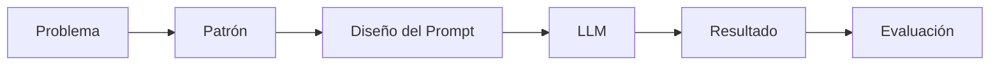

# Módulo 2 — Prompt Engineering Profesional

# Capítulo 17 — Patrones de Prompt Engineering

> *"Conocer un patrón no significa aplicarlo siempre. La ingeniería consiste en saber cuándo utilizarlo y cuándo descartarlo."*

---

## Objetivos de aprendizaje

- Comprender qué es un patrón de Prompt Engineering.
- Diferenciar técnicas aisladas de patrones reutilizables.
- Analizar por qué surgieron los patrones modernos.
- Introducir un marco para seleccionar el patrón adecuado según el problema.

---

## Introducción

En el capítulo anterior tratamos al prompt como un componente de ingeniería. Aprendimos a diseñarlo, estructurarlo, evaluarlo y gestionarlo durante su ciclo de vida.

Sin embargo, no todos los problemas requieren el mismo tipo de prompt.

Solicitar un resumen, clasificar documentos, generar código, planificar tareas o coordinar agentes demanda estrategias diferentes.

Con el tiempo, la comunidad comenzó a identificar soluciones recurrentes para este tipo de situaciones. Esas soluciones reutilizables dieron origen a los **patrones de Prompt Engineering**.

---

## ¿Qué es un patrón?

Un patrón describe una forma probada de resolver un problema recurrente dentro de un contexto determinado.

No es una receta universal.

Tampoco constituye una garantía de éxito.

Su valor reside en capturar experiencia acumulada y ofrecer un punto de partida para el diseño.

En Prompt Engineering, un patrón define una manera de estructurar la interacción con el modelo para obtener un comportamiento más consistente.

---

## ¿Por qué aparecieron?

Los primeros usuarios de Large Language Models (LLMs) improvisaban cada prompt desde cero.

A medida que creció el uso profesional de estos modelos, comenzaron a repetirse ciertos problemas:

- respuestas inconsistentes;
- razonamientos incompletos;
- dificultad para resolver tareas complejas;
- baja reutilización entre proyectos.

Los patrones surgieron como una respuesta a estas limitaciones.

---

## Clasificación inicial

A lo largo de este capítulo estudiaremos los principales patrones modernos, presentados en el orden en que serán desarrollados:

| Patrón | Objetivo principal | Costo relativo |
|--------|--------------------|----------------|
| Zero-Shot | Resolver tareas sin ejemplos previos. | Bajo |
| One-Shot | Guiar el comportamiento mediante un ejemplo. | Bajo |
| Few-Shot | Generalizar a partir de múltiples ejemplos. | Medio |
| Chain of Thought | Favorecer el razonamiento paso a paso. | Medio |
| Self-Consistency | Comparar distintos razonamientos antes de responder. | Alto |
| ReAct | Combinar razonamiento y acciones. | Variable |
| Tree of Thoughts | Explorar múltiples caminos de resolución. | Alto |

Cada uno responde a problemas diferentes y presenta ventajas y limitaciones particulares. Los patrones de mayor complejidad —Chain of Thought, Self-Consistency y Tree of Thoughts— incrementan el consumo de tokens y la latencia; su adopción debe justificarse por la complejidad o el riesgo de la tarea, no por preferencia técnica.

---

## Caso de estudio

Un equipo desarrolla un asistente para clasificar reclamos de clientes.

Inicialmente utiliza un único prompt genérico.

Tras varias iteraciones descubre que incorporar ejemplos representativos mejora significativamente la precisión de la clasificación.

Sin cambiar el modelo, el equipo adopta un patrón **Few-Shot** y obtiene resultados más estables.

La mejora no provino del modelo, sino del patrón utilizado para interactuar con él.

---

## Buenas prácticas

- Seleccionar el patrón según el problema.
- Comprender el propósito antes de aplicarlo.
- Validar empíricamente los resultados.
- Combinar patrones solo cuando exista una justificación clara.

---

## Errores frecuentes

- Aplicar siempre el mismo patrón.
- Elegir una técnica por moda y no por necesidad.
- Asumir que los patrones reemplazan un buen diseño del prompt.
- Evaluar únicamente casos favorables.

---

## Ideas clave

- Los patrones capturan experiencia reutilizable.
- Ningún patrón es universal.
- La selección del patrón constituye una decisión de ingeniería.

---

## Transición hacia la siguiente sección

En la próxima sección estudiaremos el patrón **Zero-Shot Prompting**, analizando cuándo resulta suficiente y cuáles son sus principales limitaciones en soluciones empresariales.

---

> **"Un arquitecto no memoriza respuestas. Comprende problemas para poder diseñar soluciones."**
