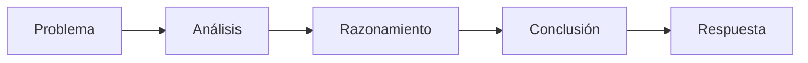

# Módulo 2 — Prompt Engineering Profesional

# Capítulo 17 — Patrones de Prompt Engineering

## Sección 05 — Chain of Thought Prompting

> *"Resolver un problema complejo rara vez consiste en encontrar la respuesta correcta de inmediato. Consiste en construir un razonamiento que conduzca a ella."*

---

## Objetivos de aprendizaje

- Comprender el patrón **Chain of Thought (CoT) Prompting**.
- Analizar por qué el razonamiento paso a paso mejora determinadas tareas.
- Identificar escenarios donde CoT aporta valor y otros donde resulta innecesario.
- Incorporar criterios para utilizar CoT en aplicaciones empresariales.

---

## Introducción

¿Qué sucede cuando el problema no tiene una respuesta directa, sino que requiere construir un camino hacia ella?

Cálculos, planificación, análisis normativo, diagnóstico, toma de decisiones y resolución de problemas complejos tienen en común que la dificultad no radica únicamente en producir una respuesta, sino en **construir un proceso de razonamiento**.

Para este tipo de situaciones aparece **Chain of Thought Prompting (CoT)**.

---

## ¿Qué es Chain of Thought?

Chain of Thought consiste en incentivar al modelo a resolver un problema mediante una secuencia organizada de pasos intermedios antes de producir la respuesta final.

Conceptualmente, el patrón busca transformar un problema complejo en una serie de decisiones más pequeñas.



El objetivo no es hacer la respuesta más extensa, sino favorecer un proceso de inferencia más estructurado.

La forma más sencilla de activar CoT es mediante una instrucción explícita en el prompt:

```
Analizá el siguiente incidente de seguridad. Antes de emitir tu conclusión,
razoná paso a paso: identificá las evidencias disponibles, descartá hipótesis
improbables y justificá cada decisión.

Incidente: "A las 2:15 AM se detectaron 3.000 intentos de login fallidos
desde una única IP ubicada en un país donde la empresa no opera."
```

Esta variante se conoce como **Zero-Shot CoT**: no requiere ejemplos, solo la instrucción de razonar paso a paso. En la variante **Few-Shot CoT**, se incorporan ejemplos donde la respuesta modelo ya incluye el razonamiento explícito, lo que permite al modelo aprender también el estilo y la profundidad del análisis esperado.

---

## ¿Cuándo utilizar CoT?

Este patrón resulta especialmente útil cuando la tarea requiere:

| Escenario | Motivo |
|-----------|--------|
| Resolución de problemas | Existen múltiples pasos intermedios. |
| Diagnósticos | Deben evaluarse distintas evidencias. |
| Planificación | Es necesario ordenar acciones. |
| Análisis normativo | Deben justificarse conclusiones. |
| Arquitectura | Hay que comparar alternativas antes de decidir. |

Por el contrario, tareas simples como traducciones o clasificaciones básicas rara vez justifican el costo adicional.

---

## Beneficios y limitaciones

### Beneficios

- Favorece respuestas más consistentes.
- Reduce errores en problemas complejos.
- Facilita la justificación de decisiones.
- Hace más visible el proceso seguido por el modelo.

### Limitaciones

- Incrementa el consumo de tokens.
- Puede aumentar la latencia.
- No garantiza una conclusión correcta si el razonamiento parte de premisas incorrectas.
- No todas las tareas requieren razonamiento explícito.

Una advertencia importante: los pasos de razonamiento visibles que genera CoT son outputs del modelo, no una ventana directa a su proceso interno de inferencia. Un razonamiento "bien estructurado" puede ser plausible y aun así incorrecto. Los pasos intermedios deben validarse con la misma rigurosidad que cualquier otra salida del sistema.

---

## Caso de estudio

Un equipo desarrolla un asistente para apoyar el análisis de incidentes de ciberseguridad.

Con un enfoque Zero-Shot el modelo suele responder con una causa probable, pero omite justificarla.

Tras incorporar una estrategia basada en Chain of Thought, el sistema comienza a analizar evidencias, descartar hipótesis y construir una explicación antes de emitir la conclusión.

El resultado no solo mejora la precisión percibida, sino también la confianza de los analistas que utilizan la herramienta.

---

## Buenas prácticas

- Reservar CoT para problemas que realmente requieren razonamiento.
- Evaluar el costo adicional de inferencia antes de adoptar el patrón.
- Solicitar pasos claros y verificables, no explicaciones extensas.
- Comparar la calidad de las conclusiones con y sin CoT en una muestra del dominio antes de generalizar a producción.

---

## Errores frecuentes

- Aplicar CoT a tareas triviales donde el costo no se justifica.
- Asumir que más razonamiento implica mejores respuestas.
- Confundir explicaciones largas con razonamiento de calidad.
- No validar las conclusiones obtenidas: los pasos visibles no garantizan que la inferencia sea correcta.

---

## Ideas clave

- Chain of Thought guía el proceso de razonamiento, no solo la respuesta.
- Su mayor valor aparece en problemas complejos donde los pasos intermedios son necesarios para llegar a la conclusión.
- Debe utilizarse cuando el beneficio supera el costo operativo.

---

## Transición hacia la siguiente sección

En la próxima sección estudiaremos **Self-Consistency**, un patrón que amplía Chain of Thought generando múltiples razonamientos alternativos antes de seleccionar la respuesta más consistente.
