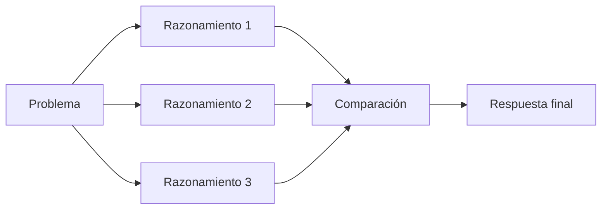

# Módulo 2 — Prompt Engineering Profesional

# Capítulo 17 — Patrones de Prompt Engineering

## Sección 06 — Self-Consistency

> *"Cuando un único razonamiento no ofrece suficiente confianza, la ingeniería busca evidencia adicional antes de decidir."*

---

## Objetivos de aprendizaje

- Comprender el patrón **Self-Consistency**.
- Analizar cómo múltiples cadenas de razonamiento pueden mejorar la confiabilidad.
- Evaluar el costo y el beneficio de este enfoque.
- Identificar escenarios donde resulta apropiado utilizarlo.

---

## Introducción

Un único razonamiento puede conducir a una conclusión incorrecta. Una premisa equivocada al inicio de una cadena de pensamiento puede propagarse hasta la respuesta final sin que el sistema detecte el error.

El patrón **Self-Consistency** aborda este problema desde un ángulo distinto: en lugar de refinar un único razonamiento, el sistema genera varios razonamientos independientes y selecciona la conclusión que emerge con mayor consistencia entre ellos.

---

## ¿Qué es Self-Consistency?

En lugar de confiar en una única secuencia de razonamiento, el sistema explora múltiples caminos posibles y compara sus resultados.

El objetivo no consiste en obtener muchas respuestas, sino en aumentar la probabilidad de seleccionar la más robusta.

**¿Cómo se implementa en la práctica?** El mecanismo más habitual consiste en realizar múltiples llamadas independientes al LLM con una temperatura mayor a cero —el parámetro que controla la variabilidad de las respuestas— para obtener diferentes caminos de razonamiento sobre el mismo problema. Las conclusiones de cada cadena se extraen y se selecciona la que aparece con mayor frecuencia, un proceso conocido como votación por mayoría. Esta selección puede ejecutarla código externo o un LLM evaluador. Esto implica N llamadas a la API en lugar de una, con el consiguiente impacto multiplicativo en costo y latencia.

---

## ¿Cuándo utilizarlo?

Self-Consistency aporta valor cuando:

| Escenario | Beneficio |
|-----------|-----------|
| Diagnóstico | Reduce el riesgo de conclusiones apresuradas. |
| Planificación | Compara estrategias alternativas. |
| Resolución de problemas complejos | Disminuye errores de razonamiento. |
| Evaluaciones críticas | Incrementa la confianza antes de decidir. |

Para tareas simples, el costo adicional suele superar el beneficio.

---

## Costos operativos

Si Chain of Thought (CoT) ya introduce un costo adicional por el razonamiento explícito, Self-Consistency multiplica ese costo. Al generar N cadenas de razonamiento, el consumo de tokens y el tiempo de inferencia se multiplican aproximadamente por N respecto a un único prompt CoT.

Esto significa que Self-Consistency incrementa:

- el consumo de tokens en proporción al número de cadenas generadas;
- el tiempo de inferencia de forma proporcional;
- el costo económico de cada llamada;
- la complejidad de la orquestación, que ahora incluye lógica de selección y agregación de resultados.

Como referencia práctica, cinco a diez cadenas constituyen un punto de partida razonable para decisiones de riesgo medio; más de diez solo se justifican cuando el impacto de una decisión incorrecta sea significativo. A partir de cierto número, los retornos son decrecientes.

Por ello, debe reservarse para escenarios donde la calidad de la decisión sea más importante que la velocidad de respuesta.

---

## Caso de estudio

Una entidad financiera utiliza un LLM para asistir en la evaluación preliminar de operaciones inusuales.

En lugar de aceptar la primera explicación generada, el sistema produce varias cadenas de razonamiento y compara sus conclusiones.

Cuando existe convergencia entre ellas, aumenta la confianza de la recomendación. Si aparecen diferencias significativas, la operación se deriva a un analista humano.

---

## Buenas prácticas

- Utilizar Self-Consistency únicamente cuando el riesgo lo justifique.
- Definir criterios objetivos para la selección de la respuesta final: ya sea por mayoría de votos sobre las conclusiones, ya sea por un evaluador externo con criterios formalizados.
- Registrar métricas de calidad y costo para justificar el uso del patrón.
- Combinar este patrón con evaluación automatizada que verifique la coherencia de los razonamientos, no solo la frecuencia de las conclusiones.

---

## Errores frecuentes

- Aplicarlo indiscriminadamente a cualquier tarea de razonamiento.
- Confundir cantidad de razonamientos con calidad: más cadenas no garantizan que la respuesta mayoritaria sea correcta.
- Ignorar el impacto multiplicativo sobre la latencia.
- No definir cómo seleccionar la respuesta final antes de implementar el patrón.

---

## Ideas clave

- Self-Consistency incrementa la robustez comparando múltiples razonamientos independientes.
- Su principal ventaja aparece en decisiones de alto impacto donde un error de razonamiento tiene consecuencias significativas.
- El aumento de calidad debe compensar el costo adicional de inferencia, que se multiplica por el número de cadenas generadas.

---

## Transición hacia la siguiente sección

En la próxima sección estudiaremos **ReAct (Reason + Act)**, un patrón que combina razonamiento con la capacidad de utilizar herramientas externas para resolver problemas que exceden el conocimiento interno del modelo.
