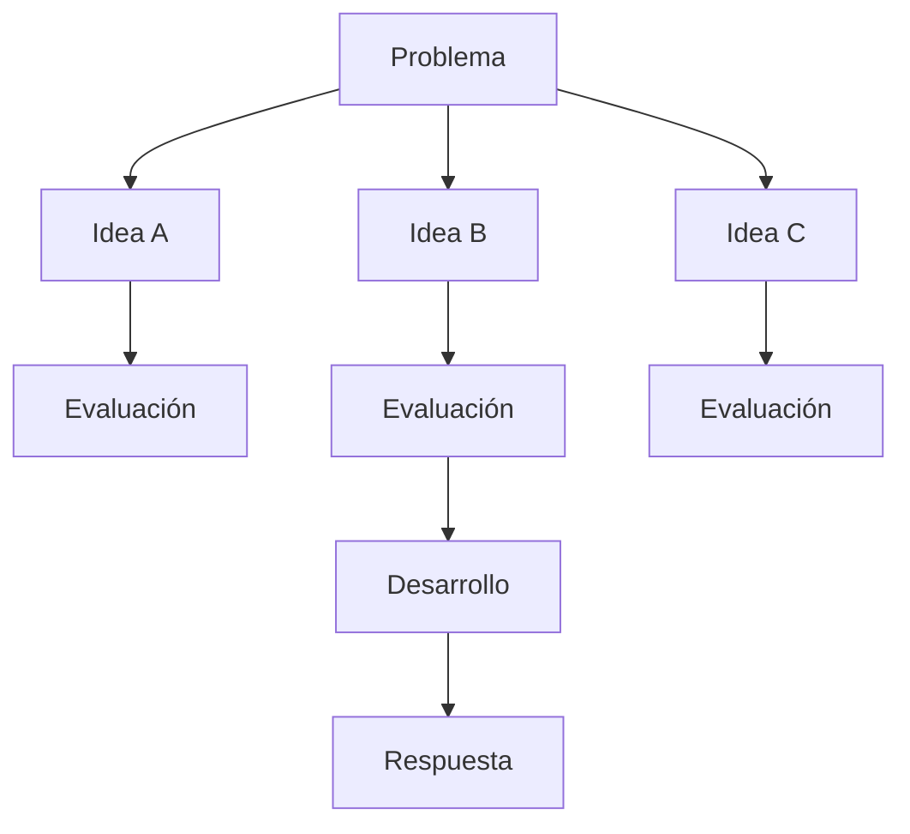

# Módulo 2 — Prompt Engineering Profesional

# Capítulo 17 — Patrones de Prompt Engineering

## Sección 08 — Tree of Thoughts

> *"Las mejores decisiones rara vez aparecen al explorar un único camino. Surgen después de comparar alternativas."*

---

## Objetivos de aprendizaje

- Comprender el patrón **Tree of Thoughts (ToT)**.
- Analizar cómo amplía las capacidades de razonamiento de un LLM.
- Diferenciar Tree of Thoughts de Chain of Thought.
- Identificar escenarios donde explorar múltiples alternativas aporta valor.

---

## Introducción

El razonamiento lineal tiene una limitación estructural: es irreversible. Si en Chain of Thought (CoT) el razonamiento inicial toma una dirección incorrecta, toda la conclusión puede verse afectada, y el sistema no puede retroceder a un punto anterior para explorar una alternativa diferente.

**Tree of Thoughts (ToT)** resuelve esta limitación organizando el razonamiento como un árbol en lugar de una línea. Esto permite al sistema retroceder a cualquier nodo del árbol y continuar por una rama diferente, algo que CoT no puede hacer por su naturaleza secuencial.

Desde la perspectiva del AI Engineering, este patrón se asemeja más a un algoritmo de búsqueda que a una conversación tradicional.

---

## ¿Qué es Tree of Thoughts?

Tree of Thoughts organiza el proceso de razonamiento como un árbol.

Cada nodo representa una posible línea de pensamiento.

El sistema puede expandir, comparar, descartar o profundizar cada rama antes de seleccionar la solución final.

El objetivo no consiste en generar más texto, sino en explorar el espacio de soluciones de forma controlada.

**¿Cómo funciona la evaluación y poda de ramas?** Este es el mecanismo central del patrón. Cada rama generada debe evaluarse antes de decidir si vale la pena desarrollarla. Existen dos estrategias principales:

- **LLM-as-judge**: el mismo modelo actúa como evaluador de sus propias ramas mediante una llamada separada con un prompt específico. Esta estrategia es flexible pero puede introducir sesgo de confirmación si el prompt evaluador no se diseña con cuidado.
- **Evaluador externo**: una función con reglas formalizadas de negocio evalúa cada rama. Es más confiable cuando los criterios son objetivos y medibles.

El criterio de poda puede ser un umbral de puntuación mínimo o la selección de las K ramas mejor evaluadas en cada nivel —un mecanismo análogo al beam search en búsqueda heurística. Cada nivel del árbol implica múltiples llamadas a la API, con un impacto de costo proporcional al número de ramas y niveles explorados.

---

## Comparación con Chain of Thought

| Aspecto | Chain of Thought | Tree of Thoughts |
|---------|------------------|------------------|
| Caminos explorados | Uno | Múltiples |
| Evaluación intermedia | Limitada | Explícita |
| Capacidad de corrección | Baja | Alta |
| Costo computacional | Menor | Mayor |

ToT incrementa el costo de Inference (inferencia), pero puede producir mejores resultados cuando existen numerosas alternativas posibles y el problema permite retroceder y reorientar el razonamiento.

---

## ¿Cuándo utilizar Tree of Thoughts?

Este patrón resulta especialmente útil en tareas como:

- planificación estratégica;
- diseño de arquitecturas;
- resolución de problemas abiertos;
- optimización de procesos;
- análisis de múltiples escenarios;
- apoyo a la toma de decisiones.

En problemas simples, el beneficio suele ser inferior al costo adicional.

---

## Caso de estudio

Un equipo debe diseñar la arquitectura de una plataforma empresarial de IA.

No existe una única solución correcta.

El sistema genera tres alternativas:

- arquitectura completamente en la nube;
- infraestructura híbrida;
- despliegue on-premise.

Cada alternativa se evalúa según costo, escalabilidad, seguridad y mantenimiento.

En lugar de responder inmediatamente, el modelo compara las opciones y desarrolla únicamente la que mejor satisface los requisitos del negocio.

El patrón no reemplaza el criterio del arquitecto, pero amplía la capacidad para analizar opciones antes de decidir.

---

## Buenas prácticas

- Definir criterios claros de evaluación antes de iniciar la exploración.
- Usar un prompt evaluador separado del prompt generador para reducir el sesgo de confirmación en la evaluación.
- Limitar la cantidad de ramas exploradas y la profundidad del árbol para controlar el costo de inferencia.
- Registrar las ramas descartadas y sus puntuaciones para poder auditar por qué el sistema eligió una alternativa sobre otra.

---

## Errores frecuentes

- Explorar demasiadas alternativas sin un criterio de selección definido.
- Usar el mismo LLM generador como evaluador sin un prompt separado, lo que introduce sesgo de confirmación.
- Utilizar ToT en problemas triviales donde CoT sería suficiente.
- No registrar las ramas descartadas, lo que impide auditar las decisiones del sistema.

---

## Ideas clave

- Tree of Thoughts explora múltiples caminos antes de decidir, con capacidad de retroceder y reorientar el razonamiento.
- Su diferencia estructural con CoT es la reversibilidad: ToT puede abandonar una rama y continuar por otra.
- Debe reservarse para escenarios donde el beneficio de explorar alternativas justifique el costo multiplicativo de inferencia.

---

## Transición hacia la siguiente sección

En la próxima sección compararemos los patrones estudiados hasta el momento y construiremos un marco de decisión que permita seleccionar el enfoque más adecuado según el problema de negocio.
