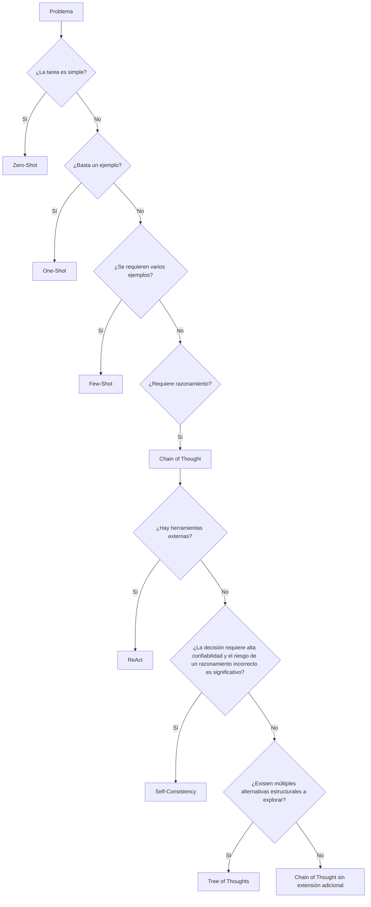

# Módulo 2 — Prompt Engineering Profesional

# Capítulo 17 — Patrones de Prompt Engineering

## Sección 09 — Marco de decisión y comparación general

> *"Conocer muchos patrones aporta poco valor si no se sabe cuál utilizar frente a un problema concreto."*

---

## Objetivos de aprendizaje

- Comparar los principales patrones de Prompt Engineering.
- Construir un marco de decisión para seleccionar el patrón adecuado.
- Relacionar la complejidad del problema con la estrategia de prompting.
- Introducir criterios de ingeniería para la toma de decisiones.

---

## Introducción

A lo largo de este capítulo analizamos siete patrones de Prompt Engineering, cada uno diseñado para resolver un conjunto específico de problemas.

Sin embargo, una pregunta continúa abierta:

**¿Cómo decidir qué patrón utilizar?**

La respuesta no depende del modelo ni de las preferencias del ingeniero. Depende del problema que se intenta resolver y de las restricciones del entorno de producción.

---

## Un marco de decisión

La selección de un patrón puede entenderse como un proceso incremental. Se recomienda comenzar con la estrategia más simple capaz de resolver el problema y evolucionar únicamente cuando la evidencia demuestre que es necesario.

---

## Comparación general

| Patrón | Complejidad | Costo | Latencia | Caso de uso típico |
|--------|-------------|-------|----------|--------------------|
| Zero-Shot | Baja | Bajo | Baja | Tareas simples y bien conocidas |
| One-Shot | Baja | Bajo | Baja | Formatos específicos con poca variabilidad |
| Few-Shot | Media | Medio | Media | Generalización con variabilidad moderada |
| Chain of Thought | Media | Medio | Media | Razonamiento complejo paso a paso |
| Self-Consistency | Alta | Alto | Alta | Decisiones críticas que requieren alta confiabilidad |
| ReAct | Alta | Variable | Variable | Problemas que requieren información dinámica o herramientas externas |
| Tree of Thoughts | Muy alta | Alto | Alta | Exploración de múltiples alternativas estructurales |

---

## Ingeniería antes que técnica

Un error frecuente consiste en adoptar el patrón más sofisticado disponible suponiendo que producirá mejores resultados.

En ingeniería ocurre exactamente lo contrario.

La mejor solución suele ser aquella que satisface los requisitos utilizando la menor complejidad posible.

Cada patrón introduce costos adicionales en términos de tokens, latencia, mantenimiento y evaluación. Por ello, la decisión debe justificarse mediante métricas y necesidades concretas del negocio.

---

## Caso de estudio

Una organización desarrolla tres asistentes con el mismo Large Language Model (LLM):

- un **generador de resúmenes**, donde el formato de salida es flexible y la variabilidad entre respuestas es aceptable: emplea Zero-Shot;
- un **analizador de contratos**, que debe identificar cláusulas problemáticas y justificar cada observación: emplea Chain of Thought;
- un **agente que coordina procesos entre varios sistemas**, consultando bases de datos y verificando información en tiempo real antes de responder: emplea ReAct.

La diferencia no reside en la capacidad del modelo, sino en la naturaleza del problema que cada aplicación debe resolver.

Self-Consistency y Tree of Thoughts no aparecen en este caso porque ninguno de los tres asistentes presenta las condiciones que los justifican: no hay decisiones de alta criticidad donde un único razonamiento sea insuficientemente robusto, ni problemas con múltiples alternativas estructurales que requieran exploración comparada. Cuando esas condiciones aparezcan —por ejemplo, en un sistema de evaluación de riesgo crediticio o en un planificador de proyectos con opciones de arquitectura alternativas— serán los patrones indicados.

---

## Buenas prácticas

- Comenzar por el patrón más simple.
- Incrementar la complejidad solo cuando sea necesario y la evidencia lo justifique.
- Medir costo y calidad antes de cambiar de estrategia.
- Documentar la justificación de cada decisión.

---

## Errores frecuentes

- Elegir patrones por tendencia tecnológica o por sofisticación percibida.
- Sobredimensionar la solución frente a la complejidad real del problema.
- Cambiar de patrón sin evidencia que respalde el cambio.
- Ignorar el impacto operativo acumulado de tokens, latencia y mantenimiento.

---

## Ideas clave

- No existe un patrón universal.
- La selección depende del problema y del contexto operativo.
- La simplicidad constituye una virtud cuando cumple los objetivos del negocio.

---

## Transición hacia la siguiente sección

En la próxima sección cerraremos el capítulo analizando cómo combinar varios patrones dentro de una misma solución y prepararemos el paso hacia el Capítulo 18, donde estudiaremos Prompt Engineering para entornos de producción.

---

> **"Un arquitecto no memoriza respuestas. Comprende problemas para poder diseñar soluciones."**
