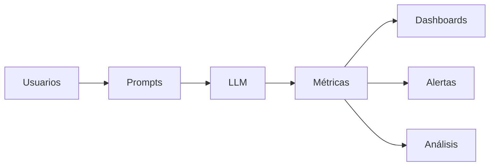

# Módulo 2 — Prompt Engineering Profesional

# Capítulo 18 — Prompt Engineering para Producción

## Sección 05 — Observabilidad y métricas

> *"Aquello que no puede medirse difícilmente pueda mejorarse de forma sistemática."*

---

## Objetivos de aprendizaje

- Comprender el papel de la observabilidad en soluciones basadas en LLM.
- Identificar métricas técnicas y de negocio aplicables a prompts.
- Diferenciar monitoreo de observabilidad.
- Introducir el concepto de mejora continua basada en evidencia.

---

## Introducción

Diseñar un buen prompt y validarlo antes del despliegue constituye un paso importante, pero no suficiente.

Una vez que el sistema entra en producción, comienza a interactuar con usuarios reales, datos cambiantes y escenarios imposibles de reproducir completamente durante las pruebas.

En ese contexto surge una nueva necesidad: observar cómo se comporta el sistema en funcionamiento.

La observabilidad permite responder preguntas fundamentales:

- ¿Está resolviendo correctamente los problemas del negocio?
- ¿Su calidad mejora o empeora con el tiempo?
- ¿Qué consultas producen más errores?
- ¿Qué impacto tienen las nuevas versiones del prompt?

---

## Monitoreo y observabilidad

Aunque suelen utilizarse como sinónimos, representan conceptos diferentes.

| Concepto | Propósito |
|----------|-----------|
| Monitoreo | Detectar eventos o anomalías previamente definidas. |
| Observabilidad | Comprender el comportamiento del sistema a partir de la información disponible. |

Mientras el monitoreo responde preguntas conocidas, la observabilidad ayuda a investigar problemas inesperados.

---

## Métricas técnicas

Algunas métricas frecuentes son:

| Métrica | Utilidad |
|---------|----------|
| Latencia | Tiempo de respuesta. |
| Consumo de tokens | Control de costos. |
| Tasa de errores | Detección de incidentes. |
| Cumplimiento del formato | Validación automática. |
| Uso de herramientas | Seguimiento de patrones ReAct (estrategia que alterna razonamiento y acción para resolver tareas complejas) o Tool Calling (capacidad del modelo para invocar funciones externas). |

Estas métricas permiten comprender el comportamiento operativo de la plataforma.

---

## Métricas de negocio

No toda mejora técnica implica una mejora para la organización.

Por ello resulta necesario complementar las métricas operativas con indicadores alineados al negocio.

Ejemplos:

- porcentaje de consultas resueltas;
- reducción del tiempo de atención;
- disminución de derivaciones a operadores humanos;
- satisfacción del usuario;
- ahorro económico generado por la automatización.

La combinación de ambos tipos de métricas ofrece una visión integral del sistema.

---

## Caso de estudio

Una empresa despliega un asistente para responder consultas internas.

Las métricas técnicas indican baja latencia y pocos errores.

Sin embargo, las métricas de negocio muestran que la mayoría de los usuarios vuelve a formular la misma consulta utilizando palabras diferentes.

El análisis revela que las respuestas son técnicamente correctas, pero poco claras para el público objetivo.

La observabilidad permite identificar un problema que el monitoreo tradicional no había detectado.

---

## Buenas prácticas

- Definir métricas antes del despliegue.
- Combinar indicadores técnicos y de negocio.
- Registrar la versión del prompt asociada a cada ejecución.
- Revisar periódicamente las tendencias.

---

## Errores frecuentes

- Medir únicamente costos o latencia.
- Carecer de indicadores funcionales.
- No correlacionar métricas con versiones.
- Ignorar el comportamiento de los usuarios.

---

## Ideas clave

- La observabilidad transforma datos en conocimiento operativo.
- Las métricas deben responder a objetivos del negocio.
- La mejora continua depende de información confiable y medible.

---

## Transición hacia la siguiente sección

En la próxima sección estudiaremos cómo integrar el versionado, las pruebas y la observabilidad dentro de un proceso continuo de despliegue, preparando el camino hacia PromptOps.
