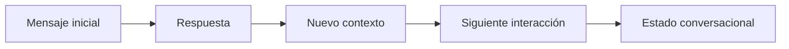

# Módulo 2 — Prompt Engineering Profesional

# Capítulo 19 — Ingeniería Conversacional

## Sección 01 — Introducción a la Ingeniería Conversacional

> *"Una conversación no es una secuencia de mensajes. Es un proceso continuo de construcción de contexto."*

---

## Objetivos de aprendizaje

- Comprender qué es la Ingeniería Conversacional y en qué se diferencia del Prompt Engineering.
- Diferenciar una consulta aislada de una conversación persistente.
- Analizar los desafíos del diseño conversacional en sistemas empresariales.
- Introducir los conceptos de estado, memoria y contexto conversacional.

---

## Introducción

Hasta este momento el módulo se centró en el diseño de prompts y en las prácticas necesarias para llevarlos a producción.

Sin embargo, muchas aplicaciones empresariales no resuelven una única consulta. Mantienen conversaciones prolongadas con usuarios, otros sistemas o incluso con agentes especializados.

Cuando esto ocurre, el problema deja de ser exclusivamente cómo escribir un buen prompt.

El desafío pasa a ser cómo diseñar una interacción consistente a lo largo del tiempo.

Esta disciplina recibe el nombre de **Ingeniería Conversacional**. A diferencia del diseño de chatbots convencionales —que suelen basarse en árboles de decisión predefinidos— o de la UX conversacional —centrada en la experiencia perceptible por el usuario—, la Ingeniería Conversacional aborda la arquitectura interna que hace posible esa experiencia: cómo se representa el estado del diálogo, cómo se construye el contexto para cada inferencia y cómo se preserva la continuidad entre sesiones. En ese sentido, extiende el Prompt Engineering hacia problemas que ningún prompt individual puede resolver por sí solo.

---

## Del prompt a la conversación

Un prompt representa una interacción puntual.

Una conversación incorpora continuidad.

Cada nueva interacción depende, en mayor o menor medida, de las anteriores.

La calidad del sistema depende tanto de cada respuesta individual como de la coherencia del diálogo completo.

---

## Componentes de una conversación

Una arquitectura conversacional suele incorporar los siguientes elementos.

| Componente | Responsabilidad |
|------------|-----------------|
| Usuario | Inicia y conduce la interacción. |
| Estado | Representa la situación actual de la conversación. |
| Contexto | Información relevante para la interacción vigente. |
| Memoria | Información persistente reutilizable entre sesiones. |
| Modelo | Genera respuestas considerando el contexto disponible. |

Aunque estos términos suelen utilizarse indistintamente en el lenguaje cotidiano, designan responsabilidades técnicas bien diferenciadas. El estado es la fotografía actual del proceso; el contexto es lo que el modelo recibe en una inferencia concreta; la memoria es lo que el sistema conserva para conversaciones futuras. Las secciones siguientes profundizan en cada uno de ellos.

---

## Nuevos desafíos

Las conversaciones prolongadas introducen problemas que no aparecen en consultas aisladas.

Entre ellos:

- pérdida de contexto;
- crecimiento del historial;
- cambios de intención del usuario;
- referencias implícitas;
- recuperación de información previa;
- continuidad entre sesiones.

Resolver estos desafíos requiere decisiones de arquitectura y no únicamente mejoras en el prompt. Es importante señalar que ninguno de ellos puede delegarse completamente al Large Language Model (LLM): el modelo no mantiene estado entre llamadas, no gestiona por sí solo qué información conservar, y no debería controlar reglas críticas de negocio. Esa responsabilidad recae en la aplicación.

---

## Caso de estudio

Una empresa implementa un asistente para acompañar el proceso de incorporación de nuevos empleados. La interacción comienza solicitando datos personales, continúa con la elección de beneficios, luego responde preguntas sobre políticas internas y finalmente coordina capacitaciones obligatorias. Cada respuesta depende de decisiones tomadas durante etapas anteriores.

Consideremos qué ocurre si el sistema pierde el estado conversacional: el asistente vuelve a solicitar información ya proporcionada, ofrece beneficios incompatibles con las elecciones previas del empleado, o desconoce qué capacitaciones fueron agendadas. La experiencia se degrada y la confianza del usuario en el sistema se pierde.

Un diseño que mantiene el estado de forma explícita evita estos problemas: cada nueva interacción se construye sobre la información ya validada, no sobre el historial bruto de mensajes.

---

## Buenas prácticas

- Diseñar conversaciones como procesos y no como mensajes independientes.
- Definir explícitamente qué información debe persistir en el estado y cuál puede descartarse.
- Separar contexto temporal de memoria de largo plazo.
- Registrar eventos relevantes para facilitar auditoría y depuración.

---

## Errores frecuentes

- Tratar cada mensaje como una consulta independiente.
- Mantener historiales completos sin ninguna estrategia de gestión.
- Mezclar estado, contexto y memoria sin distinguir sus responsabilidades.
- Depender exclusivamente del contexto enviado al modelo para sostener la continuidad.

---

## Ideas clave

- La Ingeniería Conversacional amplía el alcance del Prompt Engineering hacia problemas arquitectónicos.
- Una conversación posee estado, evolución y continuidad; un prompt aislado no.
- Diseñar conversaciones requiere decidir qué conservar, qué construir dinámicamente y qué persistir.
- El LLM genera respuestas; la aplicación gobierna la continuidad.

---

## Transición hacia la siguiente sección

En la próxima sección estudiaremos el concepto de **estado conversacional** y analizaremos distintas estrategias para representarlo y administrarlo dentro de aplicaciones empresariales.
