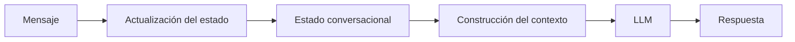

# Módulo 2 — Prompt Engineering Profesional

# Capítulo 19 — Ingeniería Conversacional

## Sección 02 — Estado Conversacional

> *"Una conversación inteligente no recuerda todo. Recuerda aquello que resulta relevante para alcanzar un objetivo."*

---

## Objetivos de aprendizaje

- Comprender el concepto de estado conversacional.
- Diferenciar estado, contexto y memoria.
- Analizar estrategias para administrar el estado en aplicaciones empresariales.
- Incorporar criterios de diseño para conversaciones de larga duración.

---

## Introducción

La sección anterior estableció que el desafío central de la Ingeniería Conversacional es mantener coherencia a lo largo del tiempo. El punto de partida de ese desafío es el **estado conversacional**: el conjunto de decisiones que el sistema toma sobre qué información conservar, cuándo actualizarla y en qué momento dejar de utilizarla.

En una aplicación basada en Large Language Models (LLM), la continuidad no aparece de manera automática. El LLM no recuerda interacciones anteriores entre llamadas distintas. Es la aplicación la que debe decidir qué preservar y cómo organizarlo.

---

## ¿Qué es el estado conversacional?

El estado representa la información necesaria para continuar una conversación de forma coherente.

No incluye todo el historial.

Incluye únicamente aquello que resulta indispensable para interpretar correctamente la siguiente interacción.

---

## Estado, contexto y memoria

Aunque suelen confundirse, cumplen responsabilidades distintas.

| Concepto | Propósito | Duración |
|----------|-----------|----------|
| Estado | Situación actual de la conversación. | Temporal |
| Contexto | Información enviada al modelo en una inferencia. | Instantánea |
| Memoria | Información reutilizable entre conversaciones o sesiones. | Persistente |

Un punto crítico: la memoria no es una propiedad del modelo. El LLM no recuerda nada entre sesiones por sí solo. La memoria es un componente gestionado por la aplicación, que debe implementar los mecanismos de persistencia y recuperación correspondientes. Confundir esto genera expectativas incorrectas y decisiones de arquitectura deficientes.

Comprender esta separación permite construir aplicaciones más escalables y fáciles de mantener.

---

## Estrategias de representación

Existen diversas formas de administrar el estado.

- Variables estructuradas asociadas a la sesión.
- Objetos de dominio que representan el avance de un proceso.
- Máquinas de estados para flujos conversacionales.
- Eventos almacenados cronológicamente.
- Combinaciones de las estrategias anteriores.

La elección dependerá del problema de negocio y del nivel de complejidad requerido.

---

## Caso de estudio

Un asistente guía a un ciudadano durante la solicitud de un beneficio.

El sistema debe rastrear:

- si la identidad ya fue validada;
- qué documentación fue presentada;
- qué etapa del proceso se encuentra activa;
- qué preguntas continúan pendientes.

Enviar el historial completo al modelo en cada interacción incrementaría costos y complejidad sin garantizar mejor calidad. Mantener un estado estructurado permite reconstruir únicamente el contexto necesario para cada paso, con información precisa y sin ruido.

---

## Buenas prácticas

- Mantener el estado mínimo indispensable.
- Separar información transitoria de datos persistentes.
- Versionar la estructura del estado cuando evolucione el sistema.
- Evitar almacenar información redundante.
- Validar la coherencia entre estado y contexto en cada interacción.

---

## Errores frecuentes

- Utilizar el historial completo como único mecanismo de continuidad.
- Confundir estado con memoria permanente.
- Actualizar el estado sin reglas claras.
- Asumir que el LLM gestiona la persistencia por sí solo.

---

## Ideas clave

- El estado conversacional representa la situación actual del diálogo, no su historia completa.
- La memoria es una responsabilidad de la aplicación, no una capacidad automática del modelo.
- Diseñar correctamente el estado mejora la eficiencia y la calidad de la conversación.

---

## Transición hacia la siguiente sección

Con el estado como base, el siguiente desafío es determinar qué información llega efectivamente al modelo en cada interacción. En la próxima sección estudiaremos cómo administrar el **contexto conversacional** y qué estrategias permiten mantener conversaciones extensas sin superar las limitaciones del espacio disponible para el modelo.
